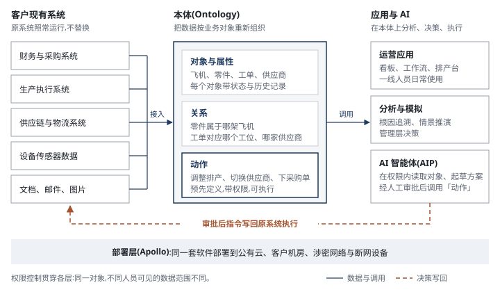
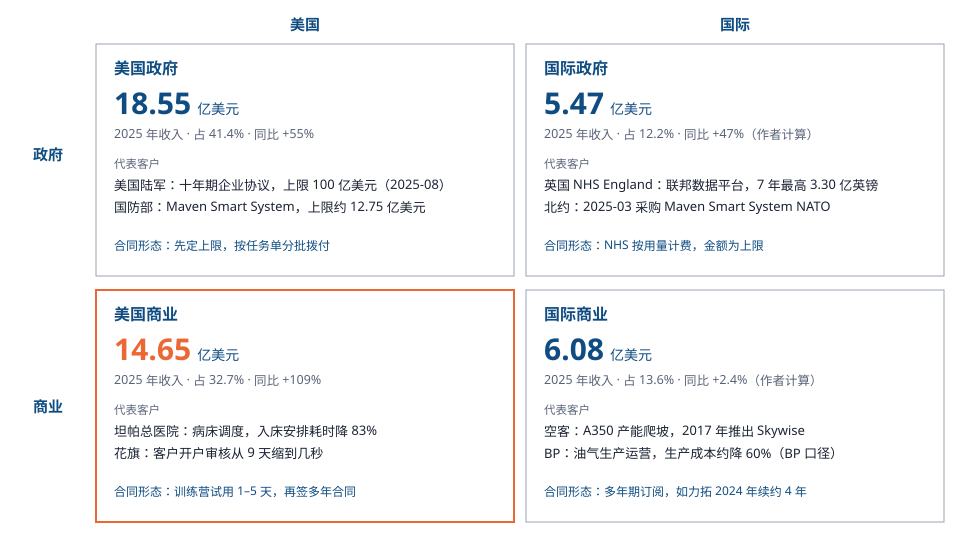
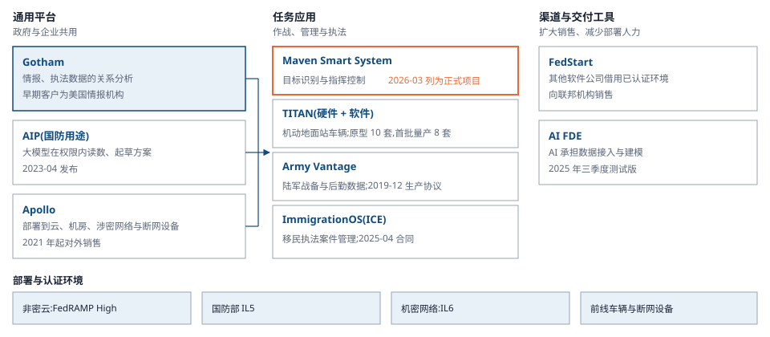
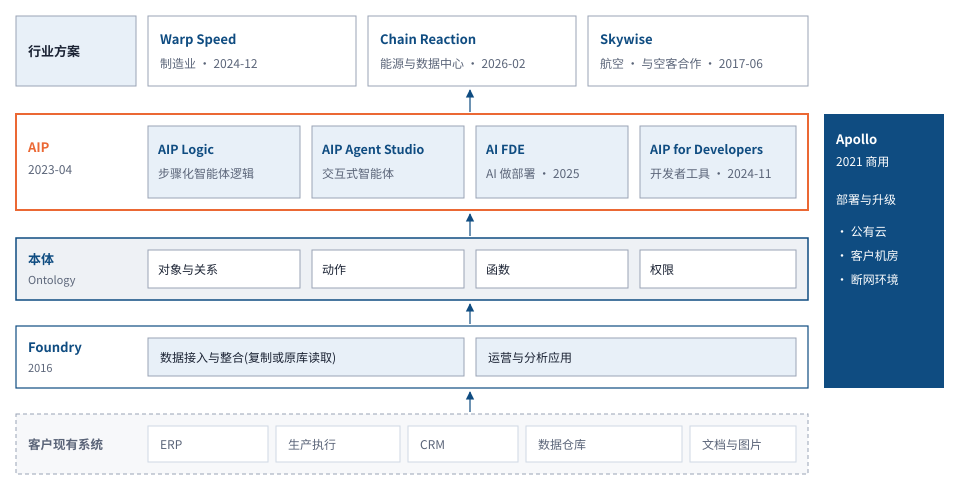
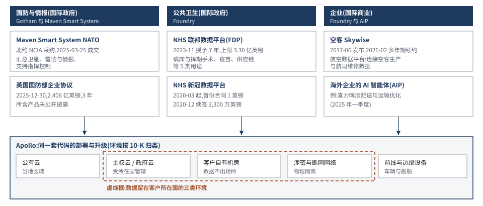

# Palantir(PLTR.US)业务认知 · 基金经理版

> 2026-09-29 · 基金经理版 · 供内部投研使用 · 本卡不写估值、目标价与评级
>
> 口径:公司数据以 10-K(FY2020–FY2025)、10-Q(至 2026 年二季度)与季度业绩稿为准,逐图注明文件与章节或发布日期;本卡在无法直接访问 SEC(美国证券交易委员会)的环境中制作,数字经公开检索结果交叉核对,未能标注 PDF 页码(见第十二章)。收入按客户类型(政府 / 商业)× 地域(美国 / 国际)四个分部口径;GAAP 与调整后(non-GAAP)指标并存时分别标明。行业数据取美国国防部预算文件、北约年报、Gartner 等机构公开数值,逐图注明来源。
>
> 底稿:Palantir 10-K、10-Q、季度业绩稿与股东信;美国陆军、国防部、NHS England、北约的合同公告;竞品年报与业绩稿;行业机构新闻稿;媒体报道(标〔公开报道〕)。完整清单与口径取舍见第十二章。

<!-- nav: 先看这里 -->

## 零、业务速览:Palantir

> [!lead] **Palantir 为政府和大型企业提供决策软件:整合客户分散在各系统的数据,在统一的业务模型上决策,再把指令写回原系统执行。**2023 年接入大模型(AIP)后,美国企业客户成为增长主力。

```kpis
收入(2Q26) | 19.35 | 亿美元 | 同比 +93%
政府 : 商业(2Q26) | 51 : 49 | | 9.90 / 9.45 亿美元
美国收入占比(2Q26) | 81 | % | 15.73 亿美元,同比 +115%
毛利率(GAAP,2Q26) | 85 | % | 毛利 16.39 亿美元
```

> 来源:公司 2026 年二季度业绩稿与 10-Q(2026-08)

### 与普通 SaaS 的差异

理解 Palantir 最直接的参照是普通 SaaS:同为按年订阅的企业软件,差异在覆盖范围和交付方式。

表 0-1　Palantir 与普通 SaaS 的差异

| 维度 | 普通 SaaS(Salesforce、Workday) | Palantir |
|---|---|---|
| 定位 | 单一部门的标准流程 | 跨系统的决策与执行层 |
| 数据 | 本系统录入 | 接入客户现有系统,数据不迁移 |
| 上线 | 开通账号、完成配置,数周 | 先建业务模型;2023 年下半年起以 1–5 天训练营切入 |
| 收费 | 按用户数,价目表公开 | 按平台议价,多年合同 |
| 部署 | 厂商公有云 | 公有云、客户机房、涉密网络 |
| 替换成本 | 较低 | 高:上层应用与流程需重建 |

> 来源:公司 10-K「Business」;企业软件采购顾问公开分析

> [!plain] 投资含义:跟踪指标不同。普通 SaaS 看付费席位,Palantir 看客户数、单客户收入和净收入留存率。详见 2.3 节。

### 工作原理

> [!analogy] Palantir 在客户现有系统之上建一层业务模型(公司称为本体):数据留在原系统,按飞机、零件、订单等对象重新组织,对象之间的关系和可执行的动作(改排产、换供应商)预先定义。管理者和 AI 在这层模型上定位问题、形成方案,审批后指令写回原系统执行。与报表工具的区别在最后一步:决策可以直接执行。



### 典型案例

> [!example] 最典型的是空客。2015 年空客为 A350 产能爬坡引入 Palantir,把零件、工序、质检和供应商交期数据接入同一平台,工程师可按「单架飞机 × 单道工序」定位缺件与返工。空客称 A350 生产节奏因此加快 33%〔空客 Skywise 公开材料〕;2017 年该平台以 Skywise 品牌向航空公司开放。

表 0-2　其他典型客户

| 客户 | 时间 | 用途 | 规模或效果 |
|---|---|---|---|
| 美国陆军 | 2025-08 | 十年期企业协议,整合 75 份既有合同,陆军与国防部各机构按需采购 | 合同上限 100 亿美元 |
| 英国 NHS England | 2023-11 | 联邦数据平台:病床与择期手术排程、疫苗接种、供应链等 5 类用途 | 7 年合同最高 3.30 亿英镑 |
| 坦帕总医院(美国) | 2024-06 | 扩大合作:病床分配、病人流转与排班 | 病人入床安排耗时降 83%,麻醉后恢复室滞留降 28%〔公开报道〕 |

> 来源:美国陆军公告(2025-08);NHS England 公告(2023-11);坦帕总医院与 Palantir 新闻稿(2024-06-05)、Healthcare IT News 报道

### 价值流向

客户按年支付平台费,合同多为多年期。获客路径是单一用例切入、见效后扩到更多部门,**增长主要来自存量客户扩容**:2Q26 净收入留存率 157%,即一年前的客户今年支出增加 57%。主要成本是工程与销售人员及股权激励;云算力与第三方大模型按用量采购。

```chain
{"title":"图 0-2 价值流向:客户按年支付平台费,人力是最大成本项",
 "subtitle":"实线 = 产品与服务;虚线 = 资金",
 "columns":[
  {"name":"上游采购","nodes":[{"label":"云算力","sub":"亚马逊、微软、谷歌","muted":true},{"label":"第三方大模型","sub":"按调用量付费","muted":true},{"label":"工程与销售人员","sub":"最大成本项,含股权激励"}]},
  {"name":"Palantir","me":true,"nodes":[{"label":"四个软件平台","sub":"Gotham / Foundry / Apollo / AIP","strong":true},{"label":"部署与支持","sub":"训练营 → 上线 → 扩容"}]},
  {"name":"付费方(2Q26 收入)","nodes":[{"label":"政府","sub":"9.90 亿美元,其中美国 8.09 亿"},{"label":"企业","sub":"9.45 亿美元,其中美国 7.64 亿"}]},
  {"name":"应用场景","nodes":[{"label":"国防与情报决策"},{"label":"医院运营"},{"label":"排产、供应链、设备维修"}]}],
 "links":[{"fwd":"采购","back":"付费"},{"fwd":"软件 + 部署","back":"平台年费"},{"fwd":"部署到业务"}],"legend":false,
 "source":"来源:公司 2026 年二季度业绩稿;结构为作者依据 10-K「Business」「Costs」整理"}
```

### 技术演变

四代产品方向一致:降低单个客户的交付人力。详见第二章。

```timeline
2003 起 | **Gotham**:为美国情报与国防机构开发,把人、地点、事件连成关系网 |
2016 | **Foundry**:同一架构进入企业,用于排产、供应链、设备维修 |
2021 | **Apollo**:作为商用产品推出,自动部署与升级,覆盖涉密与断网环境 |
2023 | **AIP**:大模型接入本体(当年 4 月发布);下半年起以 1–5 天训练营获客 | hot
```

### 跟踪指标

表 0-3　核心跟踪指标

| 指标 | 2Q26 | 看点 |
|---|---|---|
| 美国商业收入 | 7.64 亿美元,同比 +149% | 增速能否维持在 100% 以上 |
| 净收入留存率 | 157% | 老客户扩容是否持续 |
| 客户数 | 1,049 家,同比 +24% | 训练营转化是否放缓 |

> 来源:公司 2026 年二季度业绩稿

市场的主要担心是云厂商和数据平台自带的 AI 智能体压缩 Palantir 的新客户空间。目前证据不足,我们把握不高;验证信号是美国商业客户数增速连续两个季度放缓。

## 一、公司总览

> [!lead] **按客户结构看,Palantir 是以美国政府为基本盘、美国企业为增量的决策软件公司:2025 年美国两块收入 33.20 亿美元,占全年 74.2%,贡献当年新增收入的 88%**〔作者计算〕。
>
> 2025 年收入 44.754 亿美元,增长 56%。GAAP 口径下全年盈利 16.250 亿美元,其中经营环节贡献 14.140 亿、占收入 31.6%;剔除股票薪酬等项目后,调整后(non-GAAP)营业利润为 22.541 亿美元,利润率 50%。2026 年上半年收入 35.681 亿美元(+89%〔作者计算〕),GAAP 净利润 19.324 亿美元,调整后营业利润率 61%(non-GAAP);2026-08-03 全年收入指引上调到 81.50–81.58 亿美元〔管理层口径〕。

> [!plain] Palantir 卖的是架在客户现有系统之上的一层软件:把分散在各系统的数据按飞机、订单、病人等业务对象重新组织,管理者在上面决策,再把指令写回原系统执行。与按席位收费的普通 SaaS 不同,它按平台议价、签多年合同,先在一个部门试用,见效后扩到全机构。跟踪时看三个数:美国商业收入增速、客户数、净收入留存率(老客户今年支出是去年的多少,2Q26 为 157%)。

```kpis
2025 收入 | 44.754 | 亿美元 | 同比 +56%
2025 GAAP 净利润 | 16.250 | 亿美元 | 调整后营业利润率 50%(non-GAAP)
2025 美国商业收入 | 14.65 | 亿美元 | 同比 +109%
客户数(2Q26) | 1,049 | 家 | 同比 +24%
2025 经营现金流 | 21.345 | 亿美元 | Rule of 40 为 106%(公司口径)
```

> 来源:Q4 2025 业绩稿(2026-02-02);Q2 2026 业绩稿(2026-08-03);2026 年上半年为两季相加〔作者计算〕

### 1.1 收入结构:美国商业接替美国政府成为增长主力

**2025 年美国政府收入最大,美国商业增长最快,国际商业几乎停滞。**公司正式分部只有政府、商业两个,另披露美国政府与美国商业,国际两块由此倒算(表 1-1)。

表 1-1　四个分部经营数据:2025 年与 2026 年上半年

| 分部 | 2025 收入(亿美元) | 占比 | 同比 | 2026H1 收入(亿美元) | 2026H1 占比 | 2026H1 同比 | 定位 |
|---|---|---|---|---|---|---|---|
| 美国政府 | 18.55 | 41.4% | +55% | 14.96 | 41.9% | +87.2% | 基本盘 |
| 美国商业 | 14.65 | 32.7% | +109% | 13.59 | 38.1% | +142.2% | 增量来源 |
| 国际政府 | 5.47 | 12.2% | +47.2% | 3.52 | 9.9% | +46.1% | 稳定增长 |
| 国际商业 | 6.08 | 13.6% | +2.4% | 3.60 | 10.1% | +25.4% | 低增长 |
| 合计 | 44.754 | 100% | +56.2% | 35.681 | 100% | +89.0% | — |

> 来源:Q4 2025 业绩稿(2026-02-02);10-K FY2025;1Q26、2Q26 业绩稿与 10-Q。国际两块 = 分部收入 − 美国部分;国际两块、2026H1 占比与同比为作者计算

表 1-2　两个报告分部的收入与贡献利润率(亿美元)

| 项目 | 2023 | 2024 | 2025 |
|---|---|---|---|
| 政府分部收入 | 12.222 | 15.696 | 24.023 |
| 政府分部贡献 | 7.250 | 9.484 | 15.761 |
| 政府贡献利润率 | 59% | 60% | 66% |
| 商业分部收入 | 10.028 | 12.959 | 20.732 |
| 商业分部贡献 | 5.206 | 7.715 | 13.666 |
| 商业贡献利润率 | 52% | 60% | 66% |
| 分部贡献合计 | 12.456 | 17.199 | 29.427 |
| GAAP 营业利润 | 1.200 | 3.104 | 14.140 |

> 来源:10-K FY2024、FY2025 分部附注。分部贡献 = 分部收入 − 对应营业成本 − 销售与营销费用,不含股票薪酬;研发与管理费用不分摊(公司口径)

**增长和利润改善都集中在美国。**2025 年美国两块收入比上年多 14.198 亿美元,占新增收入的 88%,国际商业只多 0.144 亿美元(图 1-2)。商业分部贡献利润率从 2023 年的 52% 升到 2025 年的 66%,**与政府分部持平**;两分部贡献合计 29.427 亿美元,扣除未分摊的研发、管理费用和股票薪酬后,GAAP 营业利润为 14.140 亿美元。

```chart
{"id":"c1_seg_annual","title":"图 1-1 美国商业占收入比重从 2021 年 13.0% 升到 2026 年上半年 38.1%","subtitle":"单位:亿美元;26H1 为半年数(浅色);2020 年只有政府 6.102、商业 4.825,未拆四块","type":"stack",
 "categories":["2021","2022","2023","2024","2025","26H1"],
 "series":[{"name":"美国政府","data":[6.782,8.263,9.212,11.979,18.55,14.96]},
           {"name":"美国商业","data":[2.01,3.351,4.571,7.023,14.65,13.59]},
           {"name":"国际政府","data":[2.192,2.455,3.010,3.717,5.47,3.52]},
           {"name":"国际商业","data":[4.436,4.990,5.457,5.936,6.08,3.60]}],
 "unit":"亿美元","total_label":true,"total_values":[15.419,19.059,22.250,28.655,44.754,35.681],"forecast_from":"26H1","forecast_label":"半年数","height":"tall","digits":2,
 "note":"2021 年美国商业为美国收入减美国政府倒算;国际两块为作者计算。",
 "source":"来源:10-K FY2021–FY2025;季度业绩稿(2026-05、2026-08);作者计算"}
```

:::two-up
```chart
{"id":"c1_inc_2025","title":"图 1-2 2025 年新增收入 16.10 亿美元,美国两块贡献 88%","subtitle":"单位:亿美元","type":"waterfall",
 "categories":["2024 收入","美国商业","美国政府","国际政府","国际商业","2025 收入"],
 "series":[{"name":"收入","data":[28.655,7.627,6.571,1.753,0.144,44.754]}],
 "totals":["2024 收入","2025 收入"],"waterfall_names":["全年收入","增量","减少"],"unit":"亿美元","digits":3,"height":"short",
 "note":"四块增量合计 16.095,差额来自取整。",
 "source":"来源:10-K FY2024;Q4 2025 业绩稿;作者计算"}
```
```chart
{"id":"c1_seg_growth","title":"图 1-3 四块增速分化:2026 年上半年美国商业 +142.2%,国际商业 +25.4%","subtitle":"同比,%;26H1 为上半年同比","type":"line",
 "categories":["2022","2023","2024","2025","26H1"],
 "series":[{"name":"美国政府","data":[21.8,11.5,30.0,54.9,87.2],"labels":"last"},
           {"name":"美国商业","data":[66.7,36.4,53.6,108.6,142.2],"labels":"last"},
           {"name":"国际政府","data":[12.0,22.6,23.5,47.2,46.1],"labels":"last"},
           {"name":"国际商业","data":[12.5,9.4,8.8,2.4,25.4],"labels":"last"}],
 "unit":"%","digits":1,"height":"short",
 "source":"来源:10-K 与季度业绩稿;作者计算"}
```
:::

**季度收入增速已连续 12 个季度加快**,2Q26 同比 +93%(图 1-4);起点与 AIP(人工智能平台,2023-04 发布,把大模型接到客户业务数据上)推出的时间一致。

```chart
{"id":"c1_q_rev","title":"图 1-4 季度收入同比从 2Q23 的 +13% 加快到 2Q26 的 +93%","subtitle":"柱:收入(亿美元);线:同比(%,右轴)","type":"combo",
 "categories":["1Q23","2Q23","3Q23","4Q23","1Q24","2Q24","3Q24","4Q24","1Q25","2Q25","3Q25","4Q25","1Q26","2Q26"],
 "series":[{"name":"季度收入","type":"bar","data":[5.252,5.333,5.582,6.084,6.343,6.781,7.255,8.275,8.839,10.037,11.811,14.068,16.326,19.355]},
           {"name":"同比","type":"line","yAxisIndex":1,"unit":"%","data":[18,13,17,20,21,27,30,36,39,48,63,70,85,93],"labels":true,"digits":0}],
 "unit":"亿美元","y2_unit":"%","y2_min":0,"highlight":"2Q26","digits":3,
 "note":"4Q23 收入为全年减前三季。",
 "source":"来源:10-Q 与季度业绩稿(1Q23–2Q26);Q1 2025 业绩稿 Rule of 40 调节表"}
```

### 1.2 美国与国际:收入向美国集中

**2020 年美国收入只占一半多(52.5%),2025 年已占 74.2%,2Q26 单季达到 81.3%。**2025 年美国收入同比 +74.7%,国际 +19.7%(图 1-5);国际里英国最大,4.274 亿美元。国际增长主要来自政府,国际商业 2025 年只增 2.4%,**公司没有给出分地区解释,我们对原因把握不高**;2026 年上半年同比回到 +25.4%,见第五章。

```chart
{"id":"c1_us_intl","title":"图 1-5 2020–2025 年美国收入增至 5.8 倍,国际增至 2.2 倍","subtitle":"柱:收入(亿美元);线:美国占比(%,右轴)","type":"combo",
 "categories":["2020","2021","2022","2023","2024","2025"],
 "series":[{"name":"美国收入","type":"bar","data":[5.735,8.792,11.614,13.782,19.002,33.200]},
           {"name":"国际收入","type":"bar","data":[5.191,6.627,7.445,8.468,9.653,11.554]},
           {"name":"美国占比","type":"line","yAxisIndex":1,"unit":"%","data":[52.5,57.0,60.9,61.9,66.3,74.2],"labels":true,"digits":1}],
 "unit":"亿美元","y2_unit":"%","y2_min":40,"y2_max":90,"digits":3,
 "source":"来源:10-K FY2022、FY2025 地区收入附注(按客户所在地);国际为总收入减美国〔作者计算〕"}
```

### 1.3 利润与现金:2023 年转为 GAAP 盈利

**2023 年起 GAAP 盈利,2025 年 GAAP 净利率 36.3%,主要因为股票薪酬占收入比例下降、费用增速慢于收入。**股票薪酬占收入从 2020 年的 116.3% 降到 2025 年的 15.3%;2025 年 GAAP 营业费用 22.723 亿美元〔作者计算〕,同比 +14.2%,收入 +56%(图 1-6)。

调整后营业利润率 50.4% 比 GAAP 口径高 18.8 个百分点,差额是股票薪酬 6.840 亿美元与相关雇主税 1.561 亿美元;**公司常用的 Rule of 40(收入同比加调整后营业利润率)同样剔除了股票薪酬**。2025 年经营现金流 21.345 亿美元,资本开支 0.339 亿美元;年末现金与短期有价证券 71.770 亿美元,无借款。

```chart
{"id":"c1_rev_ni","title":"图 1-6 GAAP 净利润 2023 年转正,2025 年 16.250 亿美元","subtitle":"单位:亿美元","type":"group",
 "categories":["2020","2021","2022","2023","2024","2025"],
 "series":[{"name":"收入","data":[10.927,15.419,19.059,22.250,28.655,44.754]},
           {"name":"GAAP 净利润","data":[-11.664,-5.204,-3.737,2.098,4.622,16.250]}],
 "unit":"亿美元","digits":3,"labels":true,
 "note":"2020 年亏损主要来自直接上市前后限制性股票单位集中归属。",
 "source":"来源:10-K FY2020–FY2025;Q4 2025 业绩稿"}
```

### 1.4 商业模式:卖多年期软件订阅,成本以人力为主

**收入来自软件订阅,在合同期内平摊确认;成本以人力为主,另有云托管和分包。**订阅分两种:托管在 Palantir 云上,或装在客户自己的机房与云账户里,都附带运维,另有专业服务。**政府合同先定上限、再按任务单拨付,多带便利终止条款**;企业合同多为多年期。2025 年总合同价值(TCV)108 亿美元,同比 +128%;净收入留存率 2Q26 为 157%,前 20 大客户平均年收入从 2024 年的 6,460 万美元增到 2025 年的 9,390 万美元。

合作伙伴方面,**微软 2024-08 与 Palantir 合作,把四个平台部署到 Azure 政府云与涉密云**;系统集成商与防务企业多以联合体或分包参与(图 1-7)。

```chain
{"title":"图 1-7 商业模式与产业链:向政府和大企业卖软件订阅,成本以人力为主",
 "subtitle":"付费方为 2025 年收入",
 "columns":[
  {"name":"上游:采购与合作伙伴","nodes":[
     {"label":"云厂商","sub":"亚马逊、微软:算力与联合销售","muted":true},
     {"label":"第三方大模型","sub":"如 Azure OpenAI","muted":true},
     {"label":"人力","sub":"员工 4,429 人(2025 年末)"},
     {"label":"集成商与防务伙伴","sub":"埃森哲、普华永道(NHS);诺斯罗普·格鲁曼、L3Harris、Anduril(TITAN)"}]},
  {"name":"Palantir","me":true,"nodes":[
     {"label":"Gotham","sub":"政府:国防、情报","strong":true},
     {"label":"Foundry","sub":"企业与民事机构","strong":true},
     {"label":"AIP","sub":"大模型接入业务数据","hot":true},
     {"label":"Apollo","sub":"部署到公有云、客户机房、涉密网络"}]},
  {"name":"付费方(2025 收入)","nodes":[
     {"label":"美国政府","sub":"18.55 亿美元"},
     {"label":"盟国政府","sub":"5.47 亿美元"},
     {"label":"大型企业","sub":"20.73 亿美元,美国 14.65 亿"}]},
  {"name":"最终用途","nodes":[
     {"label":"国防与情报","sub":"目标识别、指挥控制"},
     {"label":"民事政务","sub":"公共卫生、移民与税务"},
     {"label":"企业运营","sub":"排产、供应链、医院调度"}]}],
 "links":[{"fwd":"采购","back":"付款"},{"fwd":"软件订阅与服务","back":"合同付款"},{"fwd":"部署"}],
 "source":"来源:作者依据 10-K FY2024 业务与成本说明、Q4 2025 业绩稿、微软新闻稿(2024-08-08)、NHS England 与 TITAN 授标报道整理;结构示意"}
```

### 1.5 发展历程:先政府、后企业、再到 AI 平台

**业务按政府、企业、AI 三步展开,每一步沿用上一阶段的软件架构。**早期客户是美国情报与国防机构,2016 年起同一架构以 Foundry 进入企业;2020 年直接上市时仍亏损,2023 年推出 AIP、以训练营替代数月的试点后,**当年首次全年 GAAP 盈利**。

```timeline
title: 图 1-8 发展时间轴:政府项目打底,2023 年 AIP 之后企业与政府同时加速
source: 来源:公司 S-1、10-K 与业绩稿;空客公告(2017-06);美国陆军公告(2025-08-01);国防部备忘录报道(2026-03)
2003 | 公司成立,早期客户为美国情报与国防机构 |
2016 | **起诉陆军情报系统采购并胜诉**;Foundry 进入企业 | hot
2017 | 空客推出以 Palantir 为底层的数据平台 Skywise |
2019 | 陆军数据平台 Army Vantage 生产协议,上限 4.58 亿美元 |
2020 | **9 月 30 日在纽交所直接上市**,不发新股 | hot
2023 | **4 月发布 AIP;首个全年 GAAP 盈利** | hot
2024 | 纳入标普 500 与纳斯达克 100 |
2025 | **陆军十年期企业协议,上限 100 亿美元** | hot
2026 | Maven Smart System 列为国防部正式项目 |
```

### 1.6 客户类型:四类客户,采购方式不同

**政府先定合同上限、再分批拨款,企业先试用、再签多年合同**(图 1-9)。上限、已拨付与收入是三个数:陆军企业协议上限 100 亿美元,截至 2026-03 已拨付 3.828 亿美元〔公开报道〕。客户数按过去 12 个月确认过收入的组织计,2Q26 为 1,049 家;前 20 大客户约占 2025 年收入的 42%〔作者计算〕,见第六章。



## 二、技术与产品:原理、差异与演变

> [!lead] 本章说明 Palantir 要解决的问题、本体原理、与三类参照物的差异,以及平台与交付方式的演变。**交付方式的变化已反映在经营数据上:美国商业客户从 1Q23 的 155 家增至 4Q25 的 571 家。**

### 2.1 要解决的问题:数据分散,决策靠人工对表

**大型机构不缺数据,瓶颈在于数据分散在互不相通的系统里。**订单在 ERP(财务、采购、生产管理系统)里,设备状态在传感器平台上,供应商交期在邮件里;查一张订单为何延期,要各部门导数、拼表、开会对数。美国陆军 Vantage 项目接入的数据来自 160 多个系统、30,000 多个数据集(公司新闻稿,2020-12-21)。现有软件只管本部门或只存数据,**Palantir 补的是从发现问题到修改业务这一步。**

### 2.2 原理:本体把数据映射为业务对象与动作

**核心是本体(Ontology,把各系统的数据对应到现实中的业务对象,并定义可对其执行的操作)。**平台三层结构见图 0-1,下图展开本体层。

```chain
{"title":"图 2-1 本体原理:语义要素描述业务,动能要素执行修改",
 "subtitle":"强调框为 AIP 调用的环节",
 "columns":[
  {"name":"接入的数据","nodes":[{"label":"数据集","sub":"ERP、传感器、文档","muted":true},{"label":"虚拟表","sub":"留在原库","muted":true},{"label":"模型","muted":true}]},
  {"name":"语义要素","strong":true,"nodes":[{"label":"对象","sub":"飞机、工单、病床"},{"label":"属性","sub":"状态、数量"},{"label":"关系","sub":"零件属于哪架飞机"}]},
  {"name":"动能要素","strong":true,"nodes":[{"label":"动作","sub":"受控修改对象","hot":true},{"label":"函数","sub":"读写对象的代码","hot":true},{"label":"动态权限","sub":"谁能看、谁能改"}]},
  {"name":"使用方","nodes":[{"label":"业务应用"},{"label":"AI 智能体","sub":"人工审批后执行"},{"label":"原业务系统"}]}],
 "links":[{"fwd":"映射"},{"fwd":"约束与触发"},{"fwd":"调用","back":"写回执行"}],
 "legend":"虚线 = 执行结果写回原系统",
 "source":"来源:作者依据 Palantir 产品文档「Ontology」整理;结构示意"}
```

**决定门槛的是动能要素。**只有对象、属性和关系,本体接近数据目录;加上动作、函数和权限,平台上的决定(改排产、调床位)才能写回原系统执行。2023 年推出的 AIP(人工智能平台,把大模型接入本体)改动的正是这一层。**客户定义的对象和动作越多,换平台时要重建的越多。**

### 2.3 与普通 SaaS、数据平台、咨询外包的差异

三类参照物按在客户 IT 架构中的位置分开:**数据平台在底层存算数据,普通 SaaS 在中层管部门流程,Palantir 架在两者之上;咨询外包按项目投入人力,不占固定层级。**

```chain
{"title":"图 2-2 在客户 IT 架构中的位置:Palantir 连接下两层,不替换它们",
 "columns":[
  {"name":"底层:数据存算","nodes":[{"label":"数据平台","sub":"Snowflake、Databricks","muted":true},{"label":"数据库与数据仓库","muted":true}]},
  {"name":"中层:部门系统","nodes":[{"label":"ERP","sub":"财务、采购、生产","muted":true},{"label":"普通 SaaS","sub":"Salesforce、Workday","muted":true}]},
  {"name":"上层:Palantir","me":true,"nodes":[{"label":"本体","strong":true},{"label":"应用与 AI 智能体","hot":true}]},
  {"name":"使用方","nodes":[{"label":"业务人员"},{"label":"管理层"}]}],
 "links":[{"fwd":"读取"},{"fwd":"读取","back":"写回执行"},{"fwd":"使用"}],
 "legend":"虚线 = 决策写回业务系统",
 "source":"来源:作者依据各公司 10-K「Business」整理;结构示意"}
```

**与普通 SaaS:差异在覆盖范围与上线方式。**普通 SaaS(软件即服务,在云上运行、按用户数订阅的部门软件)开通即用;Palantir 要先建本体,上线慢,替换成本高。

**与数据平台:差异在是否驱动业务动作。**数据平台存算数据、按用量收费,Palantir 读取其数据并写回决策;两者在 AI 智能体(能按步骤自主查数、发指令的 AI 程序)上正面竞争。

**与咨询外包:差异在收入与人力的关系。**咨询按人天收费;Palantir 早年靠前线部署工程师(FDE,驻场接数据、搭应用的工程师)交付,2022–2025 年收入增至 2.35 倍,年末员工只增加 15%〔作者计算〕。

表 2-1　Palantir 与三类参照物逐项对比

| 维度 | 普通 SaaS | 数据平台 | 咨询与系统集成 | Palantir |
|---|---|---|---|---|
| 代表公司 | Salesforce、Workday | Snowflake、Databricks | 埃森哲、国防承包商 | — |
| 直接执行 | 本系统内 | 不执行 | 客户自行运行 | 写回原系统 |
| 上线方式 | 开通账号,以周计 | 接入数据即用 | 项目制,以月计 | 训练营 1–5 天出首个用例 |
| 收费方式 | 按用户数 | 按存算用量 | 按人天 | 平台议价,多年合同 |
| 部署环境 | 厂商公有云 | 公有云为主 | 客户现场 | 公有云、客户机房、涉密网络 |
| 收入与人力 | 脱钩 | 脱钩 | 同步增长 | 2023 年起脱钩 |
| 代价 | 跨部门问题覆盖不了 | 应用需自建 | 利润率受人力约束 | 获客慢、前期投入大、客户集中 |
| 常看指标 | 付费席位 | 用量收入、留存率 | 人数、利用率 | 客户数、单客户收入、留存率 |

> 来源:作者依据各公司 10-K「Business」整理,收费为常见做法;员工数取自 Palantir 10-K

> [!plain] 投资含义:Palantir 的毛利率是软件公司水平(GAAP 85%,2Q26),交付方式曾接近咨询;**收入能否持续快于人员增长,决定它更像软件公司还是服务公司。**

### 2.4 技术演变:四代平台逐步压缩交付人力

**四代平台方向一致:一套代码覆盖更多客户和部署环境,单个客户的交付人力逐代下降。**

```roadmap
{"title":"图 2-3 技术演变:从情报分析到企业运营,再到 AI 执行",
 "subtitle":"各代平台至今并存",
 "stages":[
  {"era":"2003 起","name":"Gotham:情报分析","gist":"把人、地点、通讯连成关系网。","solves":"情报数据分散,比对慢","cost":"项目定制,驻场人力重","who":"受益:情报机构;受损:定制型国防承包商"},
  {"era":"2016","name":"Foundry:进入企业","gist":"同一架构用于排产、供应链、维修。","solves":"企业系统各自为政","cost":"销售周期长,仍需驻场建本体","who":"受益:大型企业;受损:定制开发项目"},
  {"era":"2021 商用","name":"Apollo:自动部署","gist":"一个控制层向云、机房、涉密环境推送更新。","solves":"环境多且隔离,人工升级跟不上","cost":"研发投入大,收入未单独披露","who":"受益:涉密环境用户;公司交付成本"},
  {"era":"2023-04","name":"AIP:大模型接入本体","gist":"大模型在权限内读对象、起草动作,人工审批后执行。","solves":"大模型不懂业务,无法执行","cost":"依赖外部模型;接入 AI 本身不稀缺","who":"受益:快速用 AI 的客户;受损:AI 试点类咨询","now":true}],
 "fork":{"label":"下一阶段:企业 AI 执行层由谁提供",
  "options":[
   {"name":"A. 平台型软件(Palantir 等)","if":"企业需要跨系统、可审计的执行","signal":"美国商业客户数与留存率上升"},
   {"name":"B. 云厂商与数据平台","if":"多数企业需求停在够用","signal":"其智能体在大企业规模化"},
   {"name":"C. 大模型厂商","if":"补齐企业系统连接与权限","signal":"OpenAI Frontier 等平台落地大客户"}]},
 "source":"来源:公司 S-1(2020)、10-K FY2021 与 FY2025「Business」"}
```

**哪条路径胜出,我们把握不高。**Databricks(2025-06)、谷歌(2025-10)、OpenAI(2026-02)先后推出企业智能体平台;反方证据是 Palantir 美国商业收入 2Q26 同比 +149%,净收入留存率(NDR,老客户今年支出是去年的多少)157%。美国商业客户数增速若连续两个季度放缓,路径 B 的权重需上调。

表 2-2　主要产品与模块:新模块都建在本体之上

| 产品 | 推出时间 | 定位 |
|---|---|---|
| Gotham | 2003 年起开发,2008 年发布〔公开报道〕 | 政府情报、国防、执法平台 |
| Foundry | 2016 | 企业平台,空客 Skywise 的底层 |
| Apollo | 2021 年商用 | 多环境自动部署与升级 |
| AIP | 2023-04 | 大模型接入本体,权限内执行 |
| AIP Logic | 2023-12 | 无代码搭建大模型函数 |
| AIP Agent Studio | 2024-11(测试版) | 用本体与自定义工具构建智能体 |
| AI FDE | 2025 年三季度(测试版) | AI 完成接数据、建本体等部署工作 |
| Warp Speed | 2024-12 首批用户 | 制造业排产、工程变更与质检 |
| FedStart | 2023-06〔公开报道〕 | 软件公司借 Palantir 的认证环境进入联邦市场,免单独取得 FedRAMP High 与 IL5 认证 |

> 来源:Palantir 10-K FY2025「Business」;产品文档;公司新闻稿(2024-11-15、2024-12-11);2Q25、4Q25 业绩稿

### 2.5 交付模式变化:从驻场试点到训练营

**2023 年下半年起,训练营取代驻场试点,成为主要获客方式:**客户带自己的数据参加,1–5 天做出可用流程(公司博客)。首席执行官 Karp 在 2024-02-05 电话会上称,2022 年公司做了 92 个试点,2023 年做了 500 多场训练营;截至 2024-02 累计 560 余场、覆盖 465 家组织,2024-06 累计 1,300 余场(公司新闻稿),此后不再披露。

```flow
{"title":"图 2-4 交付流程:训练营获客,扩展与企业协议放大合同",
 "subtitle":"强调框为合同金额扩大的环节","legend":false,
 "steps":[
  {"label":"训练营","sub":"1–5 天,带真实数据","tag":"获客"},
  {"label":"首个用例","sub":"单一问题跑通"},
  {"label":"上线生产","sub":"进入日常流程"},
  {"label":"扩展","sub":"更多部门与场景","hot":true},
  {"label":"企业协议","sub":"多年期、全组织","hot":true}],
 "source":"来源:公司博客与 2023–2024 年业绩电话会;流程为作者整理"}
```

### 2.6 对公司经营的影响

- **获客**:美国商业客户从 1Q23 的 155 家增至 4Q25 的 571 家,美国商业收入 2025 年 14.65 亿美元,是 2023 年的 3.2 倍;我们判断训练营是主因(见第四章)。
- **扩容**:净收入留存率从 3Q23 的 107% 升至 2Q26 的 157%(电话会);前 20 大客户平均收入 2025 年 9,390 万美元,2023 年为 5,460 万美元(见第六章)。
- **毛利率**:GAAP 毛利率 2022 年为 78.6%,2025 年 82.4%,2Q26 达到 85%(见第九章)。

> [!plain] 投资含义:跟踪美国商业客户数增速、净收入留存率与员工人效三项。**大模型越普及,接入 AI 越不稀缺;本体与权限层能否不被云厂商复制,是未来两三年最大的不确定性。**

<!-- nav: 主要业务 -->

## 三、美国政府

> [!lead] 美国政府业务是 Palantir 向美国联邦机构销售软件平台的收入,客户以国防部和各军种为主,另有情报、国土安全、卫生、税务等部门,是四个分部中最大的一块。**2025 年收入 18.55 亿美元,同比 +55%;2Q26 单季 8.09 亿美元,同比 +90%,占公司收入 41.8%。**

> [!plain] Palantir 把软件卖给美国联邦机构,汇总情报、战场、后勤和执法数据,帮指挥官更快决策。成长路径与国防承包商卖武器系统相近:先做原型、再签生产合同、最后列入年度预算;不同的是交付物是软件,同一平台可在多个军种和部门复用。跟踪看三组数:季度收入增速、大合同的已拨付金额(而非上限)、国防拨款落地进度。

### 3.1 行业规模

**客户预算以千亿美元计,Palantir 占比很小,增长靠在既有预算里替代其他支出。**FY2026 国防拨款法案 8,392 亿美元,是 FY2019 的 1.24 倍(图 3-1),口径更宽的 050 国防总额约 1 万亿美元(图 3-4);Palantir 美国政府收入 2021–2025 年增至 2.7 倍。预算仍在抬升:2025-07 的和解法案(OBBBA)追加国防约 1,500 亿美元,FY2027 国防部请求 1.45 万亿美元。

```chart
{"id":"c3_approp","title":"图 3-1 国防拨款法案:FY2026 为 8,392 亿美元,是 FY2019 的 1.24 倍","subtitle":"单位:亿美元;已颁布数;各年口径不同","type":"bar",
 "categories":["FY2019","FY2020","FY2021","FY2022","FY2023","FY2024","FY2025","FY2026"],
 "series":[{"name":"国防拨款法案","data":[6744,6878,6881,7283,7977,8144,null,8392]}],
 "unit":"亿美元","highlight":"FY2026","labels":true,"digits":0,"height":"short",
 "note":"FY2019–FY2021 含海外应急行动资金;FY2025 为全年持续决议,无单列数;不含军事建设。",
 "source":"来源:国会研究服务处(CRS)各年拨款报告;CRFB〔第三方统计〕"}
```

软件相关科目小得多:国防部 FY2026 IT 预算 661 亿美元,AI 与自主系统 134 亿美元中软件与集成只有 12 亿(图 3-2、图 3-3);民用机构 IT 预算见图 10-2。

:::two-up
```chart
{"id":"c3_it_ai","title":"图 3-2 国防部 IT 预算 661 亿美元,FY2027 AI 投资 585 亿美元","subtitle":"单位:亿美元;请求数","type":"barh",
 "categories":["国防部 IT(FY2026)","其中:非网络 IT","其中:网络空间","AI 与自主系统(FY2026)","AI 投资合计(FY2027)"],
 "series":[{"name":"金额","data":[661,518,143,134,585]}],
 "unit":"亿美元","highlight":"AI 与自主系统(FY2026)","labels":true,"digits":0,"table_head":"项目",
 "note":"FY2027 为分析师归集数。",
 "source":"来源:Washington Technology(2026-02、2026-06);CDO Magazine〔第三方统计〕"}
```
```chart
{"id":"c3_ai_mix","title":"图 3-3 AI 与自主预算 134 亿美元,七成给空中无人机","subtitle":"单位:亿美元;FY2026 请求数","type":"barh",
 "categories":["空中无人机","海上自主平台","软件与跨域集成","水下自主平台","地面自主车辆"],
 "series":[{"name":"金额","data":[94,17,12,7.34,2.1]}],
 "unit":"亿美元","highlight":"软件与跨域集成","labels":true,"digits":1,"table_head":"科目",
  "source":"来源:CDO Magazine、DefenseScoop(2025-06)〔第三方统计〕"}
```
:::

:::two-up
```chart
{"id":"c3_def_scope","title":"图 3-4 口径对照:050 国防总额高于拨款法案,FY2026 差约 1,600 亿美元","subtitle":"单位:亿美元;FY2026 总额为约数","type":"group",
 "categories":["FY2020","FY2022","FY2023","FY2026"],
 "series":[{"name":"050 国防总额","data":[7572,7820,8580,10000]},{"name":"国防拨款法案","data":[6878,7283,7977,8392]}],
 "unit":"亿美元","labels":true,"digits":0,"height":"short",
 "note":"050 另含能源部核项目等;FY2026 含和解法案资金。",
 "source":"来源:CRS IN11224、R48891;CRFB;军控与防扩散中心〔第三方统计〕"}
```
```chart
{"id":"c3_ratio","title":"图 3-5 美国政府收入 ÷ 国防拨款:过去四季升到 0.30%","subtitle":"单位:%","type":"line",
 "categories":["2021","2022","2023","2024","2025","3Q25–2Q26"],
 "series":[{"name":"美国政府收入 ÷ 国防拨款法案","data":[0.099,0.114,0.116,0.147,null,0.304],"labels":true,"digits":3}],
 "unit":"%","y_min":0,"height":"short",
 "note":"分子含民事机构收入,高估国防部渗透率;FY2025 无拨款单列数。",
 "source":"来源:Palantir 10-K、业绩稿;拨款同图 3-1〔作者计算〕"}
```
:::

**千分之三的位置说明预算总额不是约束,约束在能否继续从集成商和自研项目手里拿到份额。**

### 3.2 竞争格局

**联邦软件需求有五种供给方式,Palantir 的差异在两点:研发由厂商先出钱,按软件许可而非工时收费。**

```flow
{"title":"图 3-6 五种供给方式:谁出研发钱、交付什么、怎样收费",
 "lanes":[{"name":"国防 IT 集成商","steps":[{"label":"政府出资"},{"label":"定制开发","tag":"按工时"}]},
          {"name":"陆军自研","steps":[{"label":"政府出资"},{"label":"按规格开发","tag":"开发合同"}]},
          {"name":"云厂商","steps":[{"label":"厂商出资"},{"label":"算力与存储","tag":"按用量"}]},
          {"name":"Anduril","steps":[{"label":"厂商出资"},{"label":"硬件 + 软件","tag":"按套数"}]},
          {"name":"Palantir","steps":[{"label":"厂商出资"},{"label":"成品平台","tag":"软件许可","hot":true}]}],
 "source":"来源:作者依据公开材料与常见做法整理"}
```

**与集成商:差异在收费基础。**Booz Allen 等按工时收费,收入随人数增长。

**与陆军自研:差异在谁定规格。**陆军分布式通用地面系统(DCGS-A)由军方定规格、承包商开发。

**与云厂商:差异在层级。**联合作战云能力合同(JWCC)采购算力,Palantir 部署其上。

**与 Anduril:差异在是否以硬件为主。**两家在 TITAN 上合作,首批量产订单 Palantir 1.27 亿美元、Anduril 0.65 亿美元。

表 3-1　五种做法对比

| 维度 | 国防 IT 集成商 | 陆军自研(DCGS-A) | 云厂商(JWCC) | Anduril | Palantir |
|---|---|---|---|---|---|
| 交付物 | 工时与定制系统 | 按规格开发的系统 | 算力、存储 | 硬件 + 软件 | 成品平台 + 部署工程师 |
| 收费方式 | 成本加成、工时 | 分阶段开发合同 | 按用量 | 按套数 | 软件许可、固定价格 |
| 规模参照 | Booz Allen FY2026 收入 112.17 亿美元 | 能力包 1 约 8.76 亿美元(2019) | 上限 90 亿美元,四家共享 | 陆军合同上限 200 亿美元 | 美国政府收入 18.55 亿美元(2025) |
| 代价 | 收入随人数增长 | 周期长 | 不做业务应用 | 需产线 | 客户集中 |

> 来源:Booz Allen 业绩稿(2026-05-22);Defense News(2019-03-29);国防部(2022-12);TechCrunch(2026-03-14);收费方式为常见做法

> [!plain] 投资含义:集成商看工时与人员利用率,Palantir 看已拨付金额与合同扩容;集成商让出的预算是 Palantir 的份额来源。

### 3.3 历史演变

**这门生意从「按项目卖」走向「按预算科目卖」。**国防采购传统是军方定规格、承包商按工时开发,商用软件难以进入;2016 年法院认定陆军须先评估商用产品。此后路径是原型、生产合同、企业协议、正式项目,收入从一次性经费转向年度预算。

```timeline
title: 图 3-7 时间轴:从诉讼进场到企业协议与正式项目
source: 来源:Defense News;公司新闻稿;美国陆军;GovConWire;SiliconANGLE〔公开报道〕
2003 | 成立,早期客户为美国情报机构 |
2014 | ICE 调查案件系统基于 Gotham |
2016 | 起诉陆军 DCGS-A 采购并胜诉 | hot
2019 | Army Vantage,上限 4.58 亿美元 |
2022 | 取得国防部 IL6 授权 |
2024 | TITAN 原型;Maven 4.8 亿美元;FedRAMP High |
2025 | 陆军企业协议,上限 100 亿美元 | hot
2026-02 | 国土安全部协议,上限 10 亿美元 |
2026-03 | Maven 列为正式项目 | hot
```

:::two-up
```chart
{"id":"c3_usg_y","title":"图 3-8 年收入 2021–2025 年增至 2.7 倍,增速 2023 年见底","subtitle":"柱:亿美元;线:同比 %","type":"combo",
 "categories":["2021","2022","2023","2024","2025"],
 "series":[{"name":"美国政府收入","type":"bar","data":[6.782,8.263,9.212,11.979,18.55],"labels":true,"digits":2},
           {"name":"同比","type":"line","yAxisIndex":1,"unit":"%","data":[null,21.8,11.5,30.0,54.9],"labels":true,"digits":1}],
 "unit":"亿美元","y2_unit":"%","y2_min":0,"y2_max":100,"height":"short",
 "note":"同比为作者计算;2025 年公司口径 +55%。",
 "source":"来源:Palantir 10-K FY2022–FY2024;Q4 2025 业绩稿"}
```
```chart
{"id":"c3_usg_q","title":"图 3-9 季度收入 2Q26 达 8.09 亿美元,同比从 12% 升到 90%","subtitle":"柱:亿美元;线:同比 %","type":"combo",
 "categories":["1Q24","2Q24","3Q24","4Q24","1Q25","2Q25","3Q25","4Q25","1Q26","2Q26"],
 "series":[{"name":"美国政府收入","type":"bar","data":[2.57,2.78,3.20,3.43,3.73,4.26,4.86,5.70,6.87,8.09],"labels":true,"digits":2},
           {"name":"同比","type":"line","yAxisIndex":1,"unit":"%","data":[12,24,40,45,45,53,52,66,84,90],"labels":false,"digits":0}],
 "unit":"亿美元","y2_unit":"%","height":"short",
 "source":"来源:Palantir 各季业绩稿(2024-05 至 2026-08)"}
```
:::

美国政府 2026 年上半年收入 14.96 亿美元,半年即高于 2024 年全年的 11.979 亿。加速与 Maven 扩容、陆军企业协议时间重合,公司不披露各合同收入;**其中多少来自合同整合带来的集中下单,我们把握不高。**

### 3.4 具体产品

**政府侧产品分三层,目前拉动收入的是 Maven、Army Vantage 这类任务应用。**陆军企业协议截至 2026-03 已拨付 3.828 亿美元,其中 Maven 2.276 亿、Army Vantage 1.034 亿〔公开报道〕,合同明细见表 6-2。



```chain
{"title":"图 3-11 平台架构示意:多源数据汇入本体,部署在不同密级网络",
 "columns":[
  {"name":"数据来源","nodes":[{"label":"卫星、无人机、雷达","muted":true},{"label":"情报与案卷","muted":true},{"label":"人事、后勤系统","muted":true}]},
  {"name":"本体层","me":true,"nodes":[{"label":"对象","sub":"目标、部队、案件","strong":true},{"label":"关系与动作"},{"label":"按密级控制权限","hot":true}]},
  {"name":"应用","nodes":[{"label":"Gotham"},{"label":"Maven Smart System"},{"label":"Army Vantage"}]},
  {"name":"部署环境","nodes":[{"label":"非密云、IL5"},{"label":"IL6 机密网络"},{"label":"前线车辆"}]}],
 "links":[{"fwd":"接入"},{"fwd":"调用","back":"写回"},{"fwd":"部署"}],"legend":false,
 "source":"来源:作者依据公司 10-K 与官网文档绘制;结构示意"}
```

表 3-2　政府侧主要产品

| 产品 | 用途 | 关键参数 | 参数的意义 |
|---|---|---|---|
| Gotham | 情报、执法数据关系分析 | 所在云服务获 IL6 授权 | 能否进入核心系统 |
| Maven Smart System | 目标识别与指挥控制 | 活跃用户超过 2 万(2025-05) | 决定许可扩容空间 |
| TITAN | 机动地面站车辆 | 原型 10 套,首批量产 8 套 | 硬件订单能否延续 |
| Army Vantage | 陆军战备与后勤数据平台 | 接入 160 多个系统(2020) | 接入越多,替换越难 |
| AIP(国防) | 大模型在权限内起草方案 | 纳入 FedRAMP High(2024-12) | 能否处理敏感数据 |
| FedStart | 他人软件借用 Palantir 认证环境 | 参与者含 Anthropic | 认证变成渠道 |
| AI FDE | AI 承担部署工作 | 2025 年三季度测试版 | 减少部署人力 |

> 来源:公司新闻稿(2020-12-21、2024-12-03);Breaking Defense(2025-05);GovConWire(2026-09-02);Palantir 博客

```flow
{"title":"图 3-12 应用场景:Maven 与 TITAN 在「传感器 → 识别 → 决策 → 打击」中所处环节",
 "steps":[{"label":"传感器","sub":"卫星、无人机、雷达","phase":"传感器"},
          {"label":"地面接收","sub":"TITAN","phase":"传感器","hot":true},
          {"label":"AI 识别","sub":"Maven","phase":"识别","hot":true},
          {"label":"目标排序","sub":"Maven","phase":"决策","hot":true,"note":"第 18 空降军目标小组约 2,000 人降到约 20 人〔管理层口径〕"},
          {"label":"指挥官审批","phase":"决策"},
          {"label":"火力打击","sub":"其他厂商","phase":"打击"}],
 "source":"来源:作者依据国防部公开材料、Palantir 电话会(2024-11-04)整理"}
```

### 3.5 核心竞争要点

**决定份额的是三件事:密级认证、合同能否升级为企业协议与正式项目、交付速度。**

```flow
{"title":"图 3-13 交付流程:从原型到企业协议,再到正式预算项目",
 "steps":[{"label":"原型","sub":"OTA;TITAN 1.784 亿美元","phase":"试用"},
          {"label":"生产合同","sub":"IDIQ;Maven 4.8 亿美元","phase":"生产"},
          {"label":"扩容","sub":"Maven 升至约 12.75 亿美元","phase":"生产"},
          {"label":"企业协议","sub":"陆军整合 75 份合同","phase":"预算化","hot":true},
          {"label":"正式项目","sub":"Maven 2026-03","phase":"预算化","hot":true}],
 "source":"来源:国防部合同公告(2024-05、2025-05);美国陆军(2025-08-01);合同明细见表 6-2"}
```

① **认证**:2024-12 取得 FedRAMP High(联邦云安全认证最高基线),覆盖全部产品;2022-10 取得国防部 IL6(影响级别 6,可处理机密数据)授权,当时仅 6 家云服务商取得〔公开报道〕。② **合同结构**:原型用 OTA(其他交易授权,可绕开常规采购规则),生产用 IDIQ(只定上限、按任务单下单);陆军企业协议固定总价,取消转售商加价。③ **交付速度**:Maven 活跃用户 2025-05 是 2024-03 的 4 倍;TITAN 从原型到首批量产 30 个月。

### 3.6 公司优势与短板

**优势在认证、合同升级路径和已嵌入作战流程的产品;短板在对单一国家预算与政治环境的依赖。**2Q26 美国政府收入同比 +90%,Booz Allen FY2026 收入同比 −6.4%。短板四条:

**① 依赖单一国家预算。**美国政府占公司收入 41.4%(2025)、占政府分部收入 81.7%(2Q26)〔作者计算〕。

**② 政治与舆论风险。**ICE(移民与海关执法局)自 2014 年使用 Gotham,2025-04 又签移民执法系统合同 3,000 万美元,执法争议会直接牵连公司声誉;Defense One 称 2024 年以来 Palantir 获联邦拨付 32 亿美元,约一半来自非竞争性合同〔公开报道〕。

**③ 上限不等于收入。**截至 2026-03 已拨付占上限:陆军企业协议(上限 100 亿美元)3.8%、Maven 约 23%、国土安全部协议 1.9%〔作者计算〕;拨付后还要随交付才确认收入。

**④ 持续决议与停摆。**持续决议(按上年水平临时拨款)期间一般不能新开项目。2025 年停摆 43 天,4Q25 收入仍环比 +17%,属单次观测;FY2027 又以持续决议开局,拨款延至 2026-12-11,Maven 新列项资金可能晚到(见第十章)。

> [!plain] 投资含义:市场担心 2025–2026 年的高增长部分来自合同整合与政策窗口;验证信号是 FY2027 拨款落地后,陆军企业协议与 Maven 的已拨付进度。

## 四、美国商业

> [!lead] 美国商业是 Palantir 向美国企业销售 Foundry 与 AIP(人工智能平台,把大模型接到企业数据与权限上)的收入,四个分部中增长最快。**2025 年收入 14.65 亿美元、同比 +109%;2Q26 单季 7.64 亿美元、同比 +149%,占全公司 39.5%〔作者计算〕。**

> [!plain] 这块业务向美国大企业卖一套架在现有系统之上的决策软件:医院用它分床和排班,工厂用它排产和预警缺料,银行用它审核开户。客户先参加 1–5 天训练营,用自己的数据跑通一个用例,再扩到更多部门,最后签全公司多年协议。收费按平台议价、没有公开价目,跟踪指标是客户数、户均收入和签约额。

### 4.1 行业规模

**美国商业对应企业软件里的数据分析与 AI 应用,市场大而 Palantir 份额小,增长靠抢份额而非市场扩容。**Gartner 预测 2026 年全球软件支出 1.468 万亿美元、增长 15.5%,AI 支出 2.52 万亿美元,增量大头在数据中心硬件(图 4-1);美国商业 2025 年收入约为分析平台市场的 3%〔作者计算〕(图 4-2)。

:::two-up
```chart
{"id":"c4_gartner_it","title":"图 4-1 2026 年软件支出预计增长 15.5%,增量更多流向数据中心硬件","subtitle":"柱:支出(亿美元);线:2026 年增速(右轴);2026 年为预测","type":"combo",
 "categories":["数据中心系统","IaaS","软件","终端设备","IT 服务","通信服务"],
 "series":[{"name":"2025 年","type":"bar","data":[5060,2220,12710,7900,14920,12960]},
           {"name":"2026 年(预测)","type":"bar","data":[8220,2870,14680,8680,15700,13540]},
           {"name":"2026 年增速","type":"line","yAxisIndex":1,"unit":"%","data":[62.5,29.3,15.5,9.8,5.3,4.4]}],
 "unit":"亿美元","y2_unit":"%","digits":0,
 "source":"来源:Gartner 新闻稿(2026-07-27);AI 支出见 Gartner(2026-01-15)〔第三方统计〕"}
```
```chart
{"id":"c4_tam_adjacent","title":"图 4-2 美国商业 2025 年收入约为分析平台市场的 3%","subtitle":"单位:亿美元;口径互有重叠,不能相加","type":"barh",
 "categories":["IDC:AI 平台软件(2028 年预测)","Gartner:数据库管理系统(2024 年)","Gartner:分析平台(2025 年预测)","Palantir 全公司(2025 年)","Palantir 美国商业(2025 年)"],
 "series":[{"name":"规模","data":[1530,1197,486,44.75,14.65]}],
 "unit":"亿美元","highlight":"Palantir 美国商业(2025 年)","labels":true,"table_head":"市场或收入",
 "source":"来源:IDC(2024-07-29);Gartner(2025-01-28、2025-05);Palantir Q4 2025 业绩稿"}
```
:::

### 4.2 竞争格局

**对手分三类,先看做法:数据平台(Snowflake、Databricks)在底层存算数据、按用量收费;业务软件(ServiceNow、Salesforce)管单个部门的流程、按用户数收费;云厂商与大模型厂商卖通用智能体工具。Palantir 架在这些系统之上,把决策写回执行,按平台议价。**同类的 C3.ai FY2026 收入约 −36%。

:::two-up
```chart
{"id":"c4_peer_growth","title":"图 4-3 最新一期收入增速:美国商业 +149%,高于各家可比业务","subtitle":"单位:%;各公司最新一季或财年","type":"barh",
 "categories":["Palantir 美国商业","Palantir 全公司","Databricks 运行率","Snowflake 产品","ServiceNow 订阅","Salesforce 订阅与支持","C3.ai(FY2026)"],
 "series":[{"name":"同比增速","data":[149,93,80,37,24.5,12,-36]}],
 "unit":"%","highlight":"Palantir 美国商业","labels":true,"table_head":"公司",
 "note":"Snowflake、Salesforce 为截至 2026-07-31 的季度;Databricks 公司称超过 80%,图取 80;C3.ai 为作者计算。",
 "source":"来源:各公司业绩稿与新闻稿(2026-06 至 2026-09)"}
```
```chart
{"id":"c4_peer_scale","title":"图 4-4 最新单季收入:美国商业约为 Snowflake 产品收入的一半","subtitle":"单位:亿美元;Databricks 只披露年化运行率,不列入","type":"barh",
 "categories":["Salesforce 订阅与支持","ServiceNow 订阅","Snowflake 产品","Palantir 美国商业","C3.ai"],
 "series":[{"name":"单季收入","data":[108.2,38.77,14.9,7.64,0.524]}],
 "unit":"亿美元","highlight":"Palantir 美国商业","labels":true,"digits":2,"table_head":"公司",
 "source":"来源:各公司最近一季业绩稿(2026-07 至 2026-09)"}
```
:::

表 4-1　美国商业与主要对手对比

| 维度 | Palantir 美国商业 | Snowflake | Databricks | C3.ai | ServiceNow | Salesforce | 云厂商与大模型厂商 |
|---|---|---|---|---|---|---|---|
| 位置 | 各系统之上的执行层 | 数据存储与计算 | 数据存算与建模 | 预制行业 AI 应用 | IT 服务流程 | 销售与客服流程 | 通用智能体工具 |
| 收费方式 | 平台议价、多年合同,无公开价目 | 预付容量,按消耗确认 | 按计算单位用量付费 | 月度保底加超额用量 | 按用户数订阅 | 按用户数;智能体每动作 0.10 美元 | 微软按点数,每点 0.01 美元 |
| 最新增速 | +149% | +37% | 超过 80% | 约 −36% | +24.5% | +12% | 未单独披露 |
| 净收入留存率 | 全公司 157% | 126% | 超过 140% | 数据不可得 | 数据不可得 | 数据不可得 | — |
| 智能体产品 | AIP(2023-04) | Cortex Code(2026-02) | Agent Bricks(2025-06) | — | AI 年合同价值超过 10 亿美元 | Agentforce 年化收入超过 15 亿美元 | Gemini Enterprise(2025-10)、OpenAI Frontier(2026-02) |

> 来源:各公司 10-K「收入确认」;Databricks、微软价目说明;Salesforce 新闻稿(2025-05-15);发布时间〔公开报道〕

> [!plain] 投资含义:对手按用量或席位计价、试用门槛低;Palantir 单价不可比,只能用户均收入和签约额反推。对手的智能体在大企业落地,首先挤压 Palantir 的新客户获取。

### 4.3 历史演变

**美国商业的演变是获客方式的演变。**Foundry 2016 年进入企业,每个客户要派前线部署工程师(FDE,驻场接数据、搭应用的工程师)做数月,2022 年只做了 92 个试点;2023-04 AIP 发布后改用 1–5 天训练营,当年办了 500 多场。收入增速随之从 2023 年的 +36% 升到 2024 年的 +54%、2025 年的 +109%〔作者计算〕。

```timeline
title: 图 4-5 美国商业时间轴:从驻场试点到训练营
source: 来源:公司 10-K、业绩会(2024-02-05)、新闻稿;空客新闻稿(2017-06)
2016 | Foundry 进入企业 |
2017-06 | 空客发布以 Palantir 为底层的 Skywise |
2022 | 全年 92 个试点;收入 3.35 亿美元 |
2023-04 | **发布 AIP** | hot
2023 下半年 | 500 多场训练营 |
2024-06 | 训练营累计 1,300 余场 |
2024-12 | Warp Speed 首批制造业用户 |
2025 | **收入 14.65 亿美元,+109%** | hot
```

**3Q25 起季度同比持续高于 100%,美国商业已占商业分部收入的 80.8%,商业分部的增长基本来自美国**(图 4-6、图 4-7)。

:::two-up
```chart
{"id":"c4_q_rev","title":"图 4-6 美国商业季度收入 2Q26 达 7.64 亿美元,同比增速从 40% 升至 149%","subtitle":"柱:收入(亿美元);线:同比(右轴)","type":"combo",
 "categories":["1Q24","2Q24","3Q24","4Q24","1Q25","2Q25","3Q25","4Q25","1Q26","2Q26"],
 "series":[{"name":"美国商业收入","type":"bar","data":[1.50,1.59,1.79,2.14,2.55,3.06,3.97,5.07,5.95,7.64]},
           {"name":"同比","type":"line","yAxisIndex":1,"unit":"%","digits":0,"data":[40,55,54,64,71,93,121,137,133,149]}],
 "unit":"亿美元","y2_unit":"%","digits":2,"labels":"last","y_max":10,
 "source":"来源:公司各季业绩稿(2024-05 至 2026-08)"}
```
```chart
{"id":"c4_q_share","title":"图 4-7 美国商业占全公司收入 39.5%、占商业分部 80.8%","subtitle":"单位:%","type":"line",
 "categories":["1Q24","2Q24","3Q24","4Q24","1Q25","2Q25","3Q25","4Q25","1Q26","2Q26"],
 "series":[{"name":"占商业分部收入","data":[50.2,51.8,56.5,57.5,64.2,67.9,72.4,74.9,76.9,80.8]},
           {"name":"占全公司收入","data":[23.6,23.4,24.7,25.9,28.8,30.5,33.6,36.0,36.4,39.5]}],
 "unit":"%","digits":1,"labels":"last",
 "source":"来源:公司各季业绩稿〔作者计算〕"}
```
:::

### 4.4 具体产品

**商业侧产品逐层叠加,客户买整套平台,模块不单独标价(图 4-8)。**三个参数最影响客户:训练营 1–5 天,决定验证周期;数据留在原系统,省去迁移;Apollo 能部署到客户机房与断网环境,客户不必上公有云。



**AIP 的原理是把大模型限制在本体和权限之内:**模型按调用者权限读取业务对象,调用预定义的函数算出方案,经人工审批后写回原系统(图 4-9)。代价是前期要先建本体。

```flow
{"title":"图 4-9 AIP 工作原理:大模型在权限内读本体,动作经审批写回","per_row":6,
 "lanes":[{"name":"通用大模型助手","steps":[{"label":"员工提问"},{"label":"读上传文件"},{"label":"输出文字建议"},{"label":"员工手工操作"}]},
          {"name":"AIP","steps":[{"label":"发起任务"},{"label":"按权限读本体"},{"label":"调用函数"},{"label":"生成动作"},{"label":"人工审批"},{"label":"写回原系统","hot":true}]}],
 "source":"来源:作者依据官网本体与 Agent Studio 文档整理;示意"}
```

**应用集中在跨系统的排程、调度与审核环节,医院的公开案例最多**(图 4-10、表 4-2)。


表 4-2　典型案例(客户口径)

| 客户 | 环节 | 效果 | 披露 |
|---|---|---|---|
| 坦帕总医院 | 入院分床 | 入床安排耗时 −83% | 2023-08 |
| 克利夫兰诊所 | 转诊接收 | 4 个月接收转院 +8.5% | 2023-08 |
| HCA | 护士排班 | 每月 10–20 小时降到 1 小时 | 2023-08 |
| 特种外科医院 | 保险申诉 | 45 分钟降到 5 分钟 | 2025-11 |
| Land O'Frost | 生产排产 | 40 小时降到 30 分钟 | 2025-08 |
| 通用磨坊 | 供应网络 | 年省约 1,400 万美元 | 2024-05 |
| 花旗 | 开户审核 | 9 天缩到几秒 | 2025-08 |
| 房利美 | 贷款欺诈识别 | 2 个月缩到几秒 | 2025-08 |

> 来源:公司业绩会(2023-08 至 2025-08)转述;Q2、Q3 2025 业绩材料〔厂商口径〕

### 4.5 核心竞争要点

**三件事决定美国商业:训练营转化、存量扩容、签约覆盖。**公司不披露训练营转化率,只给个案:1Q25 一家大型医疗公司训练营后 5 周签下 5 年期合同,年合同价值 2,600 万美元〔管理层口径〕。

```flow
{"title":"图 4-11 交付流程:训练营 → 试点 → 上线生产 → 扩展 → 企业协议","subtitle":"强调框为收入放量环节",
 "steps":[{"label":"训练营","sub":"1–5 天,真实数据"},
          {"label":"试点","sub":"单一用例,首份合同"},
          {"label":"上线生产","sub":"进入日常流程"},
          {"label":"扩展","sub":"李尔:4 个用例到 280 个","hot":true},
          {"label":"企业协议","sub":"多年期、全公司范围","hot":true}],
 "source":"来源:公司博客;业绩会(2025-05、2026-02);作者整理"}
```

**扩容:2Q26 客户数 +35%、季度收入 +149%,增长主要来自户均收入。**过去 12 个月收入 22.63 亿美元、+137%,户均 347 万美元、+76%,约三分之二的增长来自户均收入〔作者计算〕(图 4-12、图 4-13)。2024 年户均一度从 207 万美元降到 184 万美元,我们的解读是训练营先带来大批小客户,2025 年起开始扩容。全公司净收入留存率(NDR)2Q26 为 157%,美国商业单独不披露。

:::two-up
```chart
{"id":"c4_vol_price","title":"图 4-12 2025 年起收入增速超过客户数增速,增长转向单客户扩容","subtitle":"单位:%,同比","type":"line",
 "categories":["1Q24","2Q24","3Q24","4Q24","1Q25","2Q25","3Q25","4Q25","1Q26","2Q26"],
 "series":[{"name":"收入同比","data":[40,55,54,64,71,93,121,137,133,149]},
           {"name":"客户数同比","data":[69,83,77,73,65,64,65,49,42,35]}],
 "unit":"%","digits":0,"labels":"last",
 "source":"来源:公司各季业绩稿;1Q26、2Q26 客户数〔公开报道〕"}
```
```chart
{"id":"c4_cust_arpc","title":"图 4-13 美国商业客户 653 家,户均收入升至 347 万美元","subtitle":"柱:客户数(家);线:户均收入(万美元,右轴)","type":"combo",
 "categories":["4Q23","1Q24","2Q24","3Q24","4Q24","1Q25","2Q25","3Q25","4Q25","1Q26","2Q26"],
 "series":[{"name":"客户数","type":"bar","data":[221,262,295,321,382,432,485,530,571,615,653]},
           {"name":"户均收入","type":"line","yAxisIndex":1,"unit":"万美元","data":[206.8,null,null,null,183.8,186.8,196.7,221.1,256.6,293.5,346.6]}],
 "unit":"家","y2_unit":"万美元","digits":0,
 "note":"户均收入 = 过去 12 个月收入 ÷ 客户数;1Q24–3Q24 缺分季数据,留空。",
 "source":"来源:公司各季业绩稿;1Q26、2Q26 客户数〔公开报道〕〔作者计算〕"}
```
:::

**覆盖:**签约额(TCV,当季签约合同全周期价值,含未行权期权)2Q26 为 21.32 亿美元、+153%;剩余交易价值(RDV,期末合同剩余总价值)62.38 亿美元,是过去 12 个月收入的 2.76 倍〔作者计算〕(图 4-14)。两者都不等于收入。FY2026 指引美国商业收入超过 34.24 亿美元〔管理层口径〕,下半年需至少 20.65 亿美元〔作者计算〕。

```chart
{"id":"c4_tcv_rdv","title":"图 4-14 签约额 2Q26 为 21.32 亿美元,剩余交易价值升至 62.38 亿美元","subtitle":"单位:亿美元;柱:当季签约额;线:期末剩余交易价值(1Q25 起披露)","type":"combo",
 "categories":["3Q23","4Q23","1Q24","2Q24","3Q24","4Q24","1Q25","2Q25","3Q25","4Q25","1Q26","2Q26"],
 "series":[{"name":"签约额 TCV","type":"bar","data":[2.52,3.43,2.86,2.62,2.97,8.03,8.10,8.43,13.1,13.44,11.76,21.32]},
           {"name":"剩余交易价值 RDV","type":"line","data":[null,null,null,null,null,null,23.2,27.9,36.3,43.8,49.2,62.38]}],
 "unit":"亿美元","digits":2,"labels":"last",
 "source":"来源:公司各季业绩稿与演示材料(2023-11 至 2026-08)"}
```

### 4.6 公司优势与短板

**优势是扩容驱动、签约覆盖;短板是客户基数小、单价不透明、与数据平台正面竞争。**

> [!good] ① 户均收入 +76%,增长不依赖新客户数。② 剩余交易价值覆盖过去 12 个月收入 2.76 倍。③ 商业分部(含国际)贡献利润率 2025 年 66%,2022 年 50%(不含股票薪酬,见第九章)。

> [!bad] ① 客户 653 家,少于 Snowflake 年产品收入超过 100 万美元的客户数(828 家);客户增速从 2024 年的 +69% 至 +83% 降到 2Q26 的 +35%。② 户均 347 万美元,全公司前 20 大客户合计约占收入 40%〔作者计算〕,美国商业口径未披露。③ 数据平台与云厂商的智能体离数据更近、按用量计价。④ 无公开价目,单价变化只能反推。⑤ 股票薪酬(SBC)2025 年占收入 15.3%,分部贡献利润率不含这部分。

市场的主要担心是智能体产品压缩新客户空间,客户增速放缓与之相符;反方证据是户均收入和签约额仍在加速。谁占上风我们把握不高,验证信号是 2026 年下半年美国商业收入能否达到 20.65 亿美元。

## 五、国际业务(国际政府与国际商业)

> [!lead] 国际业务是 Palantir 向美国以外的政府和企业销售同一套平台的收入,地区上只单独披露英国。**2025 年国际收入 11.554 亿美元:国际政府 5.47 亿美元(+47%),国际商业 6.08 亿美元(+2.4%);2Q26 国际政府 1.81 亿美元(+42%)、国际商业 1.81 亿美元(+26%,公司称)。国际政府贡献了大部分增量;分地区看,英国收入最高。**

> [!plain] 国际业务卖的是美国同款软件,差别在部署:数据通常要留在客户所在国,软件装进当地的主权云、客户机房或涉密网络。英国国家医疗服务体系(NHS)用它排病床,北约用它做指挥控制,空客用它管 A350 生产。跟踪两件事:欧洲国防预算能否转成订单,国际商业的恢复能否延续。

### 5.1 行业规模

**国际政府的增长空间来自欧洲国防开支扩张,Palantir 在其中的收入仍很小。**北约欧洲成员国与加拿大的国防开支 2025 年约 6,080 亿美元(现价,图 5-1),达到 GDP 2% 的国家由 2014 年 3 国增至 2025 年全部 31 国(图 5-2);2025-06 海牙峰会再把目标提到 2035 年 GDP 5%。2025 年国际政府收入 5.47 亿美元,不到上述开支的 0.1%〔作者计算,仅示量级〕。

:::two-up
```chart
{"id":"c5_nato_spend","title":"图 5-1 北约欧洲成员国与加拿大国防开支:2025 年约 6,080 亿美元","subtitle":"单位:亿美元,现价;2026E 为北约估计","type":"bar",
 "categories":["2024","2025","2026E"],
 "series":[{"name":"国防开支","data":[4850,6080,6340]}],
 "unit":"亿美元","forecast_from":"2026E","labels":true,"digits":0,"height":"short",
 "note":"2021 年不变价:2025 年 5,740 亿美元,较 2014 年实际 +106%。",
 "source":"来源:北约(2025-08、2026-03-26、2026-07-07);路透(2025-02-07)"}
```
```chart
{"id":"c5_nato_2pct","title":"图 5-2 国防开支达 GDP 2% 的北约成员国:2014 年 3 国,2025 年全部 31 国","type":"bar",
 "categories":["2014","2022","2023","2024","2025"],
 "series":[{"name":"达标国家数","data":[3,7,11,23,31]}],
 "unit":"国","highlight":"2025","labels":true,"digits":0,"height":"short",
 "source":"来源:Fox Business(2014–2024)〔第三方统计〕;Defense News(2025-08-29)"}
```
:::

**Palantir 国际收入 2021–2025 年增加 4.93 亿美元,三分之二来自国际政府(图 5-3);英国收入是 2020 年的 3.2 倍,其他地区只增 88%(图 5-4)。**

:::two-up
```chart
{"id":"c5_intl_annual","title":"图 5-3 国际收入 2021–2025 年增加 4.93 亿美元,三分之二来自国际政府","subtitle":"单位:亿美元;作者计算","type":"stack",
 "categories":["2021","2022","2023","2024","2025"],
 "series":[{"name":"国际政府","data":[2.192,2.455,3.010,3.717,5.47]},
           {"name":"国际商业","data":[4.436,4.990,5.457,5.936,6.08]}],
 "unit":"亿美元","total_label":true,"digits":2,
 "source":"来源:Palantir 10-K FY2021–FY2025;Q4 2025 业绩稿"}
```
```chart
{"id":"c5_uk_other","title":"图 5-4 英国收入 2025 年是 2020 年的 3.2 倍,其他地区只增 88%","subtitle":"单位:亿美元;按客户所在地","type":"group",
 "categories":["2020","2021","2022","2023","2024","2025"],
 "series":[{"name":"英国","data":[1.324,1.734,2.209,2.353,3.046,4.274]},
           {"name":"其他地区","data":[3.867,4.894,5.235,6.115,6.607,7.280]}],
 "unit":"亿美元","highlight":"英国","digits":2,
 "source":"来源:Palantir 10-K FY2022、FY2025 地区收入"}
```
:::

### 5.2 竞争格局

**三类对手做法不同(表 5-1),份额数据不可得,只比做法。**欧洲本土厂商产品接近,差异在国籍:2026-06-16 法国宣布国内安全总局(DGSI)改用 ChapsVision(法国的数据分析软件商,公开报道称其 2024 年营收接近 2 亿欧元)。SAP 处在下层,Palantir 读取其数据而非替换;埃森哲、普华永道则是 NHS 联邦数据平台联合体成员。

表 5-1　国际市场四类供应商的做法差异

| 维度 | 欧洲本土厂商(ChapsVision) | 套装软件(SAP) | 集成商(埃森哲) | Palantir |
|---|---|---|---|---|
| 形态 | 分析平台 | 业务流程软件 | 人工与定制开发 | 平台 + 部署服务 |
| 位置 | 接入各库分析 | 记录系统本身 | 按项目整合 | 各系统之上,决策写回 |
| 部署 | 本国机房 | 云或客户机房 | 随客户环境 | 主权云、客户机房、涉密网络 |
| 收费 | 项目与许可 | 订阅或许可 | 按人天 | 平台议价,多年期 |
| 代价 | 规模小 | 主要覆盖自家流程 | 收入随人数增长 | 美国公司身份受审查 |

> 来源:作者依据各公司公开业务描述整理;收费为常见做法

**格局按客户类型分化:国际政府占国际收入的比重升至 2Q26 的 50%(图 5-5)。**

```chart
{"id":"c5_ig_share","title":"图 5-5 国际政府占国际收入的比重:2021 年 33%,2Q26 升至 50%","subtitle":"单位:%","type":"line",
 "categories":["2021","2022","2023","2024","2025","1Q26","2Q26"],
 "series":[{"name":"国际政府占比","data":[33.1,33.0,35.5,38.5,47.4,48.9,50.0],"labels":true,"digits":1}],
 "unit":"%","segments":[{"from":"1Q26","label":"单季","connect":false}],"y_min":20,"y_max":60,"height":"short",
 "source":"来源:Palantir 10-K 与季度业绩稿;作者计算"}
```

> [!plain] 投资含义:国际政府订单的门槛正从产品能力转向供应商国籍。英国与北约已采用 Palantir;法国情报机构转向本土厂商,德国联邦国防军与瑞士军方未采用。

### 5.3 历史演变

**国际业务起步于企业客户,近五年重心转向政府。**国际商业以欧洲企业为主,管理层 2025 年一季度称欧洲经济疲弱、对 AI 接受偏慢〔公开报道〕,当季同比 −4.7%,为首次下降;我们判断,美国由 AIP(人工智能平台)训练营带动的扩张未在欧洲出现。国际政府则受益于国防扩张和英国、北约的长期框架。

```timeline
title: 图 5-6 国际业务时间轴:从空客起步,转向英国与北约的政府订单
source: 来源:空客;Digital Health;NCIA;英国国防部;英国 Find a Tender;Sifted
2015 | 与空客合作,支持 A350 产能爬坡 |
2017-06 | 空客发布 Skywise |
2020-03 | NHS 新冠数据平台,首份合同 1 英镑 |
2023-11 | **NHS 联邦数据平台:7 年,上限 3.30 亿英镑** | hot
2025-03 | **北约 NCIA 采购 Maven Smart System NATO** | hot
2025-09 | 英国国防部战略合作:承诺投资,非合同 |
2025-12 | **英国国防部企业协议:2.406 亿英镑,3 年** | hot
2026-02 | 空客多年期续约 Skywise |
2026-06 | 法国 DGSI 改用本土厂商 |
```

**两条线在 2026 年汇合:2Q26 国际政府与国际商业同为 1.81 亿美元(图 5-7)。**国际商业 1Q26 起恢复 20% 以上增长,4Q25 国际商业 TCV(总合同价值)13 亿美元,管理层称多为长期续约;但增速仍远低于美国商业(图 5-8)。

:::two-up
```chart
{"id":"c5_intl_q","title":"图 5-7 国际政府 2Q26 追平国际商业,均为 1.81 亿美元","subtitle":"单位:亿美元","type":"line",
 "categories":["1Q24","2Q24","3Q24","4Q24","1Q25","2Q25","3Q25","4Q25","1Q26","2Q26"],
 "series":[{"name":"国际政府","data":[0.78,0.93,0.88,1.12,1.14,1.27,1.47,1.60,1.71,1.81]},
           {"name":"国际商业","data":[1.49,1.48,1.38,1.58,1.42,1.45,1.51,1.70,1.79,1.81]}],
 "unit":"亿美元","labels":"last","digits":2,
 "source":"来源:Palantir 季度业绩稿;作者计算"}
```
```chart
{"id":"c5_yoy_q","title":"图 5-8 同为商业客户,2Q26 美国增 149%,国际约增 25%","subtitle":"单位:%,同比","type":"line",
 "categories":["1Q25","2Q25","3Q25","4Q25","1Q26","2Q26"],
 "series":[{"name":"美国商业","data":[71,93,121,137,133,149]},
           {"name":"美国政府","data":[45,53,52,66,84,90]},
           {"name":"国际政府","data":[46.2,36.6,67.0,42.9,50.0,42.5]},
           {"name":"国际商业","data":[-4.7,-2.0,9.4,7.6,26.1,24.8],"labels":true,"digits":1}],
 "unit":"%","marklines":[{"y":0,"label":""}],
 "note":"国际为作者计算;公司称 2Q26 为 +42%、+26%。",
 "source":"来源:Palantir 季度业绩稿;作者计算"}
```
:::

### 5.4 具体产品

**国际侧卖同一套平台,差异在部署与合规:Apollo 把同一套代码装进各国环境并远程升级(图 5-9、图 5-10)。**



```chain
{"title":"图 5-10 主权部署原理:数据留在客户所在国,Apollo 只推送软件与更新",
 "columns":[
  {"name":"Palantir","me":true,"nodes":[{"label":"同一套代码","sub":"Gotham / Foundry / AIP"},{"label":"Apollo","sub":"推送功能与补丁","strong":true}]},
  {"name":"所在国环境","nodes":[{"label":"主权云"},{"label":"客户机房"},{"label":"涉密网络","sub":"隔离通道导入","hot":true}]},
  {"name":"境内数据","nodes":[{"label":"本地系统"},{"label":"本体"}]},
  {"name":"使用者","nodes":[{"label":"医院、指挥部、工厂"}]}],
 "links":[{"fwd":"软件"},{"fwd":"运行"},{"fwd":"使用","back":"写回"}],"legend":false,
 "source":"来源:作者依据 10-K 整理;结构示意"}
```

四个关键参数:**部署环境**决定能否进入国防与情报客户;**数据驻留**决定能否过监管;**升级方式**决定多环境维护成本;**计费方式**上,NHS 联邦数据平台按用量计费,3.30 亿英镑是 7 年上限而非保底。

```flow
{"title":"图 5-11 国际政府交付流程:先定数据驻留,再部署到本地或主权云",
 "steps":[
  {"label":"需求与采购","sub":"框架协议或单一来源"},
  {"label":"数据驻留与认证","sub":"存放国、访问资格"},
  {"label":"本地或主权云部署","sub":"Apollo 推送","tag":"Apollo"},
  {"label":"首个用例上线","sub":"排床、指挥控制"},
  {"label":"扩展","sub":"更多医院与成员国","hot":true}],
 "source":"来源:NCIA(2025-04-14);NHS England;作者整理"}
```

```flow
{"title":"图 5-12 应用场景:NHS 病床与择期手术、北约指挥控制、空客生产与航司维修","per_row":3,
 "lanes":[
  {"name":"NHS","steps":[{"label":"病床、候诊、手术排程"},{"label":"病人、病床对象"},{"label":"排定择期手术","hot":true}]},
  {"name":"北约","steps":[{"label":"卫星、雷达、情报"},{"label":"目标、部队对象"},{"label":"识别目标、分派任务","hot":true}]},
  {"name":"空客","steps":[{"label":"零件、工序、维修记录"},{"label":"单架飞机与部件"},{"label":"定位缺件、安排维修","hot":true}]}],
 "source":"来源:NHS England(2023-11);NCIA(2025-04-14);空客(2017-06)"}
```

**NHS 联邦数据平台(FDP)按信托逐家扩展,签约 30 个月后 139 家上线(图 5-13)。**NHS England 2025-10 要求所有信托和综合护理委员会(ICB,地区医疗预算统筹机构)接入。客户口径:切尔西-威斯敏斯特医院信托候诊名单减少 28%,空客 A350 生产节奏加快 33%。

```chart
{"id":"c5_nhs_fdp","title":"图 5-13 NHS 联邦数据平台:167 家信托签署加入、139 家上线(2026-05)","subtitle":"单位:家","type":"group",
 "categories":["2024-11","2025-09","2026-05"],
 "series":[{"name":"签约或接入","data":[87,150,167]},
           {"name":"已上线","data":[null,77,139]}],
 "unit":"家","labels":true,"digits":0,"height":"short",
 "note":"2024-11 只计急症信托,另有 28 个 ICB。",
 "source":"来源:公开报道(2024-11);Digital Health(2025-09);NHS England(2026-06)"}
```

### 5.5 核心竞争要点

```cards
① 进入受控环境 | 装进本国机房或涉密网络并持续升级;北约 NCIA(北约通信与信息局)从提需求到采购仅用 6 个月。
② 从一个合同扩到全国 | NHS 平台已有 139 家信托上线;扩展越广,替换成本越高。
③ 供应商国籍 | 法国情报机构转向本土厂商;德、瑞军方以数据主权为由未采用。
```

**前两条是长处,第三条决定国际政府的增长边界。**

### 5.6 公司优势与短板

**优势集中在英国:2025 年英国收入 4.274 亿美元,占总收入 9.6%,医疗与国防都有多年期合同。**2025-09 战略合作中 Palantir 承诺在英投资最多 15 亿英镑,英方称未来 5 年国防机会最多 7.5 亿英镑,均非合同金额。

**短板是四项外部约束(表 5-2)。**

表 5-2　国际业务的四项短板

| 短板 | 事实 |
|---|---|
| 数据主权与监管 | 2023-02-16 德国宪法法院裁定黑森、汉堡警方自动化数据分析条款部分违宪;德军高层称近期不签约,改测本土与法国厂商〔公开报道〕 |
| NHS 合同涂黑与诉讼 | 2024-02 Good Law Project 起诉,合同 586 页中 417 页整页涂黑,后重新公布;报道称 2027-02 有解约条款 |
| 欧洲对美国供应商的顾虑 | 瑞士军方内部报告称美国政府可能取得交给 Palantir 的数据〔公开报道〕;法国 DGSI 改用本土厂商 |
| 汇率 | 合同以美元为主,外币主要为日元、欧元、英镑,未做套期 |

> 来源:德国宪法法院;cio.de;Digital Health;Sifted;10-K FY2024 Item 7A

市场担心欧洲主权采购把 Palantir 挡在新增国防订单之外,反证是同期的英国国防部企业协议与北约采购。**我们对欧洲大陆政府订单把握不高**,验证信号是国际政府季度同比能否保持 40% 以上。

<!-- nav: 客户与治理 -->

## 六、大客户与合同

> [!lead] **Palantir 的收入来自为数不多的大客户,增长主要靠老客户加单:2Q26 客户 1,049 家(同比 +24%),净收入留存率 157%。**政府合同的新闻金额多是上限:陆军企业协议上限 100 亿美元,授予 8 个月后已拨付 3.828 亿〔公开报道〕。

> [!plain] Palantir 客户少、单个客户金额大:2Q26 共 1,049 家客户,当季收入 19.355 亿美元;2025 年前 20 大客户贡献 42.0% 的收入〔作者计算〕。政府合同先定上限,再按任务单分批拨款,交付后才确认收入。跟踪看三组数:客户数,老客户第二年多花多少(净收入留存率),上限中已拨付的比例。

### 6.1 客户数与集中度

**客户数 3 年多增至 2.7 倍,净增部分的四分之三是美国企业。**1Q23 至 2Q26,客户从 391 家增至 1,049 家,美国商业客户从 155 家增至 653 家〔公开报道〕,**占净增的 76%**〔作者计算〕;其他客户 2Q26 同比只增 8.8%(图 6-1)。

```chart
{"id":"c6_customers","title":"图 6-1 客户数 3 年多增至 2.7 倍,增量主要来自美国企业","subtitle":"单位:家;柱顶为客户总数","type":"stack",
 "categories":["1Q23","2Q23","3Q23","4Q23","1Q24","2Q24","3Q24","4Q24","1Q25","2Q25","3Q25","4Q25","1Q26","2Q26"],
 "series":[{"name":"美国商业客户","data":[155,161,181,221,262,295,321,382,432,485,530,571,615,653]},
           {"name":"其他客户","data":[236,260,272,276,292,298,308,329,337,364,381,383,392,396]}],
 "unit":"家","total_label":true,"digits":0,
 "note":"其他客户 = 总数 − 美国商业〔作者计算〕。",
 "source":"来源:Palantir 季度业绩稿(1Q23–2Q26);1Q26–2Q26 美国商业见 TIKR、Zacks〔公开报道〕"}
```

**集中度偏高,但在下降**:前 20 大客户收入占比 2020 年为 60.8%,2025 年回落至 42.0%〔作者计算〕(图 6-6)。

### 6.2 签约与在手合同

**三个合同指标由宽到窄,都不是收入**:总合同价值(TCV)看当季签约,剩余交易价值(RDV)看剩余合同,剩余履约义务(RPO)只算不可撤销部分(表 6-1)。

表 6-1　客户与合同指标的口径

| 指标 | 定义 | 不含 | 2Q26 |
|---|---|---|---|
| 客户数 | 过去 12 个月确认过收入的组织 | 未确认收入者 | 1,049 家 |
| TCV(总合同价值) | 当期新签合同全周期总额,含全部期权 | 拨款进度 | 33.73 亿美元 |
| RDV(剩余交易价值) | 期末全部合同剩余总额,含期权 | 约 123 亿美元未拨款 IDIQ 上限 | 131 亿美元〔公开报道〕 |
| RPO(剩余履约义务) | 不可撤销、已签未确认的收入 | 一年以内合同;可便利终止部分 | 49 亿美元 |
| 合同上限 | 合同允许下单的最高额 | 实际拨款 | 陆军企业协议 100 亿美元 |
| 已拨付 | 政府已承诺支付的金额 | 未交付部分 | 陆军企业协议 3.828 亿美元〔公开报道〕 |
| NDR(净收入留存率) | 上期客户本期 12 个月收入 ÷ 其上期 12 个月收入 | 近 12 个月新客户 | 157% |

> 来源:Palantir Q4 2025 业绩稿(2026-02-02);10-K FY2025;10-Q(2026-06-30)

**签约额集中在四季度,趋势向上。**当季 TCV 与收入之比从 2Q23 的 1.2 倍升到 4Q25 的 3.0 倍〔作者计算〕(图 6-2);TCV 含未行权期权,这个比值不宜当订单出货比。千万美元以上交易从 3Q23 的 12 笔增至 2Q26 的 73 笔(图 6-3)。

:::two-up
```chart
{"id":"c6_tcv","title":"图 6-2 季度签约额集中在四季度,4Q25 为当季收入的 3 倍","subtitle":"柱:总合同价值(左轴);线:÷ 当季收入(右轴)","type":"combo",
 "categories":["2Q23","3Q23","4Q23","1Q24","2Q24","3Q24","4Q24","1Q25","2Q25","3Q25","4Q25","1Q26","2Q26"],
 "series":[{"name":"总合同价值","type":"bar","data":[6.42,8.30,11.5,9.04,9.46,11,17.9,15,22.7,27.6,42.62,24.1,33.73]},
           {"name":"÷ 当季收入","type":"line","yAxisIndex":1,"unit":"倍","digits":1,"labels":true,"data":[1.20,1.49,1.89,1.43,1.40,1.52,2.16,1.70,2.26,2.34,3.03,1.48,1.74]}],
 "unit":"亿美元","y2_unit":"倍","y_max":80,"y2_min":0,"y2_max":3.2,"height":"short",
 "source":"来源:Palantir 季度业绩稿(2Q23–2Q26);比值〔作者计算〕"}
```
```chart
{"id":"c6_deals","title":"图 6-3 大额交易笔数:千万美元以上从 12 笔增至 73 笔","subtitle":"单位:笔;空缺为未披露","type":"group",
 "categories":["3Q23","4Q23","1Q24","2Q24","3Q24","4Q24","1Q25","2Q25","3Q25","4Q25","1Q26","2Q26"],
 "series":[{"name":"≥100 万美元","data":[80,103,null,null,104,129,139,157,204,180,206,220]},
           {"name":"≥500 万美元","data":[29,null,null,null,null,null,51,66,91,84,72,98]},
           {"name":"≥1,000 万美元","data":[12,null,null,27,null,32,31,42,53,61,47,73]}],
 "unit":"笔","digits":0,"height":"short",
 "source":"来源:Palantir 季度业绩稿与电话会(3Q23–2Q26)"}
```
:::

**在手合同增速快于收入。**4Q23 至 2Q26,RDV 从 39 亿增至 131 亿美元,RPO 从 12 亿增至 49 亿(图 6-4)。RDV 是 RPO 的 2.7 倍〔作者计算〕,差额主要是政府可便利终止(不说明理由提前终止)的合同与未行权期权。

```chart
{"id":"c6_rdv_rpo","title":"图 6-4 在手合同:剩余交易价值 131 亿美元,不可撤销部分 49 亿","subtitle":"单位:亿美元;期末值","type":"line",
 "categories":["4Q22","1Q23","2Q23","3Q23","4Q23","1Q24","2Q24","3Q24","4Q24","1Q25","2Q25","3Q25","4Q25","1Q26","2Q26"],
 "series":[{"name":"剩余交易价值 RDV","data":[37,null,34,37,39,41,43,45,54.3,59.7,71,86,112,118,131],"labels":"last"},
           {"name":"剩余履约义务 RPO","data":[9.73,null,9.68,9.88,12,13,13.7,15.7,17.3,19.0,24.2,26.0,42.1,45,49],"labels":"last"}],
 "unit":"亿美元","digits":1,
 "note":"1Q26 两项、2Q26 RDV 为公开报道;2Q26 RPO 取 10-Q。",
 "source":"来源:Palantir 季度业绩稿与 10-Q(4Q22–2Q26)"}
```

### 6.3 老客户扩容

**增长主力是老客户加单:净收入留存率从 3Q23 的 107% 升到 2Q26 的 157%,即一年前的客户今年多花 57%**(图 6-5)。前 20 大客户平均收入 2025 年为 9,390 万美元,是 2019 年的 3.8 倍,占比却在下降,**腰部客户增长更快**(图 6-6)。

:::two-up
```chart
{"id":"c6_ndr","title":"图 6-5 净收入留存率 3Q23 见底后连升 11 个季度","subtitle":"单位:%;过去 12 个月口径","type":"line",
 "categories":["4Q22","1Q23","2Q23","3Q23","4Q23","1Q24","2Q24","3Q24","4Q24","1Q25","2Q25","3Q25","4Q25","1Q26","2Q26"],
 "series":[{"name":"净收入留存率","data":[115,null,null,107,108,111,114,118,120,124,128,134,139,150,157],"labels":true,"digits":0}],
 "unit":"%","y_min":90,"height":"short",
 "note":"1Q26 为公开报道,2Q26 为电话会口径。",
 "source":"来源:Palantir 季度业绩稿与电话会(4Q22–2Q26)"}
```
```chart
{"id":"c6_top20","title":"图 6-6 前 20 大客户平均收入增至 3.8 倍,占总收入降到 42%","subtitle":"柱:平均收入(左轴);线:合计占总收入(右轴)","type":"combo",
 "categories":["2019","2020","2021","2022","2023","2024","2025"],
 "series":[{"name":"平均收入","type":"bar","data":[2480,3320,4360,4900,5460,6460,9390],"labels":true,"digits":0},
           {"name":"合计占总收入","type":"line","yAxisIndex":1,"unit":"%","digits":1,"labels":true,"data":[null,60.8,56.6,51.4,49.1,45.1,42.0]}],
 "unit":"万美元","y2_unit":"%","y_max":20000,"y2_min":0,"y2_max":70,"height":"short",
 "note":"占比〔作者计算〕;2022 年为约数。",
 "source":"来源:Palantir 10-K FY2020–FY2025;Q4 2022 电话会(2023-02-13)"}
```
:::

市场担心这轮扩容集中在 AIP 带来的一批美国企业,支出见顶后留存率会回落。我们把握不高;验证信号是留存率连续两季下降。

### 6.4 重大合同:上限与已拨付

**新闻里的政府合同金额多是上限,已拨付只占小部分。**IDIQ(不定期不定量合同,先定上限、再按任务单下单)与 BPA(一揽子采购协议,预先定价,下属单位按需下单)都是先定框架、后下单(表 6-2)。

表 6-2　重大合同:上限与已拨付分列

| 客户 | 合同 | 日期 | 上限 | 已拨付 / 首期 | 期限 | 内容 | 来源 |
|---|---|---|---|---|---|---|---|
| 美国陆军 | 企业协议 | 2025-07 | 100 亿美元 | 3.828 亿〔公开报道〕 | 10 年 | 合并 75 份合同 | 陆军公告 |
| 国防部 | Maven 智能系统 | 2024-05 | 4.8 亿 | 首期 1.53 亿 | 至 2029 | AI 目标识别 | 国防部公告 |
| 国防部 | Maven 上限上调 | 2025-05 | 约 12.75 亿 | 累计 2.927 亿〔公开报道〕 | 至 2029 | 作战司令部扩容 | 国防部公告 |
| 美国陆军 | TITAN 原型 | 2024-03 | 1.784 亿 | — | 2 年 | 10 套地面站 | 电话会 |
| 美国陆军 | TITAN 生产 | 2026-09 | 1.92 亿,Palantir 占 1.27 亿〔公开报道〕 | — | 18 个月 | 8 套生产型 | GovConWire |
| 美国陆军 | Army Vantage | 2019-12;2024-12 延期 | 4.58 亿;延期 6.189 亿〔公开报道〕 | 基础年 1.10 亿;延期授予 4.007 亿 | 延期最长 4 年 | 陆军数据平台 | 公司新闻稿;Defense News |
| 特种作战司令部 | 多年期合同 | 2Q23 | 4.63 亿 | — | 多年 | — | 电话会 |
| 美国海军 | ShipOS | 4Q25 | 4.48 亿 | — | — | 潜艇造船供应链 | 电话会 |
| 国土安全部 | 部门级 BPA | 2026-02 | 10 亿 | 1,870 万〔公开报道〕 | 至 2031 | 下属机构直接下单 | 第三方整理 |
| 国务院 | BPA × 2 | 2022 / 2025 | 5.096 亿〔公开报道〕 | 9,880 万 | — | 企业数据管理 | 第三方整理 |
| 国税局 | BPA × 2 | 2018 / 2023 | 2.571 亿〔公开报道〕 | 1.96 亿 | 至 2028 | 案件线索分析 | 第三方整理 |
| NHS England | 联邦数据平台 | 2023-11 | 3.30 亿英镑(非保底) | 首年至少 2,560 万英镑 | 7 年 | 医院排程 | NHS England |
| 英国国防部 | 企业协议 | 2025-12 | 2.406 亿英镑〔公开报道〕 | — | 3 年 | 单一来源 | 英国采购公告 |

> 来源:美国陆军公告(2025-08-01);国防部合同公告;Palantir 新闻稿与电话会;已拨付为 Ithildin 整理(2026-03);「—」为数据不可得

**陆军企业协议主要是合并采购,不等于新增 100 亿美元需求**:它把 75 份既有合同并成一份 10 年合同,取消转售商加价、按量打折〔公开报道〕。Maven 则从原型走到正式预算:上限从 4.8 亿升至约 12.75 亿美元,2026-03 被定为国防部正式项目(进入常规预算的长期项目)〔公开报道〕。

```chart
{"id":"c6_ceiling","title":"图 6-7 大合同上限多数尚未拨付:陆军企业协议已拨 3.8%","subtitle":"单位:亿美元;括号内为已拨付占上限〔作者计算〕","type":"barh",
 "categories":["陆军企业协议(3.8%)","Maven 智能系统(23.0%)","国土安全部 BPA(1.9%)","国务院 BPA(19.4%)","国税局 BPA(76.2%)"],
 "series":[{"name":"合同上限","data":[100,12.75,10,5.096,2.571]},
           {"name":"已拨付","data":[3.828,2.927,0.187,0.988,1.96]}],
 "unit":"亿美元","labels":true,"digits":2,
 "note":"起始年份不同,比例不宜横比。",
 "source":"来源:陆军与国防部合同公告;Ithildin 整理(2026-03)〔公开报道〕"}
```

> [!note] 口径分歧:同一来源的企业协议任务单分项合计 3.98 亿美元,超过其总额 3.828 亿;本卡用总额。

### 6.5 联邦合同年度拨付

**联邦年度拨付 2025 财年首次超过 10 亿美元,相当于同年美国政府收入的 54.5%**〔作者计算〕。第三方整理的 FY2022、FY2024、FY2025 拨付为 3.768 亿、5.412 亿、10.21 亿美元,其余年份不可得;Washington Technology 百强榜的全序列与之相差 6% 以内〔公开报道〕(图 6-8)。

```chart
{"id":"c6_fed_obl","title":"图 6-8 联邦年度拨付 2025 财年超过 10 亿美元","subtitle":"柱:拨付额(左轴);线:百强榜拨付 ÷ 同年美国政府收入(右轴)","type":"combo",
 "categories":["FY2020","FY2021","FY2022","FY2023","FY2024","FY2025"],
 "series":[{"name":"USAspending 第三方整理","type":"bar","data":[null,null,3.768,null,5.412,10.21],"labels":true,"digits":2},
           {"name":"百强榜","type":"bar","data":[2.63,2.29,4.00,3.48,5.30,10.11],"labels":true,"digits":2},
           {"name":"÷ 美国政府收入","type":"line","yAxisIndex":1,"unit":"%","digits":1,"labels":true,"data":[null,33.7,48.4,37.8,44.2,54.5]}],
 "unit":"亿美元","y2_unit":"%","y_max":20,"y2_min":0,"y2_max":60,
 "note":"百强榜 N 年榜单对应 N−1 财年〔作者对应〕。",
 "source":"来源:Ithildin 整理(2026-03);Washington Technology Top 100(2021–2026)〔公开报道〕"}
```

拨付额只及美国政府收入的 34%–55%,可能因为涉密合同不公开、分包记在总包商名下、财年错位,我们无法核实。**拨付数只看趋势,不用来推算收入**;分机构累计数互相矛盾(表 6-3)。

表 6-3　按机构累计拨付:第三方数据互相矛盾

| 机构 | Ithildin(至约 2026-03) | Statista(2008 年起) |
|---|---|---|
| 国防部 | 23.1 亿–24.35 亿 | 至少 16.5 亿 |
| 陆军 | 23.8 亿 | 7.303 亿 |
| 空军 | 6.42 亿 | 4.862 亿 |
| 海军 | 0.79 亿 | — |
| 国土安全部 | 2.95 亿–3.20 亿 | — |
| 其中移民与海关执法局 | 3 亿以上 | 至少 2.483 亿 |

> 来源:Ithildin(2026-03)、Statista〔公开报道〕。Ithildin 陆军、空军、海军合计 31.0 亿,超过其国防部合计

### 6.6 客户推进链

**两类客户的合同都先小后大。**陆军从 2019 年 Army Vantage 起步,经 TITAN、Maven,到 2025 年企业协议合并 75 份合同;企业从 1–5 天的训练营切入,李尔从 100 名用户扩到 16,000 名用户(2026-02 电话会)。每走一步,后续采购对单独招标的依赖就少一些(图 6-9)。

```flow
{"title":"图 6-9 客户推进链:政府走到企业协议,企业走到多年合同","subtitle":"强调框为金额放大环节",
 "lanes":[
  {"name":"美国陆军","steps":[
    {"label":"单项合同","sub":"2019 Army Vantage 4.58 亿"},
    {"label":"原型","sub":"2024 TITAN 1.784 亿"},
    {"label":"生产扩容","sub":"Maven 4.8 亿 → 12.75 亿"},
    {"label":"企业协议","sub":"2025 上限 100 亿","hot":true},
    {"label":"正式项目","sub":"2026 Maven 列入预算"}]},
  {"name":"美国企业","steps":[
    {"label":"训练营","sub":"1–5 天"},
    {"label":"首个用例","sub":"李尔 100 名用户"},
    {"label":"上线扩容","sub":"李尔 16,000 名用户"},
    {"label":"多年期合同","sub":"医疗公司 5 年,年均 2,600 万","hot":true},
    {"label":"续约加单","sub":"留存率 157%"}]}],
 "source":"来源:Palantir 新闻稿与电话会(2019–2026);美国陆军公告(2025-08-01)"}
```

**三组数合起来读**:客户数决定入口,留存率决定扩容速度,已拨付与 RPO 决定未来几季能确认的收入;上限与 TCV 只说明空间。

## 七、股东与治理

> [!lead] **Palantir 的经济权益分散在机构与公众手里,投票权由三位创始人锁定在 49.999999%;治理上要跟踪的是股票薪酬稀释与创始人减持。**2025 年股票薪酬 6.840 亿美元,占收入 15.3%;稀释加权股数 25.652 亿股。

> [!plain] 三位创始人 Karp、Cohen、Thiel 持股只占总股本小部分(Thiel 约 3.1%〔公开报道〕)。控制权来自两层安排:B 类老股每股 10 票;三人另持 100.5 万股 F 类股,占总股数 0.04%,票数每次表决时重算,把三人投票权补足到 49.999999%。与谷歌、Meta 的双层股权相比,多了这层浮动票数,增发只摊薄经济权益,不摊薄投票权,前提是三人合计持股不少于 1 亿股。

### 7.1 三类股与控制权

**控制权主要取决于三人合计持股是否守住 1 亿股门槛,约为现有 A、B 类股的 4.2%〔作者计算〕。**不计 F 类时,B 类占股数 4.2%、占票数 30.6%〔作者计算〕;在创始人投票协议下,董事选举、章程修改、并购等事项实际由三人决定。

```chain
{"title":"图 7-1 三类股控制结构:F 类只占总股数 0.04%,把创始人投票权补足到 49.999999%",
 "columns":[
  {"name":"股份类别(2Q26 10-Q 封面)","nodes":[{"label":"A 类 2,300,516,590 股","sub":"每股 1 票"},{"label":"B 类 101,375,151 股","sub":"每股 10 票;卖出前转为 A 类"},{"label":"F 类 1,005,000 股","sub":"三人各 33.5 万股,存于投票信托","hot":true}]},
  {"name":"创始人投票协议","me":true,"nodes":[{"label":"Karp、Cohen、Thiel","sub":"所持股票一致投票","strong":true},{"label":"F 类票数浮动","sub":"按差额重算"},{"label":"门槛:三人合计 1 亿股"}]},
  {"name":"表决结果","nodes":[{"label":"创始人合计 49.999999%","strong":true},{"label":"其他股东合计 50.000001%","muted":true}]}],
 "links":[{"fwd":"1 票 / 10 票 / 浮动"},{"fwd":"补足投票权"}],
 "source":"来源:Palantir 10-Q(2Q26)封面;S-1(2020-08);作者绘制,结构示意"}
```

机构合计持股约 64%,贝莱德 8.25%、先锋领航 6.32%、道富 4.44%(1Q26 13F)〔公开报道〕。三人合计持股离门槛多远,本卡未取得同日数据,**这一点我们把握不高**。

### 7.2 董事会与管理层

**董事会 7 席中 3 席是创始人,控制人与经营者是同一批人。**

表 7-1　董事会与高管(2026 年)

| 姓名 | 职务 | 董事任期起 |
|---|---|---|
| Peter Thiel | 联合创始人、董事长 | 2003 |
| Alexander Karp | 联合创始人、CEO | 2003 |
| Stephen Cohen | 联合创始人、总裁 | 2005 |
| Alexander Moore | 董事 | 2020-07 |
| Alexandra Schiff | 董事 | 2020-07 |
| Lauren Friedman Stat | 董事 | 2021-01 |
| Eric Woersching | 董事 | 2022 |
| Shyam Sankar | CTO | — |
| David Glazer | CFO | — |
| Ryan Taylor | 首席收入官兼首席法务官 | — |

> 来源:Palantir DEF 14A(2026-04-23);公司投资者关系网站;Simply Wall St〔公开报道〕

### 7.3 创始人与高管减持

**2024 年集中减持,六人合计约 38 亿美元,约为公司当年回购额的 59 倍〔作者计算〕;2025 年起按 10b5-1 计划分批卖出,全年汇总数据不可得。**

```chart
{"id":"c7_insider24","title":"图 7-2 2024 年六位创始人与高管合计减持约 38 亿美元,Karp 约 20 亿居首","subtitle":"单位:亿美元;媒体按 Form 4 汇总","type":"barh",
 "categories":["Karp(CEO)","Thiel(董事长)","Sankar(CTO)","Cohen(总裁)","Glazer(CFO)","Taylor(首席收入官)"],
 "series":[{"name":"2024 年减持金额","data":[20,11,4.107,1.52,0.558,0.506]}],
 "unit":"亿美元","digits":1,"highlight":"Karp(CEO)","height":"short","table_head":"人",
 "note":"Karp 4,070 万股,均价 47.99 美元。",
 "source":"来源:Motley Fool(2025-02-26)汇总 2024 年 Form 4;Thiel 为 Motley Fool(2024-10-04)、Benzinga〔公开报道〕"}
```

Thiel 于 2024-09-27 至 10-01 卖出 1,241.2 万股,均价 36.85 美元〔公开报道〕。

表 7-2　2025–2026 年有来源的单笔减持与 10b5-1 计划

| 日期 | 人 | 事项 | 数量或价格 |
|---|---|---|---|
| 2025-02 | Karp | 新签计划,原计划(上限 4,890 万股)取消 | 上限 997.5 万股 |
| 2025-03 | Cohen | 期权行权后卖出 | 31 万股,约 2,699 万美元 |
| 2025-05 | Karp | 卖出,均价 126.39 美元 | 358,982 股 |
| 2025-08 | Karp | 卖出,均价 151.37 美元 | 222,878 股 |
| 2025-11-21 | Karp | 新签计划 | 上限 36 万股 |
| 2026-08-20 | Karp | 限制性股票归属后卖出缴税 | 172.65–176.31 美元 |
| 2025–2026 | Thiel | 按计划卖出 | 数据不可得 |

> 来源:Motley Fool(2025-02-26)、Tiger Brokers、MarketBeat〔公开报道〕;FY2025 年报;Form 4(2026-08)

### 7.4 股票薪酬与稀释

**股票薪酬占收入比从 2020 年的 116.3% 降到 2025 年的 15.3%,金额仍在增长:2026 年上半年 4.668 亿美元,比上年同期多 48%〔作者计算〕。**2020 年的高点来自直接上市时 RSU(限制性股票单位)集中归属。

:::two-up
```chart
{"id":"c7_sbc","title":"图 7-3 股票薪酬占收入比由 116.3% 降至 15.3%,2024–2025 年金额仍在 6.8 亿美元以上","subtitle":"柱:亿美元;线:占收入比(右轴);26H1 为上半年","type":"combo",
 "categories":["2020","2021","2022","2023","2024","2025","26H1"],
 "series":[{"name":"股票薪酬","type":"bar","data":[12.707,7.782,5.648,4.759,6.916,6.840,4.668],"labels":true,"digits":2},
           {"name":"占收入比","type":"line","yAxisIndex":1,"unit":"%","data":[116.3,50.5,29.6,21.4,24.1,15.3,13.1],"digits":1}],
 "unit":"亿美元","y2_unit":"%","digits":2,"breaks":[{"between":["2025","26H1"]}],
 "note":"2024 年含一次性加速确认 1.158 亿美元。",
 "source":"来源:10-K FY2020–FY2025;Q4 2025 业绩稿;10-Q(1Q26、2Q26);占比为作者计算"}
```
```chart
{"id":"c7_shares","title":"图 7-4 稀释加权股数 2021–2025 年累计增加 33.4%,2026 年基本持平","subtitle":"单位:亿股;2Q26 为单季","type":"line",
 "categories":["2021","2022","2023","2024","2025","2Q26"],
 "series":[{"name":"稀释加权股数","data":[19.236,20.638,22.979,24.508,25.652,25.687],"labels":true},
           {"name":"基本加权股数","data":[19.236,20.638,21.474,22.502,23.696,23.998]}],
 "unit":"亿股","digits":2,"y_min":15,"breaks":[{"between":["2025","2Q26"]}],
 "note":"2021–2022 年亏损,稀释股数等于基本股数。",
 "source":"来源:10-K FY2021–FY2025;Q4 2025 业绩稿;10-Q(2Q26)"}
```
:::

稀释加权股数 2021–2025 年年均增约 7.5%〔作者计算〕,2023 年的 11.3% 部分来自扭亏后期权与 RSU 开始计入;2Q26 为 25.687 亿股,低于 4Q25。**净额结算替代了一部分回购**:2025 年公司代员工缴税 0.811 亿美元并少发相应股票,金额高于当年回购。反方观点在利润口径:调整后营业利润剔除的股票薪酬与相关雇主税 2025 年为 8.401 亿美元,相当于 GAAP 营业利润的 59%〔作者计算〕。

### 7.5 回购

**回购只相当于股票薪酬的一成左右,2026 年 1 月计划终止〔未复核〕。**2023-08 授权 10 亿美元;2024 年回购 0.642 亿美元(约 210 万股),2025 年 0.750 亿美元,合计用掉授权的 13.9%〔作者计算〕。1Q26 10-Q 摘要称 2026 年 1 月回购 8,452 股后计划终止,未披露原因。

### 7.6 指数纳入与交易所迁移

**连续 GAAP 盈利打开了标普 500 的门槛,三个月后公司又进入纳斯达克 100。**标普 500 要求最近四个季度 GAAP 盈利合计为正,Palantir 截至 4Q23 已连续五个季度盈利。

```timeline
title: 图 7-5 上市与指数时间轴:首个 GAAP 盈利年之后一年内进入两大指数
source: 来源:CNN(2020-09-30);Q4 2023 业绩稿;标普道琼斯指数(2024-09-06);公司新闻稿(2024-11-14);纳斯达克(2024-12-13)
2020-09-30 | 纽交所直接上市,不发新股、不募资 |
4Q22 | 首个 GAAP 盈利季度 |
2023 | **首个 GAAP 盈利年**,净利润 2.098 亿美元 | hot
2024-09-23 | **纳入标普 500**(09-06 公告) | hot
2024-11-26 | 转到纳斯达克,代码不变 |
2024-12-23 | **纳入纳斯达克 100**(12-13 公告) | hot
```

### 7.7 监管与舆情事实

**争议集中在美国移民执法与英国公共部门,只列事实与日期。**ICE(美国移民与海关执法局)隶属 DHS(国土安全部)。

表 7-3　监管与舆情事实

| 日期 | 事实 | 金额或进展 |
|---|---|---|
| 2025-04 | ICE 单一来源授予 ImmigrationOS(移民执法全流程系统) | 3,000 万美元;原型 2025-09 交付 |
| 2025-09-25 | ImmigrationOS 运维任务单 | 2,990 万美元 |
| 2026-02 | DHS 一揽子采购协议,下属各局可直接下单 | 上限 10 亿美元;截至 2026-03 拨付 1,870 万美元 |
| 2023-11-21 | NHS England 授予联邦数据平台合同 | 最高 3.30 亿英镑,7 年 |
| 2024-02 | Good Law Project 起诉,要求公开涂黑部分 | 586 页中 417 页整页涂黑 |
| 2024-03-05 | NHS England 同意发布涂黑更少的版本 | 个人数据保护条款公开 |
| 2025-07-08 | 下议院科学、创新与技术委员会质询 Palantir 英国与欧洲负责人 | 议题含 NHS 平台 |
| 2026-02-10 | 下议院就国防部合同提出紧急质询 | 2.406 亿英镑;议员追问为何未经竞争授予 |

> 来源:Axios(2025-05-01);SiliconANGLE(2026-02-19);Digital Health;UKAuthority(2024-03-05);英国议会记录〔公开报道〕

> [!plain] 投资含义:治理风险不在控制权,在两件可量化的事:股票薪酬占收入比与稀释股数增速;DHS 协议的实际拨付与英国合同的续约方式。

<!-- nav: 经营与跟踪 -->

## 八、非主要业务简述

> [!lead] 主业之外有三类非经营项目:现金利息(2025 年 2.292 亿美元)、2021–2022 年战略投资留下的损失与合同收入、2Q26 的股权投资收益。**三者不决定软件业务的价值,但会让单季 GAAP 净利润偏离经营表现。**

> [!plain] 这一章讲不靠卖软件、却进利润表的钱:闲置现金买国债的利息,以及 2021 年前后「入股初创公司、换对方签软件合同」留下的投资损益。跟踪指标是利息占税前利润的比重和单季投资损益。

### 8.1 利息收入与现金管理

**利息收入对利润的分量在下降。**2025 年利息收入 2.292 亿美元(2024 年 1.968 亿),占税前利润从 40.2% 降到 13.8%〔作者计算〕,原因是营业利润增长更快(图 8-1)。公司没有借款,闲置资金主要买短期美国国债;按平均余额算,2025 年收益率约 3.7%〔作者计算〕,利率敏感性见第十章。

```chart
{"id":"c8_interest","title":"图 8-1 利息收入逐季增加,占税前利润的比重从 39% 降到 10%","subtitle":"柱:利息收入(亿美元,左轴);线:占税前利润(%,右轴)","type":"combo",
 "categories":["1Q23","2Q23","3Q23","4Q23","1Q24","2Q24","3Q24","4Q24","1Q25","2Q25","3Q25","4Q25","1Q26","2Q26"],
 "series":[{"name":"利息收入","type":"bar","data":[0.196,0.290,0.361,0.444,0.434,0.466,0.521,0.547,0.504,0.563,0.598,0.627,0.664,0.774]},
           {"name":"占税前利润","type":"line","yAxisIndex":1,"unit":"%","data":[null,null,null,null,39.2,33.1,33.2,68.0,22.6,16.9,12.4,10.1,null,null],"labels":true,"digits":1}],
 "unit":"亿美元","y2_unit":"%","digits":3,
 "note":"2023 年各季与 1Q26、2Q26 为 FMP 财务费率 × 当季收入的估算〔作者计算,FMP 口径〕;4Q24 含一次性股票薪酬 1.158 亿美元。",
 "source":"来源:Palantir Q1–Q4 2025 业绩稿利润表;Q2 2026 10-Q(2026-08-04);FMP 季度利润表(2026-08-19 取)"}
```

### 8.2 战略投资与战略商业合同

**这是用资产负债表换收入的交易,2022 年商业收入的质量因此打了折扣。**2021 年起公司入股一批特殊目的收购公司(SPAC,先上市募资、再与非上市公司合并的空壳公司)及其他初创公司,对方同时签下软件合同,10-K 称「战略商业合同」,2021 年末总价值 7.679 亿美元。投资金额 10-K 口径未取得,公开报道称约 4.5 亿美元〔公开报道〕。2021–2022 年有价证券损失合计 3.449 亿〔作者计算〕。合同收入 2022 年 1.184 亿、占商业收入 14.2%,2025 年降到 1,526 万、占 0.7%(图 8-2)。

```chart
{"id":"c8_scc","title":"图 8-2 战略商业合同收入 2022 年占商业收入 14%,2025 年降到 0.7%","subtitle":"柱:合同收入(亿美元,左轴);线:占商业分部收入(%,右轴)","type":"combo",
 "categories":["2021","2022","2023","2024","2025"],
 "series":[{"name":"战略商业合同收入","type":"bar","data":[0.483,1.184,0.873,0.523,0.153],"labels":true},
           {"name":"占商业分部收入","type":"line","yAxisIndex":1,"unit":"%","data":[7.5,14.2,8.7,4.0,0.7],"labels":true,"digits":1}],
 "unit":"亿美元","y2_unit":"%","digits":3,
 "source":"来源:Palantir 10-K FY2021–FY2023 投资附注;Q4 2025 业绩稿;占比为作者计算"}
```

### 8.3 其他:股权投资收益

**2Q26 净利润含一笔投资收益,看净利率时应扣除。**当季「其他收入净额」0.918 亿美元,相当于 GAAP 净利润的 8.6%〔作者计算〕;10-Q 称主要来自非上市股权的已实现收益与上调、上市股权的未实现收益。公开报道称主要来自所持 SpaceX 股份,对每股收益贡献约 0.02 美元(一页纸线索为 0.03 美元);公司文件未点名,本卡未能核实〔公开报道〕。

## 九、UE与经营效率

> [!lead] 单位经济(UE,每名员工、每 1 美元销售费用带来多少收入和毛利)2025 年明显改善:人均收入 101.0 万美元,每多 1 美元收入多留 0.70 美元调整后营业利润。**利润率提升主要来自费用率下降;反向信号是应收账款天数从 2021 年的 45 天升到 2025 年的 84 天。**

> [!plain] 软件多卖一份,新增的服务器和人工不多,收入涨得越快,每 1 美元收入分摊的费用越少。跟踪指标是人均收入、销售效率和调整后营业利润率。

### 9.1 单位经济

**大客户变大,新增客户起步小。**前 20 大客户平均收入 2025 年 9,390 万美元(+45%),占总收入的比重从 2023 年的 49.1% 降到 42.0%〔作者计算〕(见图 6-6)。美国商业户均收入 2024 年降到 184 万美元,因为当年新增 161 家客户,新客户当年只贡献部分收入;2025 年回升到 257 万,2Q26 过去 12 个月(TTM)为 347 万〔作者计算〕(见图 4-13)。

**人效在 2024–2025 年跳升。**人均收入从 2020 年的 44.8 万美元升到 2025 年的 101.0 万(图 9-1),2025 年员工增 12.5%、收入增 56.2%。销售效率(新增毛利 ÷ 销售与营销费用)2022–2023 年只有 0.42 和 0.40,2025 年升到 1.31(图 9-2)。

:::two-up
```chart
{"id":"c9_rev_emp","title":"图 9-1 人均收入 2025 年达到 101 万美元,是 2020 年的 2.3 倍","subtitle":"柱:人均收入(万美元,左轴);线:年末全职员工(人,右轴)","type":"combo",
 "categories":["2020","2021","2022","2023","2024","2025"],
 "series":[{"name":"人均收入","type":"bar","data":[44.8,52.8,49.7,59.6,72.8,101.0],"labels":true},
           {"name":"年末员工","type":"line","yAxisIndex":1,"unit":"人","data":[2439,2920,3838,3735,3936,4429]}],
 "unit":"万美元","y2_unit":"人","digits":1,"highlight":"2025","y2_max":10000,"y2_min":0,
 "source":"来源:Palantir 10-K FY2020–FY2025(员工数见 Human Capital 一节,2025 年为第三方转引);收入 ÷ 年末员工,作者计算"}
```
```chart
{"id":"c9_sales_eff","title":"图 9-2 销售效率 2025 年升到 1.31,2022–2023 年只有 0.4","subtitle":"单位:倍;当年新增毛利 ÷ 当年销售与营销费用(含股票薪酬)","type":"bar",
 "categories":["2021","2022","2023","2024","2025"],
 "series":[{"name":"销售效率","data":[0.75,0.42,0.40,0.57,1.31]}],
 "unit":"倍","digits":2,"labels":true,"highlight":"2025",
 "source":"来源:10-K FY2020–FY2025;销售费用 2021–2023 为 FMP 费用率 × 收入〔作者计算,FMP 口径〕"}
```
:::

**两个分部的贡献利润率 2025 年都升到 66%。**分部贡献(收入减营业成本与销售费用,不含股票薪酬)利润率,政府从 2020 年的 57% 升到 66%,商业从 2022 年的 50% 升到 66%(图 9-3)。

```chart
{"id":"c9_margins","title":"图 9-3 两个分部的贡献利润率 2025 年都升到 66%,商业追上政府","subtitle":"单位:%;分部贡献不含股票薪酬","type":"line",
 "categories":["2020","2021","2022","2023","2024","2025"],
 "series":[{"name":"GAAP 毛利率","data":[67.7,78.0,78.6,80.6,80.2,82.4],"labels":"last"},
           {"name":"政府分部贡献利润率","data":[57,60,58,59,60,66],"labels":"last"},
           {"name":"商业分部贡献利润率","data":[51,55,50,52,60,66],"labels":"last"}],
 "unit":"%","digits":1,"y_min":40,
 "source":"来源:Palantir 10-K FY2021、FY2022、FY2024、FY2025 分部附注;毛利率为作者计算"}
```

表 9-1　单位经济汇总

| 指标 | 算式 | 2023 | 2024 | 2025 | 2Q26 |
|---|---|---:|---:|---:|---:|
| 前 20 大客户平均收入(百万美元) | 公司披露 | 54.6 | 64.6 | 93.9 | 124(TTM)〔公开报道〕 |
| 前 20 大客户收入占比 | 20 × 平均收入 ÷ 收入 | 49.1% | 45.1% | 42.0% | 40.3%(TTM) |
| 全部客户户均收入(百万美元) | 收入 ÷ 客户数 | 4.48 | 4.03 | 4.69 | 5.87(TTM) |
| 美国商业户均收入(百万美元) | 美国商业收入 ÷ 其客户数 | 2.07 | 1.84 | 2.57 | 3.47(TTM) |
| 人均收入(万美元) | 收入 ÷ 年末员工 | 59.6 | 72.8 | 101.0 | 数据不可得 |
| 销售效率(倍) | 新增毛利 ÷ 销售与营销费用 | 0.40 | 0.57 | 1.31 | — |
| GAAP(美国通用会计准则)毛利率 | 毛利 ÷ 收入 | 80.6% | 80.2% | 82.4% | 85% |
| 政府 / 商业贡献利润率 | 分部贡献 ÷ 分部收入 | 59% / 52% | 60% / 60% | 66% / 66% | 数据不可得 |
| 股票薪酬(SBC)÷ 收入 | 股票薪酬 ÷ 收入 | 21.4% | 24.1% | 15.3% | 13.7% |

> 来源:Palantir 10-K FY2023–FY2025;Q4 2025、Q2 2026 业绩稿;客户数见第六章、股票薪酬见图 7-3;比率为作者计算

### 9.2 定价权与增量利润率

**定价权的证据是间接的,方向偏强。**① 2023 年推出大模型平台(AIP)后新增了算力成本,GAAP 毛利率仍从 80.6% 升到 2Q26 的 85%,新增收入的定价覆盖了新增成本。② 净收入留存率(NDR,老客户今年付费 ÷ 去年付费)从 3Q23 的 107% 升到 2Q26 的 157%;公司不披露单价,提价与用量各占多少,数据不可得。③ 反方证据是 2021–2022 年靠投资换合同获客,说明当时对初创企业的议价力弱;这类收入 2025 年只占商业收入的 0.7%。

**2025 年增量利润率 69.9%**:(22.541 − 11.281) ÷ (44.754 − 28.655),即调整后营业利润增量 11.260 亿美元除以收入增量 16.099 亿美元〔作者计算〕;2026 年上半年同比口径为 78.7%。

### 9.3 费用结构

**三项费用率合计从 1Q23 的 78.7% 降到 2Q26 的 37.5%,降幅集中在销售与管理。**销售费用率从 35.6% 降到 17.5%,管理费用率从 25.9% 降到 10.1%,研发费用率降到 10.0% 后基本持平(图 9-4);4Q24 的跳升来自一次性股票薪酬 1.158 亿美元。调整后营业利润率从 2Q23 的 25% 升到 2Q26 的 62%,四十法则(收入同比增速加调整后营业利润率)从 38% 升到 155%;GAAP 营业利润率与调整后的差距从 23 个百分点缩到 15 个(图 9-5)。

:::two-up
```chart
{"id":"c9_opex_q","title":"图 9-4 销售、管理、研发费用率 14 个季度合计下降 41 个百分点","subtitle":"单位:%;费用 ÷ 当季收入,GAAP,含股票薪酬","type":"line",
 "categories":["1Q23","2Q23","3Q23","4Q23","1Q24","2Q24","3Q24","4Q24","1Q25","2Q25","3Q25","4Q25","1Q26","2Q26"],
 "series":[{"name":"销售费用率","data":[35.62,34.53,31.6,32.44,30.45,29.02,28.87,34.84,26.74,24.29,23.25,21.48,19.55,17.54],"labels":"last"},
           {"name":"管理费用率","data":[25.94,24.87,22.96,20.92,21.12,20.44,19.12,22.01,18.51,16.2,13.69,12.07,11.18,10.05],"labels":"last"},
           {"name":"研发费用率","data":[17.16,18.66,18.94,17.96,17.35,16.04,16.2,20.72,15.26,13.45,12.21,10.2,9.86,9.95],"labels":"last"}],
 "unit":"%","digits":1,"y_min":0,
 "source":"来源:FMP 季度利润表(2026-08-19 取)〔FMP 口径〕;1Q24–4Q25 与业绩稿原值一致"}
```
```chart
{"id":"c9_r40","title":"图 9-5 调整后营业利润率升到 62%,四十法则升到 155%","subtitle":"单位:%;四十法则 = 收入同比 + 调整后营业利润率(公司定义)","type":"line",
 "categories":["2Q23","3Q23","4Q23","1Q24","2Q24","3Q24","4Q24","1Q25","2Q25","3Q25","4Q25","1Q26","2Q26"],
 "series":[{"name":"四十法则","data":[38,46,54,57,64,68,81,83,94,114,127,145,155],"labels":"last"},
           {"name":"调整后营业利润率","data":[25,29,34,35.7,37.4,38.0,45.0,44.2,46.3,50.8,56.8,60,62],"labels":"last"},
           {"name":"GAAP 营业利润率","data":[1.9,7.2,10.8,12.8,15.5,15.6,1.3,19.9,26.8,33.3,40.9,46,47],"labels":"last"}],
 "unit":"%","digits":1,
 "source":"来源:Palantir Q1 2025 业绩稿 Rule of 40 调节表;各季业绩稿与 10-Q"}
```
:::

### 9.4 经营效率

**回款在变慢,客户预付在变少。**应收账款周转天数从 2021 年的 45 天升到 2025 年的 84 天;合同负债(递延收入 + 客户预付款)天数从 108 天降到 65 天,2024 年起低于应收天数(图 9-6)。按四季度收入年化,应收天数 2023–2025 年仍从 54 天升到 67 天〔作者计算〕。同期政府收入占比在 53.7% 到 54.9% 之间,客户结构解释不了;公司未说明原因,我们对原因把握不高。

**利润已兑现为现金。**经营现金流与净利润之比 2023 年 3.39 倍、2025 年 1.31 倍、2026 年上半年 1.09 倍〔作者计算〕(图 9-7)。

:::two-up
```chart
{"id":"c9_days","title":"图 9-6 应收天数升到 84 天,合同负债天数降到 65 天,2024 年起应收高于预收","subtitle":"单位:天;年末余额 ÷ 全年收入 × 360;合同负债 = 递延收入 + 客户预付款","type":"line",
 "categories":["2020","2021","2022","2023","2024","2025"],
 "series":[{"name":"应收账款周转天数","data":[51.7,44.6,48.8,59.0,72.2,83.8],"labels":true},
           {"name":"合同负债天数","data":[175.2,108.2,64.1,78.7,71.2,65.3],"labels":true}],
 "unit":"天","digits":0,"y_min":0,
 "source":"来源:Palantir 10-K FY2020–FY2025 资产负债表与利润表;作者计算"}
```
```chart
{"id":"c9_ni_ocf","title":"图 9-7 经营现金流持续高于 GAAP 净利润,2026 年差距收窄","subtitle":"单位:亿美元;季度;归母净利润","type":"line",
 "categories":["1Q23","2Q23","3Q23","4Q23","1Q24","2Q24","3Q24","4Q24","1Q25","2Q25","3Q25","4Q25","1Q26","2Q26"],
 "series":[{"name":"GAAP 净利润","data":[0.168,0.281,0.715,0.934,1.055,1.341,1.435,0.790,2.140,3.267,4.756,6.087,8.705,10.619],"labels":"last"},
           {"name":"经营现金流","data":[1.874,0.902,1.334,3.012,1.296,1.442,4.198,4.603,3.103,5.393,5.077,7.773,8.992,12.16],"labels":"last"}],
 "unit":"亿美元","digits":2,
 "source":"来源:Palantir 各季业绩稿与 10-Q"}
```
:::

**资产八成是现金,剔除现金后周转在加快。**总资产周转率 2021–2025 年在 0.52 到 0.59 次之间,因为现金与短期有价证券占总资产 80.6%(2025 年末);经营资产周转率从 2.20 次升到 3.16 次〔作者计算〕(图 9-8)。2021–2025 年资本开支合计 1.142 亿美元,只占同期经营现金流的 2.5%(图 9-9)。

:::two-up
```chart
{"id":"c9_turnover","title":"图 9-8 总资产周转率约 0.5–0.6 次,剔除现金后升到 3.16 次","subtitle":"单位:次;收入 ÷ 平均资产;经营资产 = 总资产 − 现金 − 短期有价证券","type":"line",
 "categories":["2021","2022","2023","2024","2025"],
 "series":[{"name":"总资产周转率","data":[0.52,0.57,0.56,0.53,0.59],"labels":true},
           {"name":"经营资产周转率","data":[2.20,2.46,2.66,2.93,3.16],"labels":true}],
 "unit":"次","digits":2,"y_min":0,
 "source":"来源:Palantir 10-K FY2020–FY2025 资产负债表与利润表;作者计算"}
```
```chart
{"id":"c9_capex","title":"图 9-9 资本开支每年不超过 0.4 亿美元,经营现金流 2025 年 21.3 亿","subtitle":"单位:亿美元;资本开支 = 购置物业及设备","type":"line",
 "categories":["2020","2021","2022","2023","2024","2025"],
 "series":[{"name":"经营现金流","data":[-2.966,3.339,2.237,7.122,11.539,21.345],"labels":true},
           {"name":"资本开支","data":[0.122,0.126,0.400,0.151,0.126,0.339],"labels":"last"}],
 "unit":"亿美元","digits":2,
 "source":"来源:Palantir 10-K FY2020–FY2025 现金流量表"}
```
:::

**负债主要是客户的钱,不是借款。**资产负债率(总负债含经营租赁负债)从 2020 年的 43.4% 降到 2025 年的 15.9%,剔除经营租赁负债后为 13.3%;合同负债占总负债的 57.5%〔作者计算〕(图 9-10)。2020 年末长期借款 1.980 亿美元于 2021 年还清,此后无借款。在手净现金 2025 年末 71.77 亿美元,2Q26 公司口径 92 亿(图 9-11);2021–2022 年的有价证券含战略投资的股权(见第八章)。

:::two-up
```chart
{"id":"c9_lev","title":"图 9-10 资产负债率从 2020 年的 43% 降到 2025 年的 16%","subtitle":"单位:%;总负债口径,含经营租赁负债","type":"line",
 "categories":["2020","2021","2022","2023","2024","2025"],
 "series":[{"name":"资产负债率","data":[43.4,29.5,23.7,21.3,19.7,15.9],"labels":true}],
 "unit":"%","digits":1,"y_min":0,
 "source":"来源:Palantir 10-K FY2020–FY2025 资产负债表;作者计算"}
```
```chart
{"id":"c9_netcash","title":"图 9-11 在手净现金 2025 年末 71.77 亿美元,2Q26 末 92 亿","subtitle":"单位:亿美元;现金 + 短期有价证券 − 借款;1Q26、2Q26 为公司口径","type":"bar",
 "categories":["2020","2021","2022","2023","2024","2025","1Q26","2Q26"],
 "series":[{"name":"在手净现金","data":[18.13,25.25,26.34,36.74,52.30,71.77,80,92]}],
 "unit":"亿美元","digits":2,"labels":true,"highlight":"2Q26","breaks":[{"between":["2025","1Q26"]}],"note":"1Q26、2Q26 为公司披露的取整值。",
 "source":"来源:Palantir 10-K FY2020–FY2025;Q1、Q2 2026 业绩稿(现金 + 短期美国国债);作者计算"}
```
:::

下一章看决定收入量级的外部变量。

## 十、跟什么走

> [!lead] 六个外部变量决定 Palantir 的收入与利润:国防拨款节奏、联邦 IT 改革、欧洲国防开支、企业 AI 采用与大模型价格、云算力成本、汇率与利率。**2026 年上半年,预算规模与企业 AI 需求是顺风;拨款迟到与云托管成本上升是逆风,降息会压低利息收入。**2Q26 美国政府收入 8.09 亿美元(+90%),美国商业 7.64 亿美元(+149%)。

> [!plain] 本章把每个变量换算成对收入、成本或利润的影响:政府侧看拨款多少、何时到位,企业侧看客户是否为 AI 付费,成本侧看云算力,财务侧看美元与利率;敏感性均为静态测算。

### 10.1 美国国防预算与拨款节奏

**国防预算在扩张,拨款却几乎年年迟到;迟到拖慢新项目起步,存量合同受影响小。**FY2026 国防拨款法案 8,392 亿美元(图 3-1);FY2027 请求国防部 1.45 万亿美元,其中 3,500 亿以再通过一部和解法案(简单多数即可通过的预算法案)为前提。

持续决议(未通过全年拨款时按上年水平临时拨款,原则上不许启动新项目)已是常态:FY2019–FY2027 只有 FY2019 按时拨款;FY2026 停摆 46 天,2026-02-03 才签署;FY2027 的临时拨款已延到 12-11(图 10-1)。4Q25 含 43 天停摆,美国政府收入仍增 66%;受影响的是 Maven 在 FY2027 的新预算科目这类新列项。

敏感性:**Palantir 美国政府收入占国防拨款的比例每提高 1 个基点,对应收入 0.84 亿美元**〔作者计算:8,392 亿 × 0.01%〕;2025 年美国政府收入 18.55 亿,约合 22 个基点(过去四季见图 3-5)。

```chart
{"id":"c10_cr","title":"图 10-1 九个财年里国防部只有 FY2019 按时拿到拨款,FY2026 拖了 125 天",
 "subtitle":"单位:天;财年开始至国防拨款签署;FY2027 为已定的持续决议天数",
 "type":"stack","categories":["FY2019","FY2020","FY2021","FY2022","FY2023","FY2024","FY2025","FY2026","FY2027"],
 "series":[{"name":"持续决议","data":[0,80,87,165,89,174,365,79,71]},
           {"name":"停摆","data":[0,0,0,0,0,0,0,46,null]}],
 "unit":"天","forecast_from":"FY2027","forecast_label":"进行中","total_label":true,
 "note":"FY2025 为全年持续决议;FY2026 停摆为 2025-10-01 至 11-12 与 2026-01-31 至 02-02。",
 "source":"来源:国会研究处 R48891、IN12425、IN12234、R46812、R46361;P.L. 119-103(2026-09-02);按签署日作者计算"}
```

### 10.2 联邦 IT 与效率改革

**效率改革削减的是咨询与外包合同,Palantir 目前在受益一侧;民用机构 IT 预算本身没有扩张**(图 10-2)。2025 年白宫设立政府效率部(DOGE,削减联邦支出的顾问机构),国防部 2025-04 取消 51 亿美元 IT 与咨询合同,德勤、博思艾伦、埃森哲分别有 129、61、30 份合同被终止或缩减〔公开报道〕。同期 Palantir 拿到国土安全部上限 10 亿美元的采购协议(2026-02)。

敏感性测算:民用机构收入占比公司未披露,**弹性数据不可得**;民用 IT 份额每提高 0.1 个百分点,对应 0.68 亿美元〔作者计算:679 亿 × 0.1%〕。

```chart
{"id":"c10_civit","title":"图 10-2 民用机构 IT 预算 FY2026 为 679 亿美元,比上年请求少 72 亿",
 "subtitle":"单位:亿美元;不含国防部;FY2022–FY2025、FY2027 为请求数",
 "type":"bar","categories":["FY2021","FY2022","FY2023","FY2024","FY2025","FY2026","FY2027"],
 "series":[{"name":"民用机构 IT","data":[601,584,650,744,751,679,757]}],
 "unit":"亿美元","highlight":"FY2026","labels":true,"digits":0,
 "source":"来源:OMB Analytical Perspectives FY2023、FY2025;TBR(2024);FedScoop 引 OMB(2026)"}
```

### 10.3 北约与欧洲国防开支

**欧洲国防开支的增量远大于 Palantir 国际政府收入,弹性取决于采购能否落地。**北约欧洲成员国与加拿大 2025 年国防开支约 6,080 亿美元,北约估计 2026 年 6,340 亿(图 5-1)。Palantir 2025 年国际政府收入 5.47 亿美元,只相当于前者的 9 个基点,不到美国侧 22 个基点的一半〔作者计算〕。

敏感性:**拿到 2026 年约 260 亿美元增量的 1%,即 2.6 亿美元,相当于 2025 年国际政府收入的 48%**〔作者计算:(6,340 − 6,080)× 1% ÷ 5.47〕。国际政府收入含非国防客户,只作量级参考。

### 10.4 企业 AI 采用与大模型成本

**大模型越来越便宜,企业却多停在试验;这个落差决定美国商业增速。**a16z 测算同等性能的推理价格每年约降 10 倍(图 10-3)。MIT NANDA 项目称 95% 的组织在生成式 AI 上未见回报,向外部厂商采购的成功率约 67%;麦肯锡称近三分之二的组织尚未在全企业规模化(图 10-4)。

敏感性:**美国商业 2025 年收入 14.65 亿美元,增速每少 10 个百分点,下一年少 1.47 亿,相当于 FY2026 收入指引中值 81.54 亿的 1.8%**〔作者计算〕。大模型调用费计入云托管,降价对毛利率的贡献不可得。

:::two-up
```chart
{"id":"c10_llm","title":"图 10-3 同等性能的大模型推理价格,两到三年分别降了 1,000 倍和 280 倍",
 "subtitle":"单位:美元 / 百万 token,同等能力最便宜模型;MMLU 42 分为 2021-11 至 2024-11,GPT-3.5 水平为 2022-11 至 2024-10",
 "type":"group","categories":["MMLU 42 分","GPT-3.5 水平"],
 "series":[{"name":"起点","data":[60,20]},{"name":"终点","data":[0.06,0.07]}],
 "unit":"美元","labels":true,"digits":2,
 "source":"来源:a16z LLMflation(2024-11);斯坦福 AI Index 2025 引 Epoch AI〔第三方统计〕"}
```
```chart
{"id":"c10_adopt","title":"图 10-4 企业 AI 多停在试验:95% 未见回报,向外部厂商采购的成功率约 67%",
 "subtitle":"单位:%;两项调查口径不同,不可相加",
 "type":"barh","categories":["试验 AI 智能体(麦肯锡)","EBIT 受 AI 影响(麦肯锡)","未见业务回报(MIT)","试点产生数百万美元价值(MIT)","采购或合作的成功率(MIT)"],
 "series":[{"name":"占比","data":[62,39,95,5,67]}],
 "unit":"%","highlight":"采购或合作的成功率(MIT)","labels":true,
 "source":"来源:麦肯锡 The state of AI in 2025(2025-11);MIT NANDA(2025-07)〔第三方统计〕"}
```
:::

### 10.5 云算力成本

**第三方云托管是营业成本增长的主要来源,2Q26 的跳升让毛利率环比回落。**2Q26 营业成本同比增 1.04 亿美元(+54%),其中云托管 0.89 亿;1Q26 增 0.43 亿(+25%),其中云托管 0.39 亿。毛利率从 1Q26 的 86.8% 降到 2Q26 的 84.7%〔作者计算〕(图 10-5)。

敏感性:**营业成本每多 1,000 万美元,2Q26 毛利率降 0.52 个百分点**〔作者计算:0.1 ÷ 19.355〕;2Q26 云托管增量相当于 4.6 个百分点。

```chart
{"id":"c10_cogs","title":"图 10-5 营业成本增速一直低于收入增速;2Q26 云托管跳升,毛利率从 86.8% 回落到 84.7%",
 "subtitle":"单位:%;毛利率为 GAAP;2024 年营业成本同比数据不可得",
 "type":"line","categories":["1Q24","2Q24","3Q24","4Q24","1Q25","2Q25","3Q25","4Q25","1Q26","2Q26"],
 "series":[{"name":"收入同比","data":[21,27,30,36,39,48,63,70,85,93]},
           {"name":"营业成本同比","data":[null,null,null,null,48.8,50.1,41.4,23.7,25,54]},
           {"name":"毛利率","data":[81.7,81.0,79.8,78.9,80.4,80.8,82.4,84.6,86.8,84.7]}],
 "unit":"%","digits":1,"labels":"last","y_min":0,
 "note":"2Q26 毛利率由 10-Q 营业成本增量推算,公司称 85%。",
 "source":"来源:2025 年各季业绩稿;10-Q 1Q26、2Q26「Cost of revenue」;作者计算"}
```

### 10.6 汇率与利率

**汇率的影响在变小,利率的影响在变大。**国际收入占比从 2020 年 47.5% 降到 1H26 的 20.0%(图 10-6);非美元合同主要以欧元、英镑计价,占比不披露。敏感性:**假设 2025 年国际收入 11.554 亿美元全部以外币计价,美元每升值 1%,收入最多少 0.116 亿,约占全年收入 0.26%**〔作者计算〕。

2Q26 末现金与短期美国国债 92 亿美元(图 10-7),当季利息收入约 0.77 亿(图 8-1)。**利率每降 1 个百分点,年利息收入少 0.92 亿美元,相当于 2025 年税前利润 16.574 亿的 5.6%**〔作者计算:92 亿 × 1%〕;利息收入只影响 GAAP 净利润。

:::two-up
```chart
{"id":"c10_fx","title":"图 10-6 国际收入占比降到 1H26 的 20.0%,美元涨跌对收入的影响变小",
 "subtitle":"柱:国际收入占比(%,左轴);线:美元指数年度涨跌(%,右轴);1H26 为半年数",
 "type":"combo","categories":["2020","2021","2022","2023","2024","2025","1H26"],
 "series":[{"name":"国际收入占比","type":"bar","data":[47.5,43.0,39.1,38.1,33.7,25.8,20.0]},
           {"name":"美元指数涨跌","type":"line","yAxisIndex":1,"unit":"%","labels":false,"data":[-6.69,6.37,8.21,-2.12,7.07,-9.41,null]}],
 "unit":"%","y2_unit":"%","digits":1,"labels":true,"forecast_from":"1H26","forecast_label":"半年数",
 "source":"来源:10-K 地区收入;2026 年一、二季度业绩稿;美元指数取 Traders Union 整理〔第三方统计〕;占比为作者计算"}
```
```chart
{"id":"c10_int","title":"图 10-7 现金与短期美债增到 92 亿美元:利率每变动 1 个百分点,年利息收入约变动 0.9 亿",
 "subtitle":"期末现金与短期美国国债(公司口径),单位:亿美元;季度利息收入见图 8-1",
 "type":"bar","categories":["4Q24","1Q25","2Q25","3Q25","4Q25","1Q26","2Q26"],
 "series":[{"name":"现金与短期美债","data":[52.3,54,60,64,71.8,80,92]}],
 "unit":"亿美元","digits":1,"labels":true,
 "note":"敏感性为作者计算:92 亿美元 × 1 个百分点 ≈ 0.92 亿美元 / 年,未计资金规模变化。",
 "source":"来源:2025 年各季业绩稿;10-Q 1Q26、2Q26;作者计算"}
```
:::

## 十一、正在变什么

> [!lead] 八条变化里,五条已体现在 2026 年上半年的数字里(美国商业、国际分部、人效、股权稀释、指引),三条还停在采购与竞争层面(Maven 正式项目、陆军企业协议、智能体竞争),要等 FY2027 拨款与 2026 年报验证。**增长来源正从获客转向老客户扩容与政府长期预算,最大的不确定性是竞争对价格的影响。**

> [!plain] 本章只列正在发生、会改变收入结构或利润率的变化,每条写证据、为什么要紧与验证时点。三份材料最关键:2026 年三季度业绩(2026-11 初)、FY2027 国防拨款(当前持续决议 2026-12-11 到期)与 2026 年 10-K(2027-02)。

1. **美国商业从多签客户转向老客户多花钱。**2Q26 美国商业收入 7.64 亿美元,同比 +149%;美国商业客户 653 家〔公开报道〕,比一年前多 35%,收入增速是客户数增速的 4 倍以上〔作者计算〕;净收入留存率(NDR,一年前已有客户今年的支出是去年的多少)157%。增长越依赖扩容,越取决于已上线用例的回报,获客放缓对短期收入影响小。验证看 3Q26 业绩的 NDR 与美国商业总合同价值(TCV,当季签约合同的全周期潜在金额;2Q26 为 21.32 亿美元)。
2. **Maven 从原型合同转为国防部正式项目。**国防部 2026-03-09 备忘录将其列为正式项目(预算里有固定科目、逐年拨款的项目);媒体称 FY2027 预算申请 23 亿美元 / 5 年,与联合火力网合并列项,不全属 Palantir〔公开报道〕。现有合同上限约 12.75 亿,已拨付 2.927 亿,约 23%〔公开报道〕。资金从原型经费转为年度预算,续约风险下降;但新科目在持续决议期间不能启动。验证看 FY2027 国防拨款何时颁布、Maven 列项金额。
3. **陆军企业协议把 75 份合同并成一份,采购从逐项签约变成按任务单下单。**协议 2025-07-31 授予,10 年上限 100 亿美元;截至 2026-03 已拨付 3.828 亿,共 19 张任务单,其中 Maven 2.276 亿、Army Vantage 1.034 亿〔公开报道〕;2026-09-01 TITAN(陆军的 AI 情报地面站)首批生产订单也经此下达,Palantir 分得 1.27 亿。下单周期缩短,但固定总价与批量采购会压低单价;陆军 2026-03 也给了 Anduril 上限 200 亿美元的企业合同。验证看 FY2026 联邦合同年度拨付(FY2025 为 10.21 亿〔公开报道〕)。
4. **国际业务分化:政府加速,商业在 2025 年停滞后回升。**国际政府 2Q26 收入 1.81 亿美元(+42%),2025 年 +47%;国际商业 2025 年只增 2.4%,2026 年上半年 3.60 亿、同比 +25%〔作者计算〕。国际商业只占 2Q26 收入的 9.4%,回升若持续,收入向美国集中的趋势会放缓(国际收入占比见图 10-6)。验证看 3Q26 国际商业同比能否保持 20% 以上。
5. **训练营与 AI FDE 让交付人力不再随收入同步增长。**2025 年末员工 4,429 人,比上年末多 12.5%,同期收入增 56%;按年末人数计,人均收入从 72.8 万美元升到 101.0 万〔作者计算〕。训练营截至 2024-06 累计 1,300 余场,此后不再披露;AI FDE(AI 前线部署工程师,自动完成数据接入与建模的智能体)2025 年三季度推出测试版。**这一点我们把握不高**:公司不披露训练营转化率与 AI FDE 的使用量,人均收入上升也可能来自提价与大单。验证看 2026 年 10-K 的员工数(2027-02)。
6. **云厂商、数据平台与大模型厂商都在做企业智能体。**亚马逊云的智能体部署服务 2025 年正式可用,谷歌 Gemini Enterprise 2025-10 发布,OpenAI Frontier 2026-02 发布;Databricks 年化收入 2026-07 超过 70 亿美元(+80% 以上),Snowflake 产品收入 Q2 FY2027 为 14.9 亿(+37%)。**市场的主要担心是**这些厂商把智能体打包进已有的数据与云合同,压低 Palantir 的新签价格。反证是 2Q26 NDR 157%、美国商业 TCV 同比 +153%〔作者计算〕。验证看美国商业客户数增速是否连续两个季度放缓。
7. **股票薪酬占比下降、稀释放缓,但创始人持续减持,回购已停。**股票薪酬占收入 2020 年为 116.3%,2025 年 15.3%,2Q26 13.7%〔作者计算〕;稀释加权股数 2025 年 25.652 亿股,2Q26 25.687 亿股。Karp 2024 年减持约 4,070 万股、约 20 亿美元〔公开报道〕,2026-08-20 仍按 10b5-1 计划(事先登记、按预设条件自动执行的减持计划)出售;2023 年授权的回购 2026-01 终止。稀释放缓使每股收益增速接近净利润增速;减持则是持续的股票供给。验证看每季 10-Q 的稀释股数与 Form 4。
8. **FY2026 收入指引三版、两次上调,累计上调 13.4%。**2026-02 给出 71.82–71.98 亿美元,5 月升至 76.50–76.62 亿,8 月升至 81.50–81.58 亿;1Q26、2Q26 实际收入分别高出当季指引上限 6.3%、7.5%〔作者计算〕。按最新全年与三季度指引(21.60–21.64 亿),4Q26 隐含收入约 24.24 亿,同比 +72%,低于 2Q26 的 93%〔作者计算〕。验证看 2026-11 初的 3Q26 实际收入与 21.64 亿上限之差。

表 11-1　核心问题与验证点

| 问题 | 验证指标 | 时点 |
|---|---|---|
| 美国商业在高基数下能否保持三位数增长 | 美国商业收入同比(2Q26 +149%)、NDR(157%)、美国商业 TCV(21.32 亿美元) | 3Q26 业绩,2026-11 初;4Q26 业绩,2027-02 |
| 国防预算扩张能否按时变成 Palantir 的拨付 | FY2027 国防拨款颁布日与 Maven 列项金额;陆军企业协议任务单累计拨付(2026-03 为 3.828 亿美元) | 持续决议 2026-12-11 到期后;FY2027 拨款颁布后 |
| 智能体竞争是否压低价格与毛利率 | 毛利率(2Q26 84.7%〔作者计算〕)、第三方云托管成本增量(2Q26 +0.89 亿美元)、美国商业客户数增速 | 每季 10-Q;2026 年 10-K,2027-02 |

> 来源:Palantir 2026 年一、二季度业绩稿与 10-Q;facts_spine;第十章;验证时点为作者整理

<!-- nav: 附录 -->

## 十二、来源与口径

> [!lead] 本卡的公司数据取自 Palantir 10-K(FY2020–FY2025)、10-Q(至 2026 年二季度)与季度业绩稿;行业数据取美国国防部与国会研究处、北约、Gartner 等机构的公开数值;合同数据取政府与机构公告,第三方整理的拨付数标〔公开报道〕。**本卡在无法直接访问 SEC(美国证券交易委员会)网站与公司官网的环境中制作**,数字经检索摘要、业绩稿全文镜像与 SEC 的 XBRL(按会计科目打标签的机读财报数据)镜像交叉核对,未能标注 PDF 页码;正式引用前应回原文逐项核对。

### 12.1 读过的材料

表 12-1　材料清单

| 类别 | 材料 | 取得方式 |
|---|---|---|
| 公司年报与季报 | 10-K FY2020–FY2025;10-Q 1Q23–2Q26 | 检索摘要;SEC XBRL 数据的第三方镜像(与业绩稿逐位核对) |
| 业绩稿与演示材料 | 2023–2026 各季业绩稿;2025 年四个季度业绩稿全文(含演示材料) | 检索摘要;业绩稿全文镜像(本卡 `sources/text/`) |
| 业绩电话会 | 2022–2026 各季电话会逐字稿(第三方整理) | 公开逐字稿镜像;管理层原话标〔管理层口径〕 |
| 招股书与委托书 | S-1(2020);DEF 14A(2026) | 检索摘要 |
| 政府与机构公告 | 美国陆军、国防部、国防部首席数字与 AI 办公室、国土安全部、NHS England、北约 NCIA、英国国防部 | 检索摘要与媒体转载 |
| 合同与拨付 | USAspending、SAM.gov 的第三方整理 | 媒体与数据站转述,标〔公开报道〕 |
| 行业数据 | 国会研究处(CRS)国防拨款报告;国防部预算概览;OMB IT 支出;北约国防开支年报;Gartner、IDC 新闻稿;麦肯锡《The state of AI in 2025》;MIT NANDA《The GenAI Divide》;a16z「LLMflation」 | 检索摘要 |
| 竞品 | Snowflake、ServiceNow、Salesforce、C3.ai 业绩稿与 10-K;Databricks 新闻稿;Anduril 第三方估算 | 检索摘要 |
| 用户已有材料(只读,只作线索) | Palantir 首次覆盖一页纸 v3.5(2026-08-21) | 结论与估值未采用;数字仅作线索,与底座冲突处以底座为准 |

### 12.2 口径冲突与取舍

表 12-2　口径冲突与取舍

| 项目 | 口径 A | 口径 B | 本卡取舍 | 理由 |
|---|---|---|---|---|
| 盈利指标 | GAAP 营业利润、净利润 | 调整后营业利润(加回股票薪酬及相关雇主税)、调整后自由现金流 | 并列,逐处标明 | 2025 年 GAAP 营业利润率 31.6%,调整后 50.4%,差额主要是股票薪酬 6.840 亿美元 |
| 分部 | 公司报告分部:政府、商业两个 | 美国商业、美国政府(业绩稿与 MD&A 披露)+ 国际商业、国际政府(作者倒算) | 四分部用于收入结构;贡献利润率只用两分部 | 公司不披露四分部的成本 |
| 分部贡献 | 分部收入 − 营业成本 − 销售与营销费用,不含股票薪酬 | 分部利润 | 写「分部贡献利润率」,不写「分部利润率」 | 研发、管理费用与股票薪酬不分摊,贡献率高于公司整体利润率 |
| 2021 年美国商业 | 用户一页纸 2.73 亿美元 | 10-K 美国合计 8.792 − 美国政府 6.782 = 2.01 亿美元 | 取 2.01 亿美元 | 与 FY2022 业绩稿「美国商业 +67% 至 3.35 亿」互相印证 |
| 2020 年四分部 | 一页纸有拆分 | 公司未披露美国商业 / 美国政府 | 2020 年只列政府、商业两分部与美国、国际两个地区 | 数据不可得,不用推算值 |
| 客户数 | 过去 12 个月确认过收入的组织 | 大型政府机构的各分支单独计 | 按公司口径 | 与普通 SaaS 的「付费账户数」不可比 |
| TCV / RDV / RPO | TCV:当季签约的全生命周期潜在价值,含未行权期权 | RDV:期末剩余合同总价值,假设期权全部行权;RPO:不可撤销的已签未确认收入,不含 12 个月以内合同 | 三者分列,不互换 | 政府合同多含便利终止条款,RPO 以商业为主;RDV 不含约 123 亿美元未拨款 IDIQ 上限 |
| 合同金额 | 上限(ceiling) | 已拨付(obligated)、收入 | 上限与已拨付分列,均不当作收入 | 陆军企业协议上限 100 亿美元,截至 2026-03 已拨 3.828 亿美元〔公开报道〕 |
| 美国商业与美国合计 | 美国商业 | 美国合计 = 美国商业 + 美国政府 | 分开写 | 2Q26 美国商业 +149%,美国合计 +115% |
| 季度与滚动 12 个月 | 单季 | 过去 12 个月(NDR、前 20 大客户平均收入) | 图题注明 | 两者增速不可直接比较 |
| 2Q26 毛利率 | 公司称 85% | 检索摘要 16.386 / 19.355 = 84.7% | 写 85%(GAAP),注明精确毛利 | 差在取整 |
| 国防预算 | 国防拨款法案 | 国防部合计、050 国防总额、授权数、持续决议 | 图中逐年注明口径 | 各年可得的口径不同,不能直接连成一条同口径序列 |
| 联邦合同拨付 | 第三方整理的 USAspending 年度数 | 同一来源的机构分项自相矛盾 | 只用年度合计,标〔公开报道〕 | 未能直接访问 usaspending.gov |

### 12.3 数据缺口

表 12-3　数据缺口

| 缺什么 | 查过哪些 | 影响 |
|---|---|---|
| 2020–2023 年调整后营业利润金额;2020–2022 年调整后自由现金流 | 业绩稿全文只取得 2025 年四季;检索摘要未覆盖 | 调整后利润率的长序列只能从 2024 年画起 |
| 2023 年各季四分部收入 | 2023 年业绩稿原文不可达 | 季度分部图从 1Q24 画起 |
| 1Q26、2Q26 资产负债表明细 | 只取得现金与短期美债合计 | 经营效率图截至 2025 年末 |
| 年末实际流通股数 | XBRL 镜像不含封面股数 | 用加权平均股数代替 |
| 创始人 2025–2026 年全年减持汇总 | 只有单笔 Form 4 与媒体报道 | 只写单笔与 10b5-1 计划 |
| 最大单一客户收入占比 | 10-K 检索未找到 | 集中度用前 20 大客户平均收入推算 |
| FY2019–2021、FY2023 联邦合同拨付 | usaspending.gov 不可达 | 拨付图只有三个年份 |
| 官网、招股书、研报原图 | 相关站点不可达 | 产品与架构图均为作者依据公开材料自绘的结构示意 |

(各章 `NN_gaps.md` 的缺口由主线合并后补入本表。)

### 12.4 声明

本卡只建立对公司业务的认知,**不含估值、目标价、评级与盈利预测**;卖方观点仅以〔卖方估计〕出现在叙述中。第三方整理的合同与拨付数、媒体报道的案例效果,均按原口径转述并注明。自绘示意图不代表公司产品的真实界面。


## 附录、术语小词典

> [!lead] 正文中每章首次出现的术语可悬停(手机上点按)查看解释;下表按章节出现顺序列出含义与投资相关性。

```glossary
术语 | 含义 | 投资相关性
分部贡献 / 分部贡献利润率 | 分部收入减去对应营业成本和销售与营销费用,不含股票薪酬;研发与管理费用不分摊到分部(公司口径) | 衡量政府、商业两块各自的交付与获客效率;2025 年两者同为 66%,但不是分部利润,加总后还要扣研发、管理费用与股票薪酬
国际政府 / 国际商业 | 政府(商业)分部收入减去美国政府(美国商业)收入得到的余额,公司不单独披露 | 只能倒算,季度误差约 ±0.01 亿美元;国际商业 2025 年只增 2.4%,是四块中增长最慢的
调整后营业利润 / non-GAAP | GAAP 营业利润加回股票薪酬及相关雇主税,公司自报口径 | 2025 年比 GAAP 营业利润多 8.401 亿美元;看利润率时两套口径要并列
Rule of 40 | 收入同比增速加调整后营业利润率;软件行业经验上两者合计超过 40% 视为增长与盈利兼顾 | 公司口径 2025 年 106%、2Q26 155%;利润部分剔除了股票薪酬,不能与 GAAP 利润率直接比
TCV / 总合同价值 | 当期签约合同在整个合同期内的潜在总金额,含未行使的选择权 | 反映签约势头,领先于收入;含选择权与政府上限,不等于未来收入
NDR / 净收入留存率 | 一年前已有客户过去 12 个月的支出,除以这些客户再往前 12 个月的支出 | 高于 100% 说明老客户在加购;2Q26 为 157%,是收入增长的主要来源
直接上市 | 公司不发新股、不募资,已有股东的股票直接在交易所挂牌交易 | Palantir 2020-09-30 以此方式在纽交所上市;上市前后股票薪酬集中确认,拉低 2020 年利润
股票薪酬 / SBC | 以公司股票而不是现金支付的员工薪酬 | 2020 年占收入 116.3%,2025 年降到 15.3%;不耗现金,但稀释股东,也是 GAAP 与调整后利润的主要差额
限制性股票单位 / RSU | 员工满足服务年限等条件后才获得的股票 | 2020 年直接上市前后集中归属,当年股票薪酬 12.707 亿美元,是 GAAP 大额亏损的主因
调整后自由现金流 | 经营现金流加上股票薪酬相关雇主税的现金支出,再减资本开支(公司口径) | 2025 年 22.704 亿美元,高于 GAAP 净利润;资本开支只有 0.339 亿美元
合同上限 / Ceiling | 政府合同写明的最高可采购金额,不代表已承诺支出 | 陆军企业协议上限 100 亿美元,截至 2026-03 已拨付 3.828 亿美元〔公开报道〕;新闻里的合同金额多是上限
已拨付 / Obligated | 政府已正式承诺支付的资金 | 比上限更接近未来收入;上限、已拨付、收入是三个不同的数
任务单 | 框架合同之下逐笔下达、单独拨款的具体采购订单 | 政府收入按任务单节奏落地,上限大不代表当年收入多
便利终止条款 | 允许政府在合同期内提前解约、只付已完成部分的条款 | 政府合同因此多不计入剩余履约义务,收入可见度低于合同金额
企业协议 / Enterprise Agreement | 把同一客户分散的多份合同合并成一份总框架,统一定价与采购 | 陆军 2025-08 协议整合 75 份合同、上限 100 亿美元;减少采购环节,单价可能按量打折
客户数(Palantir 口径) | 过去 12 个月确认过收入的组织;大型政府机构的各分支单独计 | 2Q26 为 1,049 家、同比 +24%;要与户均收入一起看,不能与按账户计数的 SaaS 直接比
AIP / 人工智能平台 | 2023-04 发布,把大模型接到客户的业务数据上,在权限内起草方案,经人工审批后执行 | 2023 年下半年起收入加速、美国商业放量的主要产品
Gotham | 面向政府(国防、情报、执法)的平台,把人、地点、事件等数据连成关系网 | 政府收入的起家产品
Foundry | 面向企业与民事机构的平台,整合运营数据并在其上建本体 | 商业收入的主体
Apollo | 把软件自动部署、升级到公有云、客户机房、涉密网络和断网设备的系统,2021 年起对外销售 | 进入涉密环境的前提,降低多环境交付的人力成本
本体 / Ontology | 把各系统数据按业务对象、对象间关系和可执行动作重新组织的一层 | 客户在上面搭的应用越多,替换成本越高
训练营 / Bootcamp | 客户带真实数据参加,1–5 天做出可用流程,替代数月的传统试点 | 决定获客速度;2023 年起美国商业加速与之同步
Maven Smart System / Maven Smart System NATO | 用 AI 处理卫星、雷达、无人机等战场数据,识别目标并支持指挥决策的平台;北约版本 2025-03 成交 | 国防部合同上限约 12.75 亿美元,2026-03 列为国防部正式项目
NHS England / 英国国家医疗服务体系 | 英格兰公立医疗系统的管理机构 | 联邦数据平台合同 7 年最高 3.30 亿英镑,按用量计费,是国际政府的代表合同
TITAN | 美国陆军的战术情报地面站车辆,用 AI 为远程精确打击提供实时情报 | 软件公司首次担任硬件项目主承包商;2026-09 获首批生产订单
Army Vantage | 美国陆军的数据分析平台,由 Palantir 软件支撑 | 2019-12 生产协议上限 4.58 亿美元,是上市前的代表性陆军合同
Skywise | 空客以 Palantir 技术为底层的航空数据平台,2017-06 发布 | 国际商业的代表案例,空客称 A350 生产节奏加快 33%
Azure 政府云 / 涉密云 | 微软为美国政府提供的专用云环境;涉密云用于保密级数据 | 2024-08 与微软合作后,Palantir 四个平台可在其中部署,扩大国防与情报客户的覆盖
语义要素 | 本体中描述业务现状的部分:对象(实体或事件)、属性(状态、数量等)、关系(对象之间的归属与关联) | 只有这部分时与数据目录区别不大,门槛不高
动能要素 | 本体中规定能对业务做哪些修改的部分:动作(受控的修改操作)、函数(读写对象的代码)、动态权限 | 决策能写回原系统执行的前提,也是 AIP 调用的环节
动态权限 | 按用户身份与数据标记决定谁能看哪些对象、能执行哪些动作的规则 | 进入涉密与强监管客户的前提,也是 AI 智能体可控执行的基础
AIP Logic | 无代码搭建调用大模型的函数的工具,输入输出为本体对象,2023-12 推出 | 让客户自己的业务人员搭 AI 流程,减少对 Palantir 工程师的依赖
AIP Agent Studio | 用大模型、本体、文档与自定义工具构建 AI 智能体的工具,2024-11 以测试版推出 | 与云厂商、数据平台的智能体产品正面竞争的模块
AI FDE | 2025 年三季度测试版,由 AI 完成数据接入、转换和建本体等部署工作 | 若有效,可继续压缩单个客户的部署人力,提高人效与利润率
Warp Speed | 面向制造业的系统:动态排产、工程变更管理、视觉质检,2024-12 公布首批用户 | 把国防工业与制造业客户引入商业业务
FedStart | 让软件公司的产品运行在 Palantir 已获认证的环境里,不必单独办理联邦安全认证的项目 | 把外部软件公司引入 Palantir 已获认证的政府环境,扩大政府业务的产品覆盖
FedRAMP High | 美国联邦政府对云服务安全要求最高一档的认证 | 取得认证周期长、成本高,是联邦业务的准入门槛
IL5 | 美国国防部云服务安全等级的第 5 级,可承载受控的非公开国防数据 | 国防业务的准入门槛,持有者少
前线部署工程师 / FDE | 派驻客户现场、负责接数据和搭应用的工程师 | 早年交付成本的主体;人效决定利润率
普通 SaaS / 软件即服务 | 厂商在云上运行、客户按用户数按月或按年订阅的标准化部门软件 | 跟踪付费席位;收费与上线方式都与 Palantir 不同
数据平台 | 专门存储和计算大量数据的软件,如 Snowflake、Databricks,按用量收费 | Palantir 的数据上游,在 AI 智能体上是竞争对手
数据仓库 | 集中存放各系统数据、供查询分析的数据库 | 能汇总数据但不驱动业务动作,是 Palantir 读取的对象
咨询外包 / 系统集成 | 按人天或项目收费、由人工为客户定制系统或报告的服务 | 收入随人数增长;Palantir 收入与人力是否脱钩要对照这一模式看
AI 智能体 / Agent | 能按步骤自主完成查数据、填表、发指令等任务的 AI 程序 | 企业 AI 的下一阶段,是 Palantir 与云厂商、数据平台、模型厂商正面竞争之处
大模型 | 能理解和生成文字的大型 AI 模型 | AIP 的原料;Palantir 不自研,向外部模型厂商接入,调用有成本
净收入留存率 / NDR | 一年前已有的客户今年的支出是去年的多少,按过去 12 个月收入计 | 高于 100% 表示老客户在扩容;2Q26 为 157%
写回 | 在平台上作出的决定,按权限直接修改原业务系统中的记录并执行 | Palantir 与报表工具、数据平台的主要区别
涉密网络 / 涉密环境 | 与互联网物理隔离的网络和设备,军方与情报机构常用 | 能在此部署的软件商少,构成政府业务门槛
ERP | 企业资源计划系统,管理财务、采购、生产等核心流程 | Palantir 读取与写回的主要业务系统之一,不被替换
IDIQ / 不定期交付不定数量合同 | 只写明上限和期限、之后按任务单逐笔下单拨款的政府合同 | 新闻里的 IDIQ 金额是上限;收入取决于任务单拨付和交付进度
正式项目 / 项目档案 / Program of Record | 列入国防部正式预算科目、每年单独拨款的采购项目 | Maven 转为正式项目后,资金从原型经费转入年度预算,续约确定性提高
FedRAMP / FedRAMP High | 联邦政府对云服务的统一安全认证;High 为最高基线,可处理最敏感的非密数据 | 无认证难以向联邦机构销售;Palantir 2024-12 全部产品获 High 授权
持续决议 | 国会未通过全年拨款时,按上年水平临时拨款的法案,一般不允许新开项目 | 推迟新项目与扩容资金到位;FY2027 以持续决议开局,至 2026-12-11
OTA / 其他交易授权 | 国防部可绕开常规采购规则签订原型合同的方式 | 让新进入者更快拿到原型;TITAN 原型采用这一方式
BPA / 一揽子采购协议 | 预先谈定条件,下属各机构在额度内直接下单的协议 | 国土安全部协议上限 10 亿美元,实际收入取决于各机构下单
单一来源授标 / 单一来源 | 只有一家供应商能满足需求时,可不经竞标直接授标 | 省去竞标成本,也带来采购公平性审查风险
JWCC / 联合作战云能力合同 | 国防部 2022-12 授予亚马逊云、谷歌、微软、甲骨文的云服务合同,上限 90 亿美元 | 云厂商提供底层算力,Palantir 平台部署其上,属上下游关系
DCGS-A / 陆军分布式通用地面系统 | 陆军主导、承包商按军方规格开发的情报分析系统 | 2016 年诉讼的对象,是 Palantir 进入陆军采购的起点
ImmigrationOS | 为移民与海关执法局开发的移民执法案件与流程管理系统 | 金额小,但集中体现移民执法相关的舆论风险
OBBBA / 和解法案 | 2025-07 签署的预算和解法案,追加国防约 1,500 亿美元,约四年内分配 | 多年期国防追加资金,抬高国防预算上限
国防拨款法案 | 国会每年通过的国防部主体拨款法律,不含军事建设 | Palantir 国防收入的资金来源;各年口径不同
050 国防总额 | 联邦预算中国防职能的合计,含国防部、能源部核武项目与其他国防相关支出 | 口径比国防拨款法案宽,FY2026 含和解法案资金约 1 万亿美元,不能与法案数混比
海外应急行动资金 | 为海外军事行动单列的专项拨款,FY2021 及以前列在国防拨款法案里 | 使 FY2019–FY2021 的拨款与之后年份不能直接比较
ICE / 移民与海关执法局 | 国土安全部下属的移民执法机构 | Palantir 政治与舆论风险的主要来源
DHS / 国土安全部 | 统管移民、边境、海关、网络安全等事务的联邦部门 | 2026-02 与 Palantir 签上限 10 亿美元的一揽子采购协议
国防 IT 集成商 | 按工时或成本为政府开发、集成和运维信息系统的承包商,如 Booz Allen | Palantir 的对手兼实施伙伴;其收缩让出的预算是 Palantir 份额来源
成本加成 | 按实际成本加约定利润收费的政府合同方式 | 收入随投入人力增长,与软件许可的收入结构不同
美国商业 / U.S. commercial | Palantir 向美国企业客户销售软件的收入,公司在业绩稿与年报管理层讨论中单独披露 | 2Q26 占全公司收入 39.5%,是四个分部中增速最高的一块
FDE / 前线部署工程师 | 派驻客户现场、负责接入数据和搭建应用的工程师 | 早年交付成本的主要来源,人效高低影响利润率
AIP for Developers | 面向外部开发者的 AIP 版本,2024-11 发布 | 扩大平台使用者范围
Chain Reaction | 面向发电、电网、数据中心建设方的行业方案,公司在 2026-02 业绩材料中介绍 | 把 AI 基础设施建设方纳入客户范围
RDV / 剩余交易价值 | 期末全部合同尚未确认的剩余总价值,假设选择权全部行使、合同不提前终止 | 看收入可见度;2Q26 美国商业为过去 12 个月收入的 2.76 倍
户均收入 | 本卡作者口径:过去 12 个月美国商业收入 ÷ 过去 12 个月确认过收入的美国商业客户数 | 衡量单客户扩容;2Q26 为 347 万美元
SBC / 股票薪酬 | 以公司股票而非现金支付的员工薪酬 | 不耗现金但稀释股东;分部贡献利润率不含这部分
按消耗计费 | 按实际使用的计算、存储或调用量收费,客户可预付容量换折扣 | Snowflake、Databricks 的主要模式,收入随用量波动
按席位收费 | 按使用软件的员工人数收费 | ServiceNow、Salesforce 的主要模式,与 Palantir 的平台议价不同
收入运行率 | 把最近一段时间的收入折算成全年的金额 | Databricks 只披露这一口径,不能与财报收入直接比较
ServiceNow | 美国企业软件公司,主营 IT 服务与员工服务流程软件,按用户数订阅 | 业务软件类对手,也在推 AI 智能体
Snowflake | 美国数据平台公司,为企业存储和计算数据,按消耗确认收入 | 数据平台类对手,2026-02 推出编码智能体 Cortex Code
Databricks | 未上市的数据与 AI 平台公司,按计算单位用量收费 | 数据平台类对手,2025-06 发布 Agent Bricks
Agentforce | Salesforce 的 AI 智能体产品,可按动作或按对话计费 | 与 AIP 在企业智能体上直接竞争
IaaS / 基础设施即服务 | 按需租用云端算力、存储与网络 | 云厂商的底层收入,Palantir 的上游成本之一
国际商业 | 美国以外企业客户的收入,作者用商业分部收入减美国商业收入算出 | 2025 年仅 +2.4%,2026 年上半年能否持续恢复是看点
数据主权 | 数据受存放地所在国法律管辖、由本国决定谁可访问的要求 | 决定美国供应商能否进入欧洲国防、情报与医疗项目
数据驻留 | 合同或法规要求数据必须存放在指定国家或场所内 | 影响部署方式与交付成本,是国际政府项目的前置条件
主权云 / 政府云 | 在所在国境内运营、受当地法律管辖的云环境,常用于政府与敏感数据 | Palantir 需适配各国主权云,才能进入不接受境外公有云的客户
NHS / 英国国家医疗服务体系 | 英国公立医疗体系;英格兰部分由 NHS England 统筹 | 联邦数据平台的买方,英国收入的主要来源之一
NHS 联邦数据平台 / FDP | NHS England 采购的数据平台,整合医院与地区数据,用于排床、择期手术、疫苗等,由 Palantir 牵头 | 7 年上限 3.30 亿英镑、按用量计费,收入随上线医院数增长
信托 / NHS 信托 | 英格兰公立医院的经营单位,一家信托可含多家医院 | 联邦数据平台按信托逐家上线,是扩展进度的计数单位
ICB / 综合护理委员会 | 英格兰按地区统筹医疗预算与服务的机构 | 平台从医院扩到地区层面的买方
北约 NCIA / NCIA / 北约通信与信息局 | 北约负责采购与运营指挥、通信和信息系统的机构 | Maven Smart System NATO 的买方,北约订单的入口
Maven Smart System NATO / MSS NATO | 北约 2025 年采购的 AI 指挥控制系统,汇总卫星、雷达、无人机与情报数据识别目标 | 北约层面采购、供各成员国使用,是国际国防订单的入口
单一来源采购 | 政府不经公开竞标、直接向一家供应商采购 | 缩短采购周期,也常引来议会与媒体审查
海牙峰会 | 北约 2025-06 峰会,商定 2035 年国防相关支出达 GDP 5%(核心 3.5% + 相关投入 1.5%) | 相关投入含网络防御与供应链韧性,与数据软件相关
现价 / 不变价 | 现价按当年价格计;不变价剔除通胀,按基准年价格计 | 北约数据两套口径并存,比较增速须同口径
DGSI / 法国国内安全总局 | 法国负责反恐与反间谍的情报机构,2016 年起使用 Palantir | 2026-06 宣布改用本土厂商,是欧洲主权替换的公开案例
ChapsVision | 法国数据分析软件商,成立于 2019 年;公开报道称 2024 年营收接近 2 亿欧元 | 欧洲本土替代者,已拿下法国 DGSI
系统集成商 / 集成商 | 按人天收费、为客户定制或整合系统的咨询与外包公司,如埃森哲、普华永道 | 在国际项目中既是 Palantir 的合作方,也是替代方案
ACV / 年合同价值 | 当期签约总额除以这些合同按金额加权的平均年限 | 比 TCV 更接近每年能确认的收入规模
RPO / 剩余履约义务 | 已签合同中不可撤销、尚未确认为收入的金额(会计口径),不含一年以内的合同 | 未来收入可见度的保守口径,以商业合同为主
客户数 | 过去 12 个月确认过收入的组织,大型政府机构的不同分支分别计数 | 看获客入口;政府分支拆开计数,与普通 SaaS 的客户数不可直接比
便利终止 | 政府可以不说明理由、在合同期内提前终止合同的条款 | 政府合同因此多不计入 RPO,在手合同的确定性低于商业合同
USAspending | 美国联邦政府公开合同与拨款数据的官方网站 | 可追踪各机构对 Palantir 的年度拨付;不含涉密合同,分包记在总包商名下
CDAO / 国防部首席数字与人工智能办公室 | 美国国防部负责数据与人工智能采购和推广的机构 | Maven 智能系统合同的发包方
Maven / Maven 智能系统 | 用 AI 处理卫星、雷达、无人机等战场数据,识别目标并支持指挥决策的国防部系统 | 国防业务中增长最快的项目,上限已从 4.8 亿升至约 12.75 亿美元
单一来源 | 不经竞标、直接授予某一供应商的采购方式 | 反映替换难度,也是国会与媒体争议的焦点
F 类股 | 三位创始人持有的特殊股,共 100.5 万股,每次表决时票数重新计算 | 让创始人投票权固定在 49.999999%,增发和减持都不改变控制权
B 类股 | 上市前发行、每股 10 票的普通股,创始人卖出前先转为 A 类 | 2Q26 占股数 4.2%、占票数约三成(不计 F 类);减持会逐步减少 B 类票数
创始人投票协议 / Founder Voting Agreement | Karp、Cohen、Thiel 约定本人及关联方所持股票一致投票的协议,与 F 类股配套 | 董事选举、章程修改、并购等表决实际由三人决定,外部股东难以通过投票改变公司方向
持股门槛 | 三人合计须持有 1 亿股公司权益证券,F 类浮动票数才有效 | 约为现有 A、B 类股的 4.2%,是控制权安排唯一的量化边界
10b5-1 计划 | 内部人事先签订、按预设价格或日期自动执行的交易计划 | 减持节奏事先定好,计划上限可用来估算未来卖出规模
Form 4 | 董事、高管与大股东买卖本公司股票后须向美国证券交易委员会提交的申报表 | 逐笔减持股数与价格的一手来源
RSU / 限制性股票单位 | 按服务年限分批归属的股票奖励,归属时员工获得股票 | 归属时的个人所得税常由公司现金代缴,同时影响现金流与股数
稀释加权股数 / 稀释 | 把期权、限制性股票等可能转成股票的部分也计入的平均股数 | 每股收益的分母,增速决定每股收益比净利润少增长多少
净额结算 | 股票奖励归属时公司扣下部分股票抵作个人所得税,并用现金代缴 | 少发股、多用现金,效果接近回购
13F | 管理资产超过 1 亿美元的美国机构每季度披露持仓的报表 | 看机构持股集中度与变化,披露有一个半月滞后
实际支付薪酬 | 美国证券交易委员会要求在委托书中披露的薪酬口径,计入股权奖励的公允价值变动 | 股价大涨的年份远高于当年到手现金,不能当作现金成本
一揽子采购协议 | 事先谈好条款与金额上限、下属机构按需下单的采购框架 | 上限不等于收入,要看实际拨付
FDP / 联邦数据平台 | NHS England 用于连接各医院信托数据的平台,Palantir 牵头承建 | 7 年最高 3.30 亿英镑,按用量计费,上限不是保底
紧急质询 | 英国下议院议员要求部长当天到场答复的质询程序 | 反映英国公共合同受到的政治关注,可能影响续约方式
利息收入 | 公司用闲置现金存款或买入短期美国国债取得的利息,列在营业利润之下 | 2025 年 2.292 亿美元、占税前利润 13.8%,随利率与现金余额变化,与软件经营无关
战略商业合同 | 被投公司在接受 Palantir 投资的同时签下的软件合同,10-K 单独披露其收入 | 2022 年占商业收入 14.2%,2025 年降到 0.7%,判断商业收入质量时应剔除
SPAC / 特殊目的收购公司 | 先上市募集现金、再与一家非上市公司合并使其上市的空壳公司 | 2021–2022 年公司入股的对象多为此类,两年有价证券损失合计 3.449 亿美元
其他收入(支出)净额 | 利润表中营业利润以下、利息以外的损益,主要是股权投资的估值变动与买卖盈亏 | 2Q26 为 0.918 亿美元,相当于当季 GAAP 净利润的 8.6%,不进调整后营业利润
公允价值变动 | 按市价或最近交易价重新估值所持股权,差额计入当期利润 | 让 GAAP 净利润随被投公司股价上下波动
有价证券 | 资产负债表上可随时交易的投资,Palantir 主要是短期美国国债,2021–2022 年还含被投公司股票 | 计算在手净现金时计入;2021–2022 年口径与公司常用的「现金 + 短期美国国债」不同
SpaceX | 美国商业航天公司;公开报道称 2026 年 6 月上市 | 公开报道称 2Q26 投资收益主要来自所持 SpaceX 股份,公司文件未点名
FMP | 第三方财务数据库 Financial Modeling Prep,提供季度利润表 | 本章 2023 年各季与 1Q26、2Q26 的利息收入为按其费率估算
UE / 单位经济 | 每个计价单位(一名员工、一个客户、1 美元费用)带来的收入与利润 | 判断收入扩张时利润率能否继续上升
销售效率 | 当年新增毛利 ÷ 当年销售与营销费用 | 2025 年 1.31,即每 1 美元销售费用对应 1.31 美元新增年度毛利;2022–2023 年只有 0.42 和 0.40
增量利润率 | 利润增量 ÷ 收入增量 | 2025 年调整后口径 69.9%,高于当年利润率 50.4%,说明利润率仍在上升
应收账款周转天数 | 年末应收账款 ÷ 全年收入 × 360 | 从 2021 年 45 天升到 2025 年 84 天,回款变慢会占用现金
合同负债 | 客户已付款或已开票、公司尚未交付的部分,本卡取递延收入加客户预付款 | 天数从 108 天降到 65 天,客户预付对现金流的贡献在减弱
客户预付款 | 客户在交付前预先支付的款项(customer deposits),列为负债 | 与递延收入一起构成合同负债,2025 年末 3.571 亿美元
分部贡献利润率 | 分部收入减营业成本与销售费用后占分部收入的比例,不含股票薪酬,研发与管理费用不分摊 | 2025 年政府与商业都为 66%,用于比较两个分部的盈利能力
四十法则 / Rule of 40 | 收入同比增速加调整后营业利润率,软件行业常以 40% 为及格线 | 2Q26 为 155%,公司用它衡量增长与盈利的平衡
经营资产周转率 | 收入 ÷ 平均(总资产 − 现金 − 短期有价证券),本卡自定义 | 剔除现金后衡量业务本身的资产效率,2025 年 3.16 次
在手净现金 | 现金 + 短期有价证券 − 借款 | 2025 年末 71.77 亿美元,公司无借款
TTM / 过去 12 个月 | 最近四个季度合计 | 用于季度之间比较户均收入
GAAP / 美国通用会计准则 | 美国上市公司法定财报口径 | 与公司调整后口径的差异主要是股票薪酬
拨款中断 / 停摆 | 旧拨款到期、新拨款未通过,联邦机构暂停非必要工作 | 暂停期间签约与付款放缓;4Q25 含 43 天停摆,美国政府收入仍增 66%
和解法案 | 只需参众两院简单多数即可通过的预算法案,用于税收与强制性支出 | FY2027 国防部请求中 3,500 亿美元强制性资金以再通过一部和解法案为前提
DOGE / 政府效率部 | 2025 年白宫设立、负责削减联邦支出的顾问机构 | 2025 年大批咨询与外包合同被取消,联邦 IT 采购的供应商结构随之变化
MMLU | 衡量大模型通用知识的标准测试,分数越高能力越强 | 用来比较同等能力下大模型价格的下降速度
token | 大模型计费的文本单位,约相当于一个词或词的一部分 | 大模型调用按 token 计费,这部分费用计入 Palantir 的第三方云托管成本
GPT-3.5 / GPT-3 | OpenAI 早期的大模型版本,GPT-3 于 2020 年发布,GPT-3.5 是 ChatGPT 最初使用的版本 | 作为同等能力大模型价格下降的起点基准
MIT NANDA / 麻省理工 NANDA 项目 | 麻省理工学院研究企业 AI 落地的项目,2025 年发布生成式 AI 采用调查 | 「95% 的组织未见回报」常被用来衡量企业 AI 需求能否转化为付费
第三方云托管 | Palantir 向亚马逊、微软等云厂商购买的服务器、存储与大模型调用服务 | 2Q26 营业成本同比增量 1.04 亿美元中占 0.89 亿,决定毛利率走向
美元指数 | 美元对欧元、日元、英镑等六种货币的加权汇率指数 | 美元走强压低以欧元、英镑计价的国际收入;国际收入 1H26 占 20.0%
基点 | 百分之一个百分点,即 0.01% | 衡量 Palantir 收入占国防拨款或欧洲国防开支的比例变化
```
