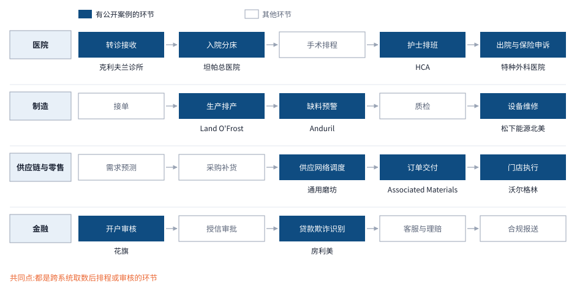

# Palantir(PLTR.US)业务认知 · 基金经理版

> 自测

## 四、美国商业

> [!lead] 美国商业是 Palantir 向美国企业销售 Foundry 与 AIP(人工智能平台,把大模型接到企业数据与权限上)的收入,是四个分部里增长最快的一块。**2025 年收入 14.65 亿美元、同比 +109%;2Q26 单季 7.64 亿美元、同比 +149%,占全公司收入 39.5%。**

> [!plain] 这块业务向美国大企业卖一套架在其现有系统之上的决策软件:医院用它分配床位和排班,工厂用它排产和预警缺料,银行用它审核开户。获客先办 1–5 天的训练营,客户带自己的数据当场跑通一个用例,见效后再扩到更多部门,最后签全公司范围的多年协议。收费按平台议价,没有公开价目表,因此跟踪指标是三组数:客户数、单客户收入、签约额。

```kpis
美国商业收入(2Q26) | 7.64 | 亿美元 | 同比 +149%
美国商业客户(2Q26) | 653 | 家 | 同比 +35%
美国商业签约额(2Q26) | 21.32 | 亿美元 | 同比 +153%
美国商业剩余交易价值(2Q26) | 62.38 | 亿美元 | 同比 +124%
```

> 来源:公司 Q2 2026 业绩稿(2026-08-03);客户数为公开报道转述〔公开报道〕

### 4.1 行业规模

**美国商业对应的是企业软件预算里的数据分析与 AI 应用,市场足够大,Palantir 的份额仍小,增长主要靠抢份额而非市场扩容。**Gartner 预测 2026 年全球软件支出 1.468 万亿美元、增长 15.5%,增速最快的是数据中心系统(+62.5%),AI 预算的大头仍在硬件(图 4-1)。美国商业 2025 年收入 14.65 亿美元,约为 Gartner 分析平台市场(2025 年预测 486 亿美元)的 3%〔作者计算〕(图 4-2)。

:::two-up
```chart
{"id":"c4_gartner_it","title":"图 4-1 2026 年软件支出预计增长 15.5%,增量更多流向数据中心硬件","subtitle":"柱:支出(亿美元);线:2026 年增速(%,右轴);2026 年为 Gartner 预测","type":"combo",
 "categories":["数据中心系统","IaaS 云基础设施","软件","终端设备","IT 服务","通信服务"],
 "series":[{"name":"2025 年","type":"bar","data":[5060,2220,12710,7900,14920,12960]},
           {"name":"2026 年(预测)","type":"bar","data":[8220,2870,14680,8680,15700,13540]},
           {"name":"2026 年增速","type":"line","yAxisIndex":1,"unit":"%","data":[62.5,29.3,15.5,9.8,5.3,4.4]}],
 "unit":"亿美元","y2_unit":"%","highlight":"软件","digits":0,
 "source":"来源:Gartner 全球 IT 支出预测新闻稿(2026-07-27)〔第三方统计〕"}
```
```chart
{"id":"c4_tam_adjacent","title":"图 4-2 美国商业 2025 年收入约为分析平台市场的 3%","subtitle":"单位:亿美元;各机构口径互有重叠,不能相加","type":"barh",
 "categories":["IDC:AI 平台软件(2028 年预测)","Gartner:数据库管理系统(2024 年)","Gartner:分析平台(2025 年预测)","Palantir 全公司收入(2025 年)","Palantir 美国商业收入(2025 年)"],
 "series":[{"name":"规模","data":[1530,1197,486,44.75,14.65]}],
 "unit":"亿美元","highlight":"Palantir 美国商业收入(2025 年)","labels":true,"table_head":"市场或收入",
 "source":"来源:IDC 新闻稿(2024-07-29);Gartner 市场份额报告摘要(2025-05)与分析平台预测摘要(2025-01-28);Palantir Q4 2025 业绩稿(2026-02-02);比值为作者计算"}
```
:::

> [!note] 口径分歧:Gartner 2025-09-17 稿称 2025 年全球 AI 支出近 1.5 万亿美元;2026-01-15 稿称 2026 年 2.52 万亿美元、增长 44%,按此倒推 2025 年约 1.75 万亿美元〔作者计算〕。两稿基数不一致,本章不画 AI 支出序列。Gartner 另称 2025 年生成式 AI 支出约八成用于硬件(2025-03-31)。

### 4.2 竞争格局

**对手分三类,差异先在做法:数据平台在底层存算数据、按用量收费;业务软件管一个部门的流程、按用户数收费;云厂商和大模型厂商卖通用的智能体开发工具。Palantir 卖的是架在这些系统之上、能把决策写回执行的一层,按平台议价。**

**与数据平台:差异在是否执行。**Snowflake、Databricks 存储和计算数据,客户预付容量或按用量付费;Palantir 读取它们的数据,再把审批后的动作写回业务系统。两家都已推出智能体产品,正从底层往上走。

**与业务软件:差异在覆盖范围。**ServiceNow、Salesforce 按用户数订阅,各管 IT 服务、销售与客服一类流程;Palantir 跨部门取数,单个合同金额大、客户数少。

**与 C3.ai:同类定位,结果分化。**C3.ai 同样卖企业 AI 应用,2023 财年起改按消耗收费,FY2026 收入 2.503 亿美元、同比约 −36%。

:::two-up
```chart
{"id":"c4_peer_growth","title":"图 4-3 最新一期收入增速:美国商业 +149%,高于各家可比业务","subtitle":"单位:%;各公司最新一季或财年,期间不同","type":"barh",
 "categories":["Palantir 美国商业(2Q26)","Palantir 全公司(2Q26)","Databricks 收入运行率(截至 2026-07)","Snowflake 产品收入(截至 2026-07 季度)","ServiceNow 订阅收入(2Q26)","Salesforce 订阅与支持收入(截至 2026-07 季度)","C3.ai 总收入(FY2026,截至 2026-04)"],
 "series":[{"name":"同比增速","data":[149,93,80,37,24.5,12,-36]}],
 "unit":"%","highlight":"Palantir 美国商业(2Q26)","labels":true,"table_head":"公司与口径",
 "note":"Databricks 为公司所称「超过 80%」,图取 80;Salesforce 含收购 Informatica 贡献 4.4 亿美元;C3.ai 为作者按订阅与服务收入减少额倒推上年后计算。",
 "source":"来源:Palantir Q2 2026 业绩稿(2026-08-03);Databricks 新闻稿(2026-08-13);Snowflake Q2 FY2027 业绩稿;ServiceNow Q2 2026 业绩稿;Salesforce Q2 FY2027 业绩稿(2026-08);C3.ai FY2026 业绩稿(2026-06-03)"}
```
```chart
{"id":"c4_peer_scale","title":"图 4-4 最新单季收入:美国商业约为 Snowflake 产品收入的一半","subtitle":"单位:亿美元;Databricks 只披露年化运行率(超过 70 亿美元),不列入","type":"barh",
 "categories":["Salesforce 订阅与支持","ServiceNow 订阅","Snowflake 产品","Palantir 美国商业","C3.ai 总收入"],
 "series":[{"name":"单季收入","data":[108.2,38.77,14.9,7.64,0.524]}],
 "unit":"亿美元","highlight":"Palantir 美国商业","labels":true,"digits":2,"table_head":"公司",
 "source":"来源:Salesforce、Snowflake 截至 2026-07-31 季度业绩稿;ServiceNow、Palantir 2Q26 业绩稿;C3.ai Q1 FY2027 业绩稿(2026-09-02)"}
```
:::

表 4-1　美国商业与主要对手的做法与参数对比

| 维度 | Palantir 美国商业 | Snowflake | Databricks | C3.ai | ServiceNow | Salesforce | 云厂商与大模型厂商 |
|---|---|---|---|---|---|---|---|
| 在客户 IT 中的位置 | 各系统之上的决策与执行层 | 数据存储与计算 | 数据存储、计算与模型开发 | 预制的行业 AI 应用 | IT 与员工服务流程 | 销售与客服流程 | 通用智能体开发与运行 |
| 上线方式 | 1–5 天训练营,再扩部门 | 开通账号,迁入数据 | 同左 | 试点后转合同 | 按模块实施 | 按模块实施 | 客户开发者自建 |
| 收费方式 | 云订阅或客户环境期限许可,按合同期确认;无公开价目 | 多为年度预付容量,按实际消耗确认 | 按计算单位(DBU)计量,按量付费或承诺用量折扣 | 月度最低费加超额计算小时,或 1–3 年期 | 按用户数订阅 | 按用户数订阅;Agentforce 每个动作 0.10 美元或每次对话 2 美元 | 微软 Copilot Studio 每月 200 美元含 2.5 万点,或每点 0.01 美元 |
| 最新增速 | +149%(2Q26) | 产品收入 +37% | 运行率 +80% 以上 | 约 −36%(FY2026) | 订阅 +24.5% | 订阅与支持 +12% | 未单独披露 |
| 净收入留存率 | 全公司 157% | 126% | 超过 140% | 数据不可得 | 数据不可得 | 数据不可得 | — |
| 智能体产品 | AIP(2023-04) | Cortex Code(2026-02) | Agent Bricks(2025-06) | — | AI 年合同价值超过 10 亿美元 | Agentforce 年化收入超过 15 亿美元 | 谷歌 Gemini Enterprise(2025-10)、OpenAI Frontier(2026-02) |

> 来源:各公司 10-K「收入确认」一节(Palantir FY2024、Snowflake FY2025、C3.ai FY2024、ServiceNow FY2024);Databricks 与 Azure 价目说明;Salesforce 新闻稿(2025-05-15);微软 Copilot Studio 授权说明;增速与留存率见图 4-3 来源;智能体发布时间为公开报道〔公开报道〕;上线方式为常见做法

> [!plain] 投资含义:对手按用量或按席位计价,试用门槛低、价格可比;Palantir 按平台议价,单价不可比,只能用户均收入和签约额反推。数据平台和云厂商的智能体一旦在大企业落地,首先挤压的是 Palantir 的新客户获取。

### 4.3 历史演变

**美国商业的演变是获客方式的演变。**Foundry 2016 年进入企业后,每个客户要派前线部署工程师(FDE,驻场接数据、搭应用的工程师)做数月,2022 年全年只做了 92 个试点。2023-04 AIP 发布后,公司改用 1–5 天训练营,2023 年做了 500 多场;获客单位从「数月一个试点」变成「几天一场训练营」,收入加速集中在 2025 年以后。

```timeline
title: 图 4-5 美国商业时间轴:从驻场试点到训练营
source: 来源:Palantir 10-K(FY2021、FY2022)、Q4 2023 业绩会(2024-02-05)、公司新闻稿(2024-06-05、2024-12-11)、Q4 2025 与 Q2 2026 业绩稿;空客新闻稿(2017-06)
2016 | Foundry 进入企业 |
2017-06 | 空客发布以 Palantir 为底层的航空数据平台 Skywise |
2021 | Apollo 对外销售;美国商业收入 2.01 亿美元(作者倒算) |
2022 | 全年 92 个试点;美国商业收入 3.35 亿美元 |
2023-04 | **发布 AIP,大模型接入本体** | hot
2023 下半年 | 500 多场训练营 |
2024-06 | 训练营累计 1,300 余场 |
2024-12 | Warp Speed 首批制造业用户 |
2025 | **美国商业收入 14.65 亿美元,同比 +109%** | hot
2Q26 | 单季 7.64 亿美元,同比 +149% |
```

年度增速从 2023 年的 +36% 升到 2024 年的 +54%、2025 年的 +109%〔作者计算〕。季度看,2024 年同比在 +40% 到 +64% 之间,2025 年起逐季抬升至 2Q26 的 +149%(图 4-6)。**美国商业占全公司收入的比重从 1Q24 的 23.6% 升至 2Q26 的 39.5%,占商业分部收入的 80.8%:国际商业同期几乎不增长(见第五章),商业分部的增长基本来自美国**(图 4-7)。

:::two-up
```chart
{"id":"c4_q_rev","title":"图 4-6 美国商业季度收入 2Q26 达 7.64 亿美元,同比增速从 40% 升至 149%","subtitle":"柱:收入(亿美元);线:同比(%,右轴)","type":"combo",
 "categories":["1Q24","2Q24","3Q24","4Q24","1Q25","2Q25","3Q25","4Q25","1Q26","2Q26"],
 "series":[{"name":"美国商业收入","type":"bar","data":[1.50,1.59,1.79,2.14,2.55,3.06,3.97,5.07,5.95,7.64]},
           {"name":"同比","type":"line","yAxisIndex":1,"unit":"%","data":[40,55,54,64,71,93,121,137,133,149]}],
 "unit":"亿美元","y2_unit":"%","digits":2,"labels":"last","highlight":"2Q26",
 "source":"来源:Palantir 各季业绩稿(2024-05-06 至 2026-08-03),同比为公司口径"}
```
```chart
{"id":"c4_q_share","title":"图 4-7 美国商业占全公司收入 39.5%、占商业分部 80.8%(2Q26)","subtitle":"单位:%","type":"line",
 "categories":["1Q24","2Q24","3Q24","4Q24","1Q25","2Q25","3Q25","4Q25","1Q26","2Q26"],
 "series":[{"name":"占商业分部收入","data":[50.2,51.8,56.5,57.5,64.2,67.9,72.4,74.9,76.9,80.8]},
           {"name":"占全公司收入","data":[23.6,23.4,24.7,25.9,28.8,30.5,33.6,36.0,36.4,39.5]}],
 "unit":"%","digits":1,"labels":"last",
 "source":"来源:Palantir 各季业绩稿与 10-Q;比重为作者计算〔作者计算〕"}
```
:::

### 4.4 具体产品

**商业侧产品按层级组织:Foundry 接入数据,本体把数据组织成业务对象,AIP 把大模型接到本体上,行业方案在最上层组装,Apollo 负责部署与升级(图 4-8)。**客户买的是整套平台,模块不单独标价。

与 2025 年各季业绩材料绘制;结构示意,非产品截图")

表 4-2　商业侧主要模块与关键参数

| 模块 | 推出 | 关键参数或功能 | 对客户的意义 |
|---|---|---|---|
| Foundry | 2016 | 接入各系统数据,数据留在原系统 | 不必先做数据迁移,首个用例可在原系统上跑通 |
| AIP | 2023-04 | 大模型在用户权限内读本体、调用动作 | 模型输出可直接进入业务流程,执行前有人审批 |
| 训练营 | 2023 下半年起规模化 | 1–5 天,客户带真实数据 | 验证周期从月缩到天,同样的销售人力可覆盖更多客户 |
| AIP Logic、Agent Studio | 数据不可得 | 步骤树逻辑;大模型 + 本体 + 文档 + 工具 | 业务人员可自己搭智能体,不必每个用例都找工程团队 |
| AI FDE | 2025 三季度测试版 | 由 AI 连接数据、编辑本体、搭建应用 | 扩到新部门时的部署人力减少〔管理层口径〕 |
| Warp Speed | 2024-12 首批用户 | 排产、工程变更、视觉质检 | 制造业可用预配置方案;Anduril 称预判缺料效率最高提升 200 倍〔厂商口径〕 |
| Apollo | 2021 年起商用 | 同一套代码部署到云、客户机房与断网环境 | 客户不必上公有云,也能持续获得升级 |

> 来源:公司 10-K「Business」;官网产品文档;公司博客(训练营);Q2 2025、Q4 2025 业绩材料(AI FDE);Warp Speed 首批用户新闻稿(2024-12-11)

**AIP 的原理是把大模型限制在本体和权限之内。**通用的大模型助手读文件、给文字建议,执行仍靠员工回到各系统操作;AIP 让模型按调用者的权限读取本体对象,调用预先定义的函数算方案,生成待执行的动作,经人工审批后写回原系统并留痕(图 4-9)。代价是前期要先建本体。

```flow
{"title":"图 4-9 AIP 工作原理:大模型只在用户权限内读取本体,动作经审批后写回原系统","per_row":6,
 "lanes":[{"name":"通用大模型助手","steps":[{"label":"员工提问"},{"label":"模型读上传文件"},{"label":"输出文字建议"},{"label":"员工回各系统手工操作","tag":"人工"}]},
          {"name":"AIP","steps":[{"label":"员工或智能体发起任务"},{"label":"按权限读取本体对象","sub":"订单、库存、床位"},{"label":"调用函数算方案"},{"label":"生成待执行动作"},{"label":"人工审批","tag":"人工"},{"label":"写回原系统并留痕","hot":true}]}],
 "source":"来源:作者依据官网本体与 AIP Agent Studio 文档、公司 10-K「Business」整理;结构示意"}
```

**应用集中在跨系统的排程、调度与审核环节**(图 4-10、表 4-3)。医院是公开案例最多的行业,覆盖转诊、分床、排班到出院;制造与供应链集中在排产和缺料预警;金融集中在开户审核与欺诈识别。



表 4-3　美国商业典型案例(效果为客户口径,经公司业绩会或业绩材料转述)

| 客户 | 所处环节 | 效果 | 披露时点 |
|---|---|---|---|
| 坦帕总医院 | 入院分床 | 入床安排耗时 −83% | 2023-08 |
| 克利夫兰诊所 | 转诊接收 | 上线 4 个月接收转院 +8.5% | 2023-08 |
| HCA | 护士排班 | 每月排班 10–20 小时降到 1 小时 | 2023-08 |
| 特种外科医院 | 保险申诉 | 单件人工 45 分钟降到 5 分钟,5 周建成 | 2025-11 |
| Land O'Frost | 生产排产 | 40 小时降到 30 分钟 | 2025-08 |
| 通用磨坊 | 供应网络 | 年节省约 1,400 万美元 | 2024-05 |
| Associated Materials | 订单交付 | 准时足额交付率 40% 升到 90% | 2024-11 |
| 沃尔格林 | 门店工作流 | 8 个月覆盖 4,000 家门店 | 2025-05 |
| 花旗 | 开户审核 | 9 天缩到几秒 | 2025-08 |
| 房利美 | 贷款欺诈识别 | 2 个月缩到几秒 | 2025-08 |

> 来源:Palantir 业绩电话会(2023-08-07、2024-05-06、2024-11-04、2025-05-05、2025-08-04);Q2 2025、Q3 2025 业绩材料(AIPCon 客户发言)〔厂商口径〕

### 4.5 核心竞争要点

**决定美国商业的有三件事:训练营转化的速度、存量客户的扩容、签约对收入的覆盖。**

```flow
{"title":"图 4-11 美国商业交付流程:训练营 → 试点 → 上线生产 → 扩展 → 企业协议","subtitle":"强调框为收入放量环节",
 "steps":[{"label":"训练营","sub":"1–5 天,客户带真实数据","tag":"获客","phase":"获客"},
          {"label":"试点","sub":"单一用例跑通,签首份合同","phase":"获客","note":"个案:训练营后 5 周签 5 年期合同"},
          {"label":"上线生产","sub":"进入日常流程,Apollo 持续升级","phase":"落地"},
          {"label":"扩展","sub":"增加部门、用例与用户","phase":"扩张","hot":true,"note":"李尔:4 个用例扩到 280 个"},
          {"label":"企业协议","sub":"多年期、全公司范围,按平台议价","phase":"扩张","hot":true}],
 "source":"来源:公司博客(训练营 1–5 天);Q1 2025 业绩会(2025-05-05);Q4 2025 业绩会(2026-02-02);流程为作者依据业绩会表述整理"}
```

**转化:公司不披露训练营转化率,只给个案。**1Q25 电话会称一家大型医疗公司训练营后 5 周签下 5 年期合同,年合同价值 2,600 万美元〔管理层口径〕;李尔从 100 名用户、4 个用例扩到 16,000 名用户、280 个用例。

**扩容:2Q26 客户数同比 +35%,季度收入 +149%,增长的大头来自单客户收入。**按过去 12 个月口径,收入 22.63 亿美元、+137%,户均收入 347 万美元、+76%;对数拆分下约三分之二的增长来自户均收入〔作者计算〕(图 4-12、图 4-13)。户均收入 2024 年一度从 207 万美元降到 184 万美元,我们的解读是训练营带来大批小客户,2025 年起这批客户开始扩容。全公司净收入留存率(NDR,一年前的客户今年支出是去年的多少)2Q26 为 157%,美国商业单独的留存率公司不披露(见第六章)。

:::two-up
```chart
{"id":"c4_vol_price","title":"图 4-12 2025 年起收入增速超过客户数增速,增长转向单客户扩容","subtitle":"单位:%,同比","type":"line",
 "categories":["1Q24","2Q24","3Q24","4Q24","1Q25","2Q25","3Q25","4Q25","1Q26","2Q26"],
 "series":[{"name":"美国商业收入同比","data":[40,55,54,64,71,93,121,137,133,149]},
           {"name":"美国商业客户数同比","data":[69,83,77,73,65,64,65,49,42,35]}],
 "unit":"%","digits":0,"labels":"last",
 "source":"来源:Palantir 各季业绩稿与演示材料;1Q26、2Q26 客户数同比为公开报道〔公开报道〕"}
```
```chart
{"id":"c4_cust_arpc","title":"图 4-13 美国商业客户 653 家,户均收入升至 347 万美元","subtitle":"柱:客户数(家,过去 12 个月确认收入);线:户均收入(万美元,右轴)= 过去 12 个月美国商业收入 ÷ 客户数","type":"combo",
 "categories":["4Q23","1Q24","2Q24","3Q24","4Q24","1Q25","2Q25","3Q25","4Q25","1Q26","2Q26"],
 "series":[{"name":"美国商业客户数","type":"bar","data":[221,262,295,321,382,432,485,530,571,615,653]},
           {"name":"户均收入","type":"line","yAxisIndex":1,"unit":"万美元","data":[206.8,null,null,null,183.8,186.8,196.7,221.1,256.6,293.5,346.6]}],
 "unit":"家","y2_unit":"万美元","digits":0,
 "note":"1Q24–3Q24 缺 2023 年分季美国商业收入的公司披露值,户均收入留空;4Q23、4Q24、4Q25 用全年收入。",
 "source":"来源:Palantir 各季业绩稿与演示材料;1Q26、2Q26 客户数为公开报道〔公开报道〕;户均收入为作者计算〔作者计算〕"}
```
:::

**覆盖:签约额与剩余交易价值都跑在收入前面。**签约额(TCV,当季签约合同全周期的潜在价值,含未行权期权)2Q26 为 21.32 亿美元、+153%;剩余交易价值(RDV,期末合同剩余总价值,假设期权全部行权)62.38 亿美元、+124%,是过去 12 个月收入的 2.76 倍,1Q25 以来这一倍数在 2.7–3.1 倍之间〔作者计算〕(图 4-14)。两者都含期权,不等于收入。公司 FY2026 指引美国商业收入超过 34.24 亿美元〔管理层口径〕,上半年已确认 13.59 亿美元,下半年需至少 20.65 亿美元〔作者计算〕。

```chart
{"id":"c4_tcv_rdv","title":"图 4-14 美国商业签约额 2Q26 为 21.32 亿美元,剩余交易价值升至 62.38 亿美元","subtitle":"单位:亿美元;柱:当季签约额(TCV);线:期末剩余交易价值(RDV,1Q25 起公司披露绝对值)","type":"combo",
 "categories":["3Q23","4Q23","1Q24","2Q24","3Q24","4Q24","1Q25","2Q25","3Q25","4Q25","1Q26","2Q26"],
 "series":[{"name":"签约额 TCV","type":"bar","data":[2.52,3.43,2.86,2.62,2.97,8.03,8.10,8.43,13.1,13.44,11.76,21.32]},
           {"name":"剩余交易价值 RDV","type":"line","data":[null,null,null,null,null,null,23.2,27.9,36.3,43.8,49.2,62.38]}],
 "unit":"亿美元","digits":2,"labels":"last",
 "source":"来源:Palantir 各季业绩稿与演示材料(2023-11-02 至 2026-08-03)"}
```

### 4.6 公司优势与短板

**优势在于增长由存量客户扩容驱动、签约覆盖收入;短板在于客户基数小、单价不透明,且与离数据更近的平台正面竞争。**

> [!good] ① 扩容驱动:户均收入 +76%、全公司净收入留存率 157%,增长不依赖新客户数。② 可见度:剩余交易价值是过去 12 个月收入的 2.76 倍。③ 利润率:商业分部贡献利润率 2025 年 66%,2022 年为 50%(不含股票薪酬,见第九章)。

> [!bad] ① 客户基数小:653 家,少于 Snowflake 年产品收入超过 100 万美元的客户数(828 家);客户数增速从 2024 年的 +69% 至 +83% 降到 2Q26 的 +35%。② 集中度:户均收入 347 万美元,单个大客户流失对收入影响大;全公司前 20 大客户平均收入 1.24 亿美元(2Q26 过去 12 个月〔公开报道〕),合计约占全公司收入 40%〔作者计算〕,美国商业口径未披露。③ 正面竞争:Databricks、Snowflake、Salesforce 与云厂商的智能体离客户数据更近,按用量或席位计价,试用门槛更低。④ 无公开价目:单价变化无法单独观察,只能从户均收入和签约额反推。⑤ 股票薪酬(SBC):2025 年 6.84 亿美元、占收入 15.3%,2Q26 占 13.7%〔作者计算〕;分部贡献利润率不含这部分。

市场的主要担心是数据平台和云厂商的智能体压缩 Palantir 的新客户空间,客户数增速连续放缓与这一担心相符;反方证据是户均收入和签约额仍在加速。两者谁占上风,我们把握不高;验证信号是 2026 年下半年美国商业收入能否达到指引隐含的 20.65 亿美元,以及客户数同比是否跌破 30%。
