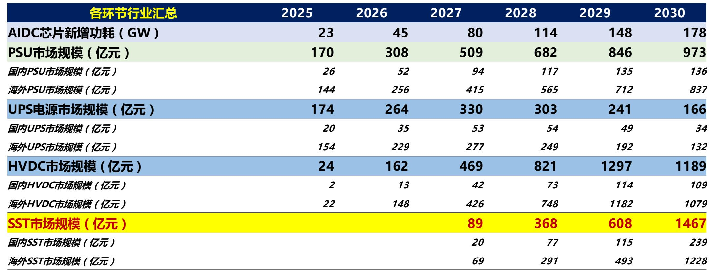
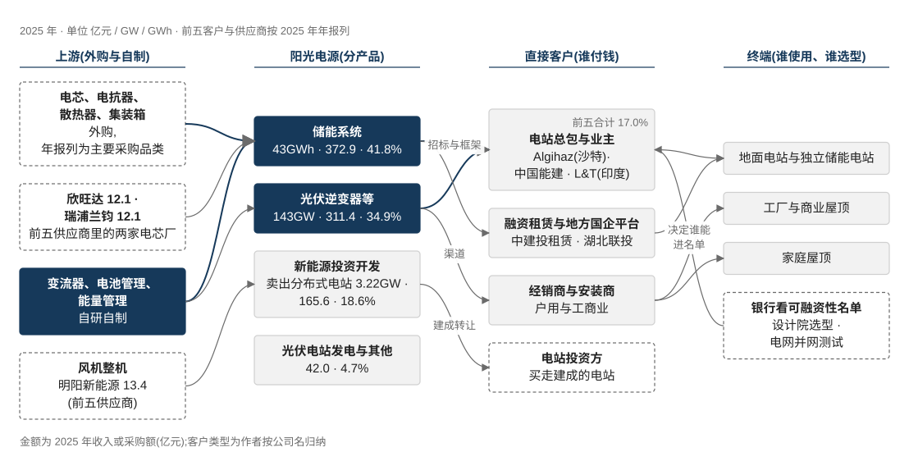

# 示例电源(000000.XX)业务认知

> 2026-09-24 · 买方内部研究 · **渲染器自测样例:本文件所有数字均为演示用虚构值,不对应任何真实公司**
> 分部数据口径示例:以公司 2025 年年报为准;行业数据示例:第三方机构 A / 机构 B;底稿示例:深度报告 5 份。

## 一、公司总览

> [!lead] 本章用来测试章首导语、KPI 磁贴、带表题的表格、堆积柱(预测年浅色 + 柱顶合计)、两图并排、产业链结构图与带标题的时间轴。

示例公司本质是一家**大功率电力电子变换平台**。第二句话测试行内格式:*强调*、`code`、[外部链接](https://example.com)、读者标签〔卖方估计〕〔作者计算〕,以及彩色小标签 {{good:主动扩张}} {{warn:主动收缩}}。
这一行与上一行在 MD 里分两行写,渲染后应连成一段且中间没有多余空格。

```kpis
2025 营业收入 | 100.0 | 亿元 | +12.3%
归母净利润 | 15.2 | 亿元 | -3.1%
综合毛利率 | 30.5 | % | +1.2pct
海外收入占比 | 55.0 | % | 贡献约七成毛利
研发投入 | 6.1 | 亿元 | 占收入 6.1%
```

表 1　2025 年分产品经营数据(示例)

| 分产品 | 收入(亿元) | 占比 | 同比 | 毛利率 | 定位 |
|---|---|---|---|---|---|
| **业务 A** | 45.0 | 45.0% | +30.1% | 35.2% | 第一主业 |
| 业务 B | 35.0 | 35.0% | +5.0% | 31.0% | 技术母体 |
| 其他 | 20.0 | 20.0% | -10.4% | 18.0% | {{warn:收缩}} |
| 新业务 C | 数据不可得 | — | — | — | 期权 |
| 合计 | 100.0 | 100% | +12.3% | 30.5% | — |

> 来源:示例公司 2025 年年报 p12(虚构页码,自测用)。

```chart
{"id":"ov_rev","title":"图 1-1 收入结构演变:业务 A 占比持续上升","subtitle":"单位:亿元;2026E–2027E 为预测(浅色)","type":"stack",
 "categories":["2021","2022","2023","2024","2025","2026E","2027E"],
 "series":[{"name":"业务 A","data":[10,18,26,34,45,55,63]},
           {"name":"业务 B","data":[20,24,30,33,35,37,38]},
           {"name":"其他","data":[12,15,22,23,20,18,null]}],
 "unit":"亿元","forecast_from":"2026E","total_label":true,
 "source":"来源:示例公司 2021–2025 年年报;2026E–2027E 为机构 A 深度(2026-07-17)p40 预测。"}
```

:::two-up
```chart
{"id":"ov_pie","title":"图 1-2 2025 年毛利结构","type":"pie","data":[{"name":"业务 A","value":15.8},{"name":"业务 B","value":10.9},{"name":"其他","value":3.6}],
 "unit":"亿元","source":"来源:示例公司 2025 年年报 p13(作者计算)"}
```
```chart
{"id":"ov_region","title":"图 1-3 海外收入与毛利率(双轴)","type":"combo","categories":["2021","2022","2023","2024","2025"],
 "series":[{"name":"海外收入","type":"bar","data":[18,25,38,47,55]},
           {"name":"海外毛利率","type":"line","yAxisIndex":1,"unit":"%","data":[28.1,30.4,null,36.0,38.2]}],
 "unit":"亿元","y2_unit":"%","source":"来源:示例公司年报(2021–2025)","note":"2023 年未披露分地区毛利率,表格视图与悬停均显示「—」。"}
```
:::

```chain
{"title":"图 1-4 产业链与商业模式:谁付钱、从哪买、卖给谁","subtitle":"实线 = 货与服务;虚线 = 钱",
 "columns":[{"name":"上游(外购为主)","nodes":[{"label":"功率器件 IGBT / SiC","sub":"海外与国产厂商","muted":true},{"label":"电芯","sub":"外购,锁价 3–6 个月","note":"成本占比最高"},{"label":"结构件 / 线缆"}]},
            {"name":"示例公司","me":true,"nodes":[{"label":"业务 A:储能系统","sub":"PCS + 电池舱 + EMS","strong":true},{"label":"业务 B:逆变器","sub":"全功率段","strong":true},{"label":"服务与运维","sub":"合同期 10–20 年","hot":true}]},
            {"name":"直接客户(谁付钱)","nodes":[{"label":"电站开发商 / EPC"},{"label":"电网公司"},{"label":"分销商","sub":"户用与工商业"}]},
            {"name":"终端","nodes":[{"label":"发电侧 / 电网侧"},{"label":"工商业 / 家庭"},{"label":"数据中心","hot":true}]}],
 "links":[{"fwd":"采购","back":"付款"},{"fwd":"设备 + 服务","back":"货款 / 服务费"},{"fwd":"交付并网"}],
 "source":"来源:作者依据示例公司年报 p8–p10 自绘"}
```

```timeline
title: 图 1-5 发展时间轴:从单一产品到平台
source: 来源:示例公司招股书 p45、历年年报
1997 | 公司成立,做第一台小功率产品 |
2011 | 创业板上市 |
2016 | 进入储能 |
2019 | **海外收入占比首次过半** | hot
2023 | 推出第三代系统 |
2025 | 业务 A 收入超过业务 B | hot
```

<!-- nav: 两大主业(显式分组) -->

## 二、业务 A:储能系统

> [!lead] 测试业务章六节齐全(自动目录分组「两大主业」)、横条份额高亮、口径分歧提示块、分组柱、断点折线、三图并排、流程图、原图面板。**2025 年收入 45.0 亿元(+30.1%),毛利率 35.2%。**

### 2.1 行业规模

需求 ≈ 新增装机 × 配储比例 × 时长。**示例判断:2026 年增速放缓但总量仍创新高。**

```chart
{"id":"a_mkt","title":"图 2-1 全球新增装机:分地区","subtitle":"单位:GWh","type":"stack",
 "categories":["2021","2022","2023","2024","2025","2026E","2027E","2028E"],
 "series":[{"name":"中国","data":[5,15,47,110,189,300,380,450]},{"name":"美国","data":[11,14,26,38,50,60,85,100]},
           {"name":"欧洲","data":[4,8,14,18,30,47,66,80]},{"name":"中东","data":[0.1,0.2,0.3,5,25,30,39,45]},
           {"name":"其他地区","data":[7,9,12,23,40,81,116,130]}],
 "unit":"GWh","forecast_from":"2026E","height":"tall",
 "source":"来源:机构 A 深度(2026-06-14)p18 图 17(源:第三方机构 B)"}
```

> [!note] 口径分歧:机构 B 官方口径 2025 年为 307GWh,低于上图 2025 年合计;两家差异主要在中国大储的统计时点。本卡图表用有分地区序列的机构 A 表,并在此并列。

### 2.2 竞争格局

:::two-up
```chart
{"id":"a_share","title":"图 2-2 集成商份额(2025)","subtitle":"本公司高亮,其他厂商灰","type":"barh",
 "categories":["厂商甲","示例公司","厂商乙","厂商丙","其他厂商合计"],"series":[{"name":"份额","data":[14,11,10,7,58]}],
 "unit":"%","highlight":"示例公司","height":"short","table_head":"厂商",
 "source":"来源:第三方机构 B(2026-03)榜单"}
```
```chart
{"id":"a_gm_peer","title":"图 2-3 储能毛利率同业对比","type":"group","categories":["2023","2024","2025"],
 "series":[{"name":"示例公司","data":[30.1,33.5,35.2]},{"name":"同业甲","data":[24.0,25.1,26.7]},{"name":"同业乙","data":[18.3,19.9,20.0]}],
 "unit":"%","highlight":"示例公司","others_grey":true,"height":"short","labels":true,
 "source":"来源:各公司 2023–2025 年年报(作者整理)"}
```
:::

### 2.3 历史演变

一段技术主线描述。时间轴(无标题,不计入图数):

```timeline
2016 | 进入储能 |
2020 | 第一代液冷系统 |
2024 | **第三代系统量产** | hot
```

```chart
{"id":"a_gm_hist","title":"图 2-4 毛利率历史:断点前后口径不同,预测段虚线","type":"line",
 "categories":["2019","2020","2021","2022","2023","2024","2025","2026E","2027E"],
 "series":[{"name":"业务 A 毛利率","data":[25.1,22.4,18.0,21.5,30.1,33.5,35.2,32.0,31.0],"labels":true,"digits":1},
           {"name":"业务 B 毛利率","data":[35.0,34.2,30.1,29.5,33.0,31.0,31.0,30.0,29.5]}],
 "unit":"%","forecast_from":"2026E","segments":[{"from":"2023","label":"新会计口径","connect":false}],
 "marklines":[{"y":30,"label":"30% 平台"}],"y_min":10,
 "source":"来源:示例公司 2019–2025 年年报;预测为机构 A(2026-07-17)p41"}
```

### 2.4 具体产品

:::three-up
p30 图 22")
p12")
")
:::


> 来源:机构 A 深度(2026-07-17)p13 图 20 原图注「主要产品参数」。



```flow
{"title":"图 2-5 储能系统从电芯到并网的生产与交付流程","subtitle":"单泳道 + 阶段分组;橙框为价值集中的工序",
 "steps":[{"label":"电芯来料检验","sub":"外购电芯,抽检容量与内阻","tag":"外购","phase":"来料"},
          {"label":"模组 / PACK","sub":"自动化线,激光焊接","tag":"自制","phase":"电池段","hot":true},
          {"label":"PCS 生产","sub":"SMT → 功率模块 → 整机","tag":"自制","phase":"电力电子段","hot":true},
          {"label":"系统集成","sub":"电池舱 + PCS + 温控 + 消防","tag":"自制","phase":"集成"},
          {"label":"出厂测试","sub":"满功率老化 48h","phase":"集成"},
          {"label":"海运与安装","sub":"EPC 或客户自建","tag":"外协","phase":"交付"},
          {"label":"并网调试","sub":"电网模型提交与测试","phase":"交付","note":"海外并网认证 6–18 个月"},
          {"label":"运维","sub":"远程监控 + 现场服务","phase":"交付"}],
 "source":"来源:示例公司招股书 p60 工艺流程(虚构页码)+ 作者整理"}
```

```flow
{"title":"图 2-6 逆变器制造流程(多泳道,自制与外协)","per_row":5,
 "lanes":[{"name":"板级","steps":[{"label":"PCB 贴片 SMT","tag":"自制"},{"label":"插件 / 波峰焊","tag":"外协"},{"label":"ICT 测试"}]},
          {"name":"整机","steps":[{"label":"功率模块装配","tag":"自制","hot":true},{"label":"整机装配"},{"label":"老化测试"},{"label":"包装入库"}]}],
 "source":"来源:示例公司招股书 p58(虚构页码)"}
```

### 2.5 核心竞争要点

```cards
① 全生命周期度电成本 | 客户比的是项目 IRR,不是设备单价。
② 并网合规 | 海外电网模型与测试是硬门槛。
③ 可融资性 | 银行认不认,决定能不能被选上。
```

### 2.6 公司优势

```chart
{"id":"a_bridge","title":"图 2-7 单位经济:每 Wh 收入到毛利(瀑布)","type":"waterfall","categories":["单价","电芯","PCS 物料","其他物料","制造费用","毛利"],
 "series":[{"name":"元/Wh","data":[0.80,-0.32,-0.08,-0.07,-0.05,0.28]}],"totals":["单价","毛利"],"unit":"元/Wh","digits":2,
 "source":"来源:作者依据机构 A(2026-07-17)p35 成本拆分计算〔作者计算〕"}
```

## 三、业务 B:逆变器

### 3.1 行业规模

```chart
{"id":"b_mkt","title":"图 3-1 全球光伏新增装机(单序列柱:最新年高亮,预测浅蓝)","type":"bar","categories":["2021","2022","2023","2024","2025","2026E"],
 "series":[{"name":"装机","data":[172,240,405,538,664,558]}],"unit":"GW","highlight":"2025","forecast_from":"2026E",
 "source":"来源:机构 C 深度(2026-07-17)p12 表 2"}
```

### 3.2 竞争格局

> [!info] 信息提示块示例:第二段测试多段落。
>
> 这是提示块的第二段。

> [!good] 正面提示块示例。

> [!bad] 负面提示块示例:短板写在这里。

### 3.3 具体产品

```lineup
{"title":"图 3-2 产品谱系:按功率段排列(lineup 块,多张实物图合成一张)","subtitle":"橙框为主力型号;点击任一图片放大",
 "cols":4,
 "items":[{"img":"fixture_images/fx_official.png","label":"XX-3000","sub":"大型地面 · 3.0MW","group":"集中式 / 模块化"},
          {"img":"fixture_images/fx_c.jpg","label":"XX-320","sub":"组串式 · 320kW","group":"组串式","hot":true},
          {"img":"fixture_images/fx_a.jpg","label":"XX-150","sub":"工商业 · 150kW","group":"组串式"},
          {"img":"fixture_images/fx_b.jpg","label":"XX-10","sub":"户用 · 10kW","group":"户用 / 微逆"}],
 "source":"来源:示例公司官网产品页(2026-09-24 访问)、招股书 p52(虚构页码)"}
```

:::three-up
```chart
{"id":"b_small1","title":"图 3-3 小图:出货量","type":"bar","categories":["2023","2024","2025"],"series":[{"name":"出货","data":[100,130,143]}],
 "unit":"GW","highlight":"2025","source":"来源:示例公司年报"}
```
```chart
{"id":"b_small2","title":"图 3-4 小图:单价","type":"line","categories":["2023","2024","2025"],"series":[{"name":"单价","data":[0.25,0.22,0.21]}],
 "unit":"元/W","labels":true,"digits":2,"source":"来源:示例公司年报(作者计算)"}
```
```flow
{"title":"图 3-5 小流程:订单到并网","per_row":2,
 "steps":[{"label":"签单"},{"label":"排产","tag":"自制"},{"label":"发货","tag":"外协"},{"label":"并网","hot":true}],
 "source":"来源:作者整理"}
```
:::

<!-- nav: 经营与跟踪 -->

## 四、非主要业务简述

**电站开发(示例)。**一段完整叙述。

1. 有序列表第一项
2. 有序列表第二项,**加粗**

- 无序列表项 A
- 无序列表项 B

#### 四级标题示例

---

## 五、UE与经营效率

:::two-up
```chart
{"id":"ue_wc","title":"图 5-1 应收与存货周转天数","type":"line","categories":["2019","2020","2021","2022","2023","2024","2025","25H1","26H1"],
 "series":[{"name":"应收账款周转天数","values":[179.7,123.7,114.4,100.8,87.0,112.7,103.2,114.0,129.3],"digits":0,"labels":"all"},
           {"name":"存货周转天数","values":[105.4,87.5,140.4,176.8,144.9,166.6,166.6,185.0,269.9],"digits":0}],
 "unit":"天","segments":[{"from":"25H1","label":"上半年,年化"}],"source":"来源:示例公司年报与半年报(作者计算)"}
```
```chart
{"id":"ue_share","title":"图 5-2 收入结构占比(百分比堆积)","type":"stack","percent":true,"categories":["2021","2022","2023","2024","2025"],
 "series":[{"name":"业务 A","data":[10,18,26,34,45]},{"name":"业务 B","data":[20,24,30,33,35]},{"name":"其他","data":[12,15,22,23,20]}],
 "unit":"亿元","labels":true,"source":"来源:示例公司年报(作者计算)"}
```
:::

:::two-up
```chart
{"id":"ue_np_ocf","title":"图 5-3 净利润与经营现金流(双折线)","type":"line","categories":["2021","2022","2023","2024","2025"],
 "series":[{"name":"归母净利润","data":[4.2,6.1,9.5,11.0,15.2]},{"name":"经营活动现金流净额","data":[-1.2,3.3,12.0,8.8,18.1]}],
 "unit":"亿元","labels":"last","source":"来源:示例公司年报"}
```
```chart
{"id":"ue_lev","title":"图 5-4 资产负债率与有息负债率","type":"area","categories":["2021","2022","2023","2024","2025"],
 "series":[{"name":"资产负债率","data":[61.0,68.0,64.5,65.1,58.1]},{"name":"有息负债率(含长期应付款)","data":[9.2,12.0,10.7,13.1,6.8]}],
 "unit":"%","source":"来源:示例公司年报(作者计算)"}
```
:::

<!-- nav: 附录 -->

## 六、来源与口径

表 6-1　口径冲突与本卡取舍(示例)

| 项目 | 冲突 | 本卡取舍 |
|---|---|---|
| 2025 装机 | 机构 A 334GWh / 机构 B 307GWh | 图用机构 A,提示块并列机构 B |
| 份额口径 | 出货量 vs 产量 | 取出货量 |

没有表题的表(应出提示):

| 指标 | 2024 | 2025 |
|---|---:|---:|
| 员工人数(人) | 1,200 | 1,350 |
| 人均创收(万元) | 72.5 | 74.1 |

> 来源:单独一行的来源(前面是表时会并入表下)。

> 来源:再单独一行的来源,前面不是图表时渲成灰色小字行。

## 七、技术与产品(基金经理版语法自测)

> [!lead] 本章测试基金经理版新增的通俗解释块、类比块、例子块(页面不显示标签)、技术演进路线图与术语词典(悬停释义)。数字均为虚构。

> [!analogy] 储能变流器(PCS)像电池仓库的进出闸门,决定电什么时候进、什么时候出、进出多快。不同的是,这道闸门还要随时听电网的指挥。

> [!example] 某示例电站以前靠人工排充放电计划,每天改一次;换成自动调度后,每 15 分钟按电价自动调整一次(虚构)。

```roadmap
{"title":"图 7-1 技术路线:从集中式到组串式,再到构网型","subtitle":"每一代写清解决了什么、代价、谁受益谁受损",
 "stages":[
  {"era":"第一代","name":"集中式","gist":"一台大设备管一大片电池。","solves":"单位成本低","cost":"一处故障停一片","who":"受益:大电站"},
  {"era":"第二代","name":"组串式","gist":"每一小串电池配一台小设备。","solves":"故障影响小、容量利用率高","cost":"设备数量多、单价高","who":"受益:集成商;受损:集中式厂商","now":true},
  {"era":"第三代","name":"构网型","gist":"储能不只听电网指挥,还能帮电网稳住电压和频率。","solves":"新能源占比高时电网不稳","cost":"控制算法难,认证周期长","who":"受益:掌握控制算法的厂商","future":true}],
 "fork":{"label":"下一步的分岔","options":[{"name":"A. 构网型成为标配","if":"电网强制要求","signal":"各国并网标准修订"},{"name":"B. 只在弱电网地区用","if":"成本降不下来","signal":"构网型项目占新增比例"}]},
 "source":"来源:虚构,仅供渲染自测"}
```

## 附录、术语小词典

```glossary
术语 | 是什么 | 可以理解成 | 对投资意味着什么
PCS / 储能变流器 | 控制电池充电、放电的设备,把直流电和交流电互相转换 | 电池仓库的进出闸门 | 储能系统里技术含量最高、毛利最好的部件之一
构网型 | 能主动帮电网稳住电压和频率的储能控制方式 | 不只是乘客,还能帮忙扶稳车 | 新一代技术门槛,决定高端项目份额
```

```footer
**示例电源(000000.XX)业务认知 · 渲染器自测**　·　2026-09-24　·　买方内部研究

自测页脚:不含估值结论、目标价与投资评级。本文件所有数字均为虚构演示值。
```
