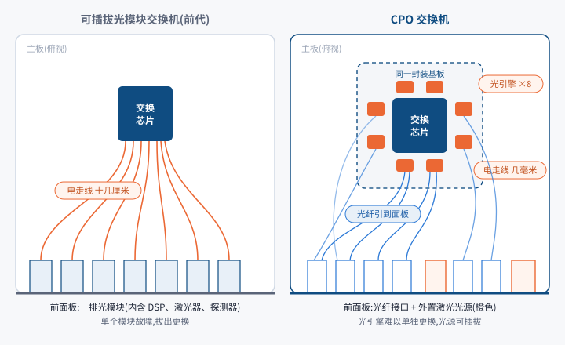

# CPO 共封装光学业务认知 · 基金经理版写法样例(技术路径)

> 2026-09-29 · 写法样例 · 本卡不写估值、目标价与评级
> 口径:本文件示范产业链 / 技术物种卡的写法:技术原理、与替代方案的差异、技术演变与下一阶段的判别方法。技术参数只取数量级;厂商宣称的数字标〔厂商口径〕并写发布时间;正式卡片的每个数回厂商发布稿、标准组织文件或研报原页,写日期与页码。
> 底稿:博通、英伟达 CPO 产品发布材料(2024-03 至 2026-08),华为等厂商的 NPO 公开展示,OIF 等标准组织公开文件,光模块厂商年报与业绩会,TrendForce 等行业报道。

## 零、业务速览:CPO

> [!lead] **CPO(共封装光学)把光电转换器件从交换机前面板移到交换芯片旁、与芯片封装在一起,目的是降低 AI 数据中心网络的功耗。**2026 年起进入量产,光模块的部分价值将转向芯片厂、封装厂和外置光源厂。

```kpis
网络能效(英伟达口径) | 3.5 | 倍 | 相对可插拔,2025-03 发布
光互连功耗降幅(博通口径) | 70 | % | 51.2T 平台,2024-03 发布
英伟达以太网 CPO 交换机 | 量产 | | 2026-08 宣布全面量产
CPO 交换芯片带宽 | 102.4 | Tb/s | 博通第三代,2025-10 出货
```

> 来源:英伟达 GTC 2025 发布与 2026-08 公告;博通 2024-03、2025-10 发布稿;TrendForce(2026-07)

### 与可插拔光模块的差异

CPO 要替代的是当前的可插拔光模块,NPO 是二者之间的折中。三者功能相同,都把交换芯片的电信号转换为光信号;**差异在光器件离芯片多远**。

表 0-1　可插拔、NPO 与 CPO 的差异

| 维度 | 可插拔光模块(当前主流) | NPO 近封装光学 | CPO 共封装光学 |
|---|---|---|---|
| 光器件位置 | 交换机前面板插口 | 主板上、芯片旁的插座 | 与交换芯片同一封装 |
| 芯片到光器件的走线 | 十几厘米 | 几厘米 | 几毫米 |
| 故障处理 | 拔出更换,无需停机 | 开箱更换单个光引擎 | 光引擎难以单独更换;光源可插拔 |
| 主导方 | 模块厂,客户多家比价 | 交换机厂与光引擎厂 | 交换芯片厂与先进封装厂 |
| 产业化阶段 | 大规模出货 | 样品与小规模试用 | 2026 年进入量产 |

> 来源:作者依据厂商发布材料与行业报道整理;1.3 节有逐项细节

> [!plain] 投资含义:从左到右功耗递减,价值与话语权从模块厂转向芯片厂和封装厂。

### 工作原理

> [!analogy] 交换芯片输出电信号,机柜之间用光传输,中间需要光电转换。可插拔方案的转换器件在前面板,信号从芯片到面板要走十几厘米铜线,速率越高衰减越大,需要 DSP 芯片补偿,功耗随之上升。CPO 把转换器件(光引擎)与芯片封在同一基板上,铜线缩短到几毫米,DSP 基本可以省去;代价是光引擎难以单独更换,因此把最易损的激光器外置、做成可插拔。



### 典型案例

> [!example] 英伟达是目前推进最快的厂商:2025 年 3 月发布 CPO 交换机,称网络能效为可插拔方案的 3.5 倍〔厂商口径〕;2026 年 8 月宣布以太网版本全面量产,供应链包括台积电(硅光芯片)、矽品(封装测试)、Lumentum 与天孚通信(激光器件)、富士康(整机)。

表 0-2　其他典型进展

| 厂商 / 客户 | 时间 | 做法 | 进展或结果 |
|---|---|---|---|
| Meta × 博通 | 2025-10 | 在 Meta 数据中心测试博通 51.2T CPO 交换机 | 累计 100 万个 400G 端口小时无一次链路闪断;光器件功耗比可插拔低 65%〔厂商口径〕 |
| 博通 | 2025-10 | 第三代 CPO 交换芯片出货,单芯片 102.4T | 带宽为上一代 CPO 的 2 倍 |
| Lambda(GPU 云) | 2026-06 | 与 GB300 NVL72 机柜一同部署英伟达 CPO InfiniBand 交换机 | 首批规模化部署之一〔公开报道〕 |

> 来源:博通公告(2025-10);英伟达发布材料;行业报道(Lambda)

### 价值流向

当前光模块是独立商品:模块厂向云厂商和设备商供货,客户可多家比价,故障时单独更换。CPO 普及后光器件成为交换机的一部分,**采购对象从模块变为整台交换机**,话语权向交换芯片厂(博通、英伟达)和先进封装厂(台积电)集中;仍可独立定价的是外置激光光源、光纤连接器和测试设备。

### 技术演变

每一步都以更低的功耗,换取维修便利性和供应商选择的下降。详见第一章。

```timeline
至今 | **可插拔光模块**:插在前面板,可单独更换;出货主力 |
2023 起 | **LPO 线性驱动**:仍可插拔,去掉 DSP 以降低功耗 |
过渡方案 | **NPO 近封装**:光引擎移到芯片旁的主板插座,仍可单独更换 |
2026 | **CPO 共封装**:英伟达、博通的 CPO 交换机进入量产 | hot
研发阶段 | **光进入 GPU 互连**:光器件封装到 GPU 旁,用于 GPU 之间直连 |
```

### 跟踪指标

表 0-3　核心跟踪指标

| 指标 | 看什么 | 来源与频率 |
|---|---|---|
| CPO 交换机出货 | 云厂商公开部署规模 | 英伟达、博通季度业绩会 |
| 可插拔模块出货结构 | 1.6T 占比;LPO 在新建集群中的比例 | 光模块厂季报 |
| GPU 互连方案 | 下一代机柜是否用光连接 GPU | GPU 厂商新品发布 |

> 来源:作者整理

市场的主要担心是 CPO 的良率和维修问题让云厂商继续选择可插拔方案。目前证据不足,我们把握不高;验证信号是 2027 年新建集群中 CPO 交换机的占比。

## 一、技术解析:原理、方案差异与演变路线

> [!lead] 本章说明光模块的作用与瓶颈、可插拔 / LPO / NPO / CPO 的差异、演变顺序及各步的受益方与受损方。

### 1.1 要解决的问题:铜线传输的速率与距离瓶颈

AI 训练把数千到数万块 GPU 连成一台「大电脑」,网络带宽不足时 GPU 只能等待。交换芯片总带宽约每两年翻一倍,单通道速率随之翻倍;**速率翻倍后,电信号在同样长度的铜线上衰减更严重**,要么缩短铜线,要么增加补偿功耗。机柜之间早已用光传输,瓶颈在电路板上、从芯片到光模块的这十几厘米。

### 1.2 原理:光模块的组成

```flow
{"title":"图 1-1 原理示意:可插拔光模块把电信号转换为光信号的路径",
 "subtitle":"强调框为后续几代技术要缩短或去掉的环节",
 "steps":[
  {"label":"交换芯片","sub":"发出高速电信号","tag":"芯片厂"},
  {"label":"电路板铜线","sub":"十几厘米,越快损耗越大","hot":true},
  {"label":"信号处理芯片","sub":"DSP,补偿衰减,功耗较高","hot":true,"tag":"芯片厂"},
  {"label":"激光器 + 调制器","sub":"把电信号加载到光上","tag":"光器件厂"},
  {"label":"光纤","sub":"传到另一台设备,几乎不衰减"},
  {"label":"探测器","sub":"把光还原成电","tag":"光器件厂"}],
 "source":"来源:作者依据光模块厂商年报产品介绍与标准组织公开文件整理"}
```

激光器、调制器和探测器完成光电转换本身,无法省去;DSP 源于铜线过长,走线越短越可以省。**后续几代技术的差异,主要在如何处理 DSP 和这段铜线。**

### 1.3 可插拔、LPO、NPO 与 CPO 的差异

四种方案分两类:**LPO 只改变模块内部**,外形和插拔方式与可插拔相同;**NPO 和 CPO 改变光器件的位置**,前者移到芯片旁的主板上,后者封进芯片封装。

```flow
{"title":"图 1-2 结构示意:四种方案中光器件与交换芯片的距离","subtitle":"每行一种方案,从左到右为信号从芯片到光纤的路径;强调框为该方案的改动之处",
 "lanes":[
  {"name":"可插拔","steps":[{"label":"交换芯片","sub":"独立封装"},{"label":"主板走线","sub":"十几厘米"},{"label":"面板上的光模块","sub":"内含 DSP、激光器、探测器","tag":"可热插拔"},{"label":"光纤"}]},
  {"name":"LPO","steps":[{"label":"交换芯片","sub":"承担信号处理","hot":true},{"label":"主板走线","sub":"十几厘米"},{"label":"面板上的光模块","sub":"去掉 DSP","hot":true,"tag":"可热插拔"},{"label":"光纤"}]},
  {"name":"NPO","steps":[{"label":"交换芯片","sub":"独立封装"},{"label":"主板走线","sub":"几厘米","hot":true},{"label":"芯片旁的光引擎","sub":"插在主板插座上","hot":true,"tag":"开箱可换"},{"label":"光纤引到面板"}]},
  {"name":"CPO","steps":[{"label":"交换芯片 + 光引擎","sub":"同一个封装","hot":true},{"label":"封装内走线","sub":"几毫米","hot":true},{"label":"光纤从封装引出","tag":"难以单独更换"},{"label":"面板上的外置光源","sub":"激光器可单独插拔","tag":"可热插拔"}]}],
 "continue_numbering":false,"legend":false,
 "source":"来源:作者依据博通、英伟达 CPO 发布材料与 NPO 公开展示整理"}
```

**可插拔与 LPO:差异在模块内部。**LPO 去掉模块内的 DSP,由交换芯片承担信号处理,功耗和成本更低;代价是链路质量要求更高,跨厂商混用易出兼容问题,传输距离更短。

**NPO 与可插拔:差异在光器件的位置。**光引擎移到主板上、芯片旁几厘米处,开箱可单独更换;节能幅度大于 LPO,光引擎与芯片仍可分别采购。

**CPO 与 NPO:差异在是否同封装。**CPO 的走线只剩几毫米,功耗最低、单台设备可接的光纤最多;代价是光引擎无法单独拔出,激光器因此外置。业内把 NPO 视为二者之间的折中〔行业报道〕。

表 1-1　四种方案逐项对比

| 维度 | 可插拔光模块 | LPO 线性驱动 | NPO 近封装光学 | CPO 共封装光学 |
|---|---|---|---|---|
| 光器件位置 | 前面板插口 | 前面板插口 | 主板上、芯片旁的插座 | 与交换芯片同一封装 |
| 芯片到光器件的走线 | 十几厘米 | 十几厘米 | 几厘米 | 几毫米 |
| DSP 信号处理芯片 | 保留 | 去掉 | 大多不需要 | 不需要 |
| 功耗(相对) | 基准 | 较低 | 更低 | 最低 |
| 故障处理 | 拔出更换,无需停机 | 拔出更换,无需停机 | 开箱更换单个光引擎 | 光引擎难以单独更换;光源可插拔 |
| 标准与供应 | 标准统一,多家可选 | 芯片与模块需联调 | 板级标准仍在形成 | 光器件与芯片绑定,供应商少 |
| 主导方 | 模块厂与客户 | 模块厂与交换芯片厂 | 交换机厂与光引擎厂 | 交换芯片厂与封装厂 |
| 产业化阶段 | 大规模出货 | 部分集群试用 | 样品与小规模试用 | 2026 年进入量产 |

> 来源:作者依据厂商发布材料、标准组织公开文件与行业报道整理;「功耗」只作相对排序,正式卡用厂商或标准组织的每比特功耗数据画图

> [!plain] 投资含义:同属「光通信受益」,可插拔模块厂、光引擎与光源厂、交换芯片与封装厂对应不同的技术路线,需分开判断。

### 1.4 技术演变:各代方案的收益与代价

```roadmap
{"title":"图 1-3 技术演变:光器件逐步靠近芯片,功耗下降、维修难度上升",
 "subtitle":"「当前主流」为出货主力;「尚未量产」为研发或样品阶段",
 "stages":[
  {"era":"至今","name":"可插拔光模块","gist":"插在交换机前面板,可单独拔出更换。","solves":"标准统一、多家供货、便于维修","cost":"高速下依赖 DSP 补偿,单个 800G 模块功耗十几瓦","who":"受益:光模块厂、DSP 芯片厂","now":true},
  {"era":"2023 起试用","name":"线性驱动模块(LPO)","gist":"仍插在前面板,去掉 DSP。","solves":"节省 DSP 的功耗和成本","cost":"链路要求高,跨厂商互通难,仅适合短距离","who":"受益:模块厂保住现有形态;受损:DSP 芯片厂"},
  {"era":"过渡方案","name":"近封装光学(NPO)","gist":"光引擎移到芯片旁的插座上,仍可单独更换。","solves":"缩短铜线,保留可维修性","cost":"需新的板级标准;节能不及 CPO","who":"受益:交换机厂、光引擎厂;规模待验证"},
  {"era":"2026 量产","name":"共封装光学(CPO)","gist":"光引擎与交换芯片同封装,激光光源外置、可单独更换。","solves":"铜线缩短到几毫米,功耗大幅下降","cost":"光引擎难维修;良率、测试、散热难度上升;供应商减少","who":"受益:交换芯片厂、先进封装厂、外置光源与连接器厂;受损:可插拔模块在这类交换机上的份额","hot":true},
  {"era":"研发阶段","name":"光直接连到 GPU","gist":"光器件封装到 GPU 旁,用于 GPU 之间直连。","solves":"突破机柜内铜缆的距离与功耗上限","cost":"难度最高,标准和供应链尚未成形","who":"受益:硅光芯片与封装厂;受损:机柜内铜缆连接","future":true}],
 "fork":{"label":"下一阶段:未来五年的主流方案",
  "options":[
   {"name":"A. 可插拔仍为主流","if":"CPO 的维修与良率问题长期未解决,云厂商坚持多供应商策略","signal":"1.6T、3.2T 模块出货节奏;LPO 在新建集群中的比例"},
   {"name":"B. CPO 在交换机上放量","if":"CPO 交换机在大客户处稳定运行,综合成本低于可插拔","signal":"CPO 交换机出货量与云厂商公开部署"},
   {"name":"C. 光进入 GPU 互连","if":"GPU 厂商下一代机柜改用光连接 GPU","signal":"GPU 厂商新品发布与机柜设计;硅光产能扩张"}]},
 "source":"来源:作者依据博通、英伟达产品发布材料与光模块厂商公开资料整理"}
```

### 1.5 对产业链的影响

- **价值向芯片与封装集中**:可插拔阶段,模块厂把激光器、DSP 和外壳组装成独立商品;CPO 阶段,光引擎由芯片厂设计、封装厂封入芯片,模块厂需转型为光引擎或外置光源供应商。
- **采购从开放转向封闭**:可插拔模块标准统一,可多家混插;CPO 的光器件与芯片绑定,选定芯片即选定光器件。云厂商不愿失去比价能力,是其态度谨慎的原因之一。

> [!plain] 投资含义:短期内可插拔仍是出货主力,CPO 先在部分交换机上替代;格局的实质变化要等 GPU 直连网络转向光互连。

## 附录、术语小词典

> [!lead] 正文中每章首次出现的术语可悬停(手机上点按)查看解释。

```glossary
术语 | 含义 | 投资相关性
CPO / 共封装光学 | 把光收发部件和交换芯片封进同一个封装 | 价值向芯片厂、封装厂集中,替代部分可插拔模块
光模块 / 可插拔光模块 | 插在交换机前面板、负责电光互相转换的部件 | 当前出货主力;中际旭创、新易盛等公司的主业
交换机 / 交换芯片 | 数据中心网络中负责转发数据的设备及其核心芯片 | 交换芯片厂是 CPO 的主导方
DSP / 数字信号处理芯片 | 光模块中补偿电信号衰减的芯片 | 可插拔模块功耗和成本的主要部分;LPO 与 CPO 都在设法省去
LPO / 线性驱动 | 去掉 DSP、由交换芯片处理信号的可插拔模块 | 保留模块形态的节能方案,冲击 DSP 芯片厂
NPO / 近封装光学 | 光引擎移到交换芯片旁的主板插座上,仍可单独更换 | 可插拔与 CPO 之间的折中,市场规模待验证
光引擎 | 集成激光器、调制器、探测器的光收发核心部件 | CPO 与 NPO 阶段新的价值载体
外置光源 | CPO 中放在封装外、可单独插拔更换的激光器 | CPO 下仍可独立定价的部分
硅光 | 用硅基芯片工艺制造光器件 | CPO 与光进 GPU 的基础工艺,决定成本下降空间
SerDes / 高速串行接口 | 芯片上把数据转为高速电信号收发的电路 | 单通道速率翻倍是铜线不够用的直接原因
横向扩展 / Scale-out | 机柜之间、服务器之间的网络 | 当前光模块用量的主体;CPO 交换机先用于此
纵向扩展 / Scale-up | 机柜内 GPU 之间直接互连的网络 | 连接数最多,目前以铜缆为主;改用光会使需求上一个台阶
先进封装 | 把多颗芯片或光器件高密度封装在一起的工艺 | CPO 的关键制造环节,台积电等受益
良率 | 一批产品中合格品的比例 | CPO 良率低会推高成本、拖慢普及
热插拔 | 设备不断电即可拔下、更换部件 | 可插拔与 LPO 的运维优势,CPO 光引擎不具备
800G / 1.6T | 单个光模块每秒传输的数据量(800G 即 800 吉比特) | 代际更替节奏决定光模块的量价周期
功耗 | 设备运行消耗的电力 | AI 数据中心受电力约束,节能本身是卖点
```
