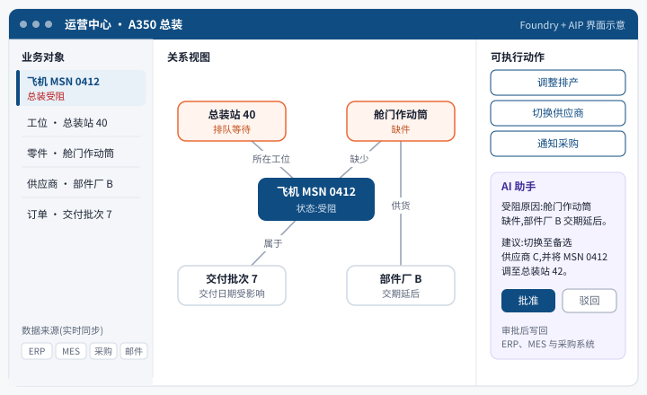

# Palantir(PLTR.US)业务认知 · 基金经理版写法样例

> 2026-09-29 · 写法样例 · 本卡不写估值、目标价与评级
> 口径:本文件只示范基金经理版新增部分的写法:零章「业务速览」、讲清技术与竞品差异的技术章、业务章开头的通俗解释、术语词典。文中少量数字取自公司 2025 年各季度业绩稿与公开报道,正式卡片一律以数字底座(facts_spine)和 10-K 原页为准,并在来源行写页码。
> 底稿:公司 S-1(2020)、10-K、季度业绩稿与股东信、AIPCon 公开演示、空客与 Palantir 公开材料、企业软件采购顾问的公开分析。

## 零、业务速览:Palantir

> [!lead] **Palantir 是面向政府和大型企业的决策软件公司:把客户分散在几十个系统里的数据整合成统一的业务模型,在上面完成分析和决策,再把指令写回原系统执行。**2023 年起公司把大模型接入这套模型(AIP),美国企业客户成为增长最快的部分。

```kpis
政府 : 商业收入 | 约 55 : 45 | | 2025 年,按收入
美国收入占比 | 约 3/4 | | 2025 年
毛利率 | 约 80 | % | 常年水平
收费方式 | 平台年费 | | 多年合同,无公开价目表
```

> 来源:公司 2025 年各季度业绩稿,作者按季度数取整(样例;正式卡以 10-K 为准)

### 与普通 SaaS 的差异

理解 Palantir 最直接的参照是普通 SaaS:两者都是按年订阅的企业软件,差异在解决的问题和交付方式。普通 SaaS 是标准化的部门级软件,一个产品覆盖一类流程(Salesforce 管销售,Workday 管人事),开通账号、完成配置即可上线,多按用户数收费。Palantir 不替代这些系统,而是架在其上,整合跨系统的数据来解决跨部门的运营问题,并把决策回写执行。

表 0-1　Palantir 与普通 SaaS 的差异

| 维度 | 普通 SaaS(Salesforce、Workday 等) | Palantir |
|---|---|---|
| 定位 | 部门级标准软件,覆盖一类流程 | 跨系统的决策与执行层 |
| 数据来源 | 以本系统录入的数据为主 | 接入客户数十个系统,数据原地不动 |
| 上线方式 | 开通账号、完成配置,数周 | 先建业务模型再搭应用;早年驻场数月,2023 年起以 5 天训练营切入 |
| 收费方式 | 多按用户数(席位),价目表公开 | 按平台议价(用例数、数据量、用户范围),多年合同 |
| 部署环境 | 厂商公有云 | 公有云、客户自有机房,可进入涉密与断网环境 |
| 替换成本 | 同类产品可替换 | 上层应用与流程需重建,替换成本高 |

> 来源:作者依据公司 10-K「Business」、企业软件采购顾问公开分析整理(样例)

> [!plain] 投资含义:这些差异让 Palantir 单客户合同金额大、替换成本高,代价是获客周期长、早期交付依赖人力,很长时间里公司的人效更接近咨询公司。跟踪指标也随之不同:普通 SaaS 看付费席位和单席位收入,Palantir 看客户数、单客户年收入和老客户扩容。更细的对比见 2.3 节。

### 工作原理

> [!analogy] Palantir 在客户现有系统之上搭一层业务模型:数据留在原系统,按飞机、订单、零件、供应商等业务对象重新组织,对象之间的关系事先连好,可执行的动作(调整排产、切换供应商)也定义在模型里。管理者和 AI 在这层模型上定位问题、形成方案,审批后指令写回原系统执行。与报表工具的区别在最后一步:决策可以直接执行。公司把这一层称为 Ontology(本体)。



### 客户案例:空客 A350

> [!example] 空客是 Palantir 最早的大型企业客户之一。A350 产能爬坡期间,零件、工序、质检和供应商交期分散在不同系统,单架飞机在总装工位受阻时,追溯原因耗时较长。双方约 2015 年开始合作,用企业平台 Foundry 整合上述数据后,工程师可以按「单架飞机 × 单道工序」定位缺件和返工环节;按双方公开表述,这加快了 A350 的产能爬坡。该平台后来以 Skywise 品牌向航空公司开放,用于机队维修预测。〔公开报道,正式卡须回原始材料核对〕

### 价值流向

客户按年支付平台使用费,合同多为多年期,另含部署与支持服务。获客采用「先落地、再扩张」:以单一用例切入,见效后扩展到更多部门和场景,**收入增长主要来自存量客户扩容,而非单笔大额新签**。政府与商业收入约为 55 : 45,美国收入约占四分之三。费用以人力为主,包括驻场与研发工程师、销售团队和较高的股权激励。

```chain
{"title":"图 0-1 价值流向:客户按年支付平台费,Palantir 向云厂商和模型厂商采购算力,人力是最大的费用项",
 "subtitle":"实线 = 产品与服务;虚线 = 资金",
 "columns":[
  {"name":"上游采购","nodes":[{"label":"云算力","sub":"亚马逊、微软、谷歌等云平台","muted":true},{"label":"第三方大模型","sub":"按调用量付费","muted":true},{"label":"工程与销售人员","sub":"最大费用项,含股权激励","note":"人效决定利润率"}]},
  {"name":"Palantir","me":true,"nodes":[{"label":"四个软件平台","sub":"Gotham / Foundry / Apollo / AIP","strong":true},{"label":"部署与支持","sub":"驻场实施 → 5 天训练营","hot":true}]},
  {"name":"付费方","nodes":[{"label":"美国政府","sub":"国防、情报、卫生、移民等部门"},{"label":"盟国政府","sub":"英国、北约及欧洲国家"},{"label":"大型企业","sub":"制造、能源、医疗、金融"}]},
  {"name":"应用场景","nodes":[{"label":"战场与情报决策"},{"label":"医院床位与候诊管理"},{"label":"排产、供应链、设备维修","hot":true}]}],
 "links":[{"fwd":"采购","back":"付费"},{"fwd":"软件 + 部署","back":"平台年费 / 合同款"},{"fwd":"部署到业务"}],"legend":false,
 "source":"来源:作者依据公司 10-K「Business」与「Costs」章节自绘(样例)"}
```

### 技术演变

四代产品方向一致:降低单个客户的交付人力,扩大可服务的客户范围。细节见第二章。

```timeline
2008 前后 | **Gotham**:面向情报与国防,把分散数据连成人、地点、事件的关系网 |
2016 前后 | **Foundry**:同一架构进入企业,从情报分析转向运营管理 |
2010 年代末 | **Apollo**:软件自动部署与升级,覆盖公有云、客户机房和涉密环境 |
2023 起 | **AIP**:大模型接入本体,在权限范围内起草方案,人工审批后执行 | hot
```

### 跟踪指标

核心看美国企业客户的增长能否持续,对应两项指标:训练营客户转为正式合同的速度,以及老客户的年度扩容(净收入留存率)。两项指标决定收入增长能否与人员扩张脱钩。市场的主要担心是云厂商和数据平台自带的 AI 智能体会压缩 Palantir 的新客户空间,目前证据不足,这一点我们把握不高,先看 2026 年美国企业新客户数是否放缓。

## 二、技术与产品:原理、差异与演变

> [!lead] 本章说明四件事:Palantir 的软件解决什么问题、原理如何、与普通 SaaS 和数据平台的差异、二十年间的产品演变及其对经营的影响。

### 2.1 要解决的问题:数据分散,跨部门决策依赖人工对表

大型机构的数据量并不少,难点在于数据分散在几十上百个系统里,各有格式、权限和负责人。一个跨部门的问题(一架飞机为何延误交付、一名病人为何等不到床位、一个嫌疑人与哪些人有关联),答案分散在五六个系统中,传统做法是各部门导出表格、人工拼接、开会对数,耗时且容易出错。

> [!analogy] 可以把大型机构比作一个人,眼睛、耳朵和手各自连着不同的大脑,每个大脑只掌握局部信息。Palantir 要做的是把它们连起来的神经系统,并把决策传回执行端。

### 2.2 原理:三层结构,核心在中间的本体层

```chain
{"title":"图 2-1 原理示意:数据接入 → 组织为业务对象 → 在其上决策并写回原系统",
 "subtitle":"权限控制贯穿三层:同一界面,不同人员看到不同数据",
 "columns":[
  {"name":"原有系统(不迁移)","nodes":[{"label":"财务、订单、生产系统"},{"label":"传感器与设备数据"},{"label":"文档、邮件、图片"}]},
  {"name":"第一层 · 接入","nodes":[{"label":"数据连接","sub":"数百种现成接口,接入并保持同步"}]},
  {"name":"第二层 · 本体","me":true,"nodes":[{"label":"对象","sub":"飞机、零件、订单、病人","strong":true},{"label":"关系","sub":"零件属于哪架飞机"},{"label":"动作","sub":"改排产、下订单、派任务","hot":true}]},
  {"name":"第三层 · 应用","nodes":[{"label":"看板与工作流"},{"label":"AI 助手","sub":"权限内读取数据、起草方案"},{"label":"回写执行","sub":"决策回到原系统","hot":true}]}],
 "links":[{"fwd":"读取"},{"fwd":"建模"},{"fwd":"使用","back":"写回"}],"legend":"实线箭头 = 数据流向;绿色虚线 = 决策写回原系统",
 "source":"来源:作者依据公司 S-1「Our Platforms」与官网架构说明自绘(样例)"}
```

本体是 Palantir 的核心。它把数据库中的一条记录对应到现实中的一个对象:一条维修记录不再是孤立的一行,而是挂在某架飞机、某个零件、某位技师名下;这架飞机可执行的动作(停飞、换件、改航线)也定义在本体里。客户在本体上搭建的应用越多,替换所需重做的工作越多,这是客户粘性的主要来源。

### 2.3 与普通 SaaS、数据平台、咨询外包的差异

投资者最常把 Palantir 归入三类熟悉的公司:普通 SaaS、数据平台、咨询外包。它与三者各有相似之处,但在客户的 IT 架构中处于不同层级。

```chain
{"title":"图 2-2 在客户 IT 架构中的位置:Palantir 不替换下两层,而是把它们连接起来",
 "subtitle":"实线 = 读取数据;虚线 = 决策写回原系统",
 "columns":[
  {"name":"底层:数据存储","nodes":[{"label":"数据库、数据仓库","sub":"甲骨文、Snowflake、Databricks 等","muted":true},{"label":"传感器、文档、图片","muted":true}]},
  {"name":"中层:部门业务软件","nodes":[{"label":"ERP","sub":"财务、采购、生产","muted":true},{"label":"普通 SaaS","sub":"销售管理、人事、IT 工单","muted":true}]},
  {"name":"上层:Palantir","me":true,"nodes":[{"label":"本体","sub":"把下两层数据组织为业务对象","strong":true},{"label":"应用与 AI","sub":"跨部门的具体问题","hot":true}]},
  {"name":"使用方","nodes":[{"label":"一线业务人员"},{"label":"管理层"},{"label":"AI 智能体","sub":"权限内执行,人工审批"}]}],
 "links":[{"fwd":"读取"},{"fwd":"读取","back":"写回执行"},{"fwd":"使用"}],"legend":"实线箭头 = 读取数据;绿色虚线 = 决策写回原系统",
 "source":"来源:作者依据公司 10-K 业务描述与官网架构说明自绘(样例)"}
```

**第一,覆盖范围不同。**普通 SaaS 一个产品覆盖一个部门的一类流程,并把它标准化;Palantir 不针对固定流程,而是整合各部门系统的数据解决跨部门问题,例如「这批订单为何延期」需要同时调取订单、生产、采购和物流四个系统。

**第二,上线方式不同。**SaaS 的功能由厂商预先开发,客户开通账号、调整配置即可使用,可以依靠广告和渠道销售;Palantir 需要先把客户业务建成本体,再搭建应用,早年要派工程师驻场数月。前者上线快、客户数多;后者上线慢,但落地后难以替换。2023 年起的 5 天训练营把起步时间从数月压缩到数天,是近两年最大的变化(见 2.5 节)。

**第三,收费方式不同。**常见 SaaS 按用户数(席位)收取月费或年费,价目表公开;Palantir 没有公开价目表,按用例数量、数据量和用户范围议定平台年费,签订多年合同〔企业软件采购顾问公开分析〕。企业用 AI 替代部分人力时,按席位收费的软件收入更容易受影响;反过来,Palantir 单笔合同大、客户数少,单一大客户的得失对收入的影响更明显。

**第四,部署环境不同。**SaaS 基本只运行在厂商的公有云上;Palantir 依靠 Apollo 可以部署到客户自有机房、涉密网络和断网的前线设备,这是获得军方和情报机构订单的前提,也是一般 SaaS 厂商难以进入的市场。

表 2-1　Palantir 与三类常被比较对象的逐项对比

| 维度 | 普通 SaaS | 数据平台 | 咨询与系统集成 | Palantir |
|---|---|---|---|---|
| 代表公司 | Salesforce、Workday | Snowflake、Databricks | 埃森哲、国防 IT 承包商 | — |
| 产品形态 | 标准化的部门软件 | 存储与计算能力 | 人工工时,逐个项目开发 | 统一平台 + 部署服务 |
| 解决的问题 | 一类固定流程 | 数据存储与计算效率 | 客户提出的定制需求 | 跨部门的具体运营问题 |
| 能否直接执行 | 在本系统内执行 | 不执行,只提供数据与算力 | 交付后由客户使用 | 决策写回原系统执行 |
| 收费方式 | 按用户数 | 按存储与计算用量 | 按人天 | 按平台议价,多年合同 |
| 收入与人力的关系 | 基本脱钩 | 基本脱钩 | 同步增长 | 早年同步,训练营后明显脱钩 |

> 来源:作者依据各公司公开材料与 10-K 业务描述整理(样例;收费方式为常见做法,个别合同不同)

> [!plain] 投资含义:Palantir 的毛利率接近软件公司(常年约八成),获客方式早年接近咨询公司。收入增长能否与人员扩张脱钩,是区分这两种商业模式的关键,也是 2.5 节交付模式变化的意义所在。

### 2.4 技术演变:四代平台各自解决的问题

```roadmap
{"title":"图 2-3 技术演变:从情报分析到企业运营,再到 AI 执行",
 "subtitle":"四代产品的共同方向:降低单个客户的交付人力",
 "stages":[
  {"era":"2008 前后","name":"Gotham:情报分析","gist":"把分散在不同数据库中的人、地点、通话、资金往来连成关系网,辅助分析员排查线索。","solves":"情报数据分散,人工比对慢且易遗漏","cost":"每个项目需工程团队驻场定制,扩张慢,长期亏损","who":"受益:情报与国防机构;受损:依赖人工整合数据的传统国防 IT 外包"},
  {"era":"2016 前后","name":"Foundry:进入企业","gist":"同一架构从情报分析转向运营管理:排产、供应链、设备维修、医院床位。","solves":"企业同样存在数据孤岛,决策依赖开会对表","cost":"企业销售周期长,驻场成本仍高","who":"受益:制造、能源、医疗等大型企业;受损:部分定制开发与咨询项目"},
  {"era":"2010 年代末","name":"Apollo:自动部署","gist":"自动部署和升级,公有云、客户机房、涉密网络、断网设备共用一套代码。","solves":"客户环境各异,升级依赖人工,数百个部署难以维护","cost":"前期投入大,本身基本不单独收费","who":"受益:Palantir 自身(交付成本下降)、需在涉密环境使用软件的军方"},
  {"era":"2023 起","name":"AIP:大模型接入本体","gist":"大模型可识别飞机、订单等业务对象,只读取权限内数据,起草方案,人工审批后执行。","solves":"大模型不了解企业业务、不能接触敏感数据、无法落地执行","cost":"依赖外部模型厂商;模型调用有成本;结果仍需人工把关","who":"受益:希望快速应用 AI 的企业与政府;受损:单纯做 AI 试点的咨询项目","now":true}],
 "fork":{"label":"下一阶段:企业 AI 执行层由谁主导",
  "options":[
   {"name":"A. 平台型软件(Palantir 等)","if":"企业需要跨系统、带权限控制、可执行的 AI,本体层难以复制","signal":"美国企业客户数、单客户收入与净收入留存率继续上升"},
   {"name":"B. 云厂商与数据平台","if":"多数企业需求以「够用」为主,且已在使用微软、谷歌、Snowflake、Databricks 的平台","signal":"上述厂商的 AI 智能体在大型企业落地;Palantir 新客户增长放缓、价格承压"},
   {"name":"C. 大模型厂商","if":"模型厂商补齐企业系统连接与权限管理","signal":"模型厂商企业收入占比、与企业系统的官方连接数量"}]},
 "source":"来源:作者依据公司 S-1、历年 10-K 与业绩会整理(样例;年份以原文为准)"}
```

表 2-2　四代平台对比

| 代际 | 主要客户 | 解决的问题 | 交付方式 | 收入意义 |
|---|---|---|---|---|
| Gotham | 情报、国防、执法 | 把线索连成关系网 | 工程师驻场定制 | 政府收入的起家产品 |
| Foundry | 大型企业、部分政府民事部门 | 整合运营数据、支持决策 | 驻场 + 平台 | 商业收入的主体 |
| Apollo | 全部客户(后台) | 软件自动部署与升级 | 自动化 | 降低交付成本;进入涉密环境的前提 |
| AIP | 企业与政府 | 让 AI 在业务对象上执行任务 | 5 天训练营 + 平台 | 2023 年以来美国企业客户加速的主要来源 |

> 来源:作者整理(样例)

### 2.5 交付模式变化:从驻场实施到 5 天训练营

早年每签一个客户,Palantir 需派驻一支前线部署工程师(FDE)团队,驻场数月完成数据接入和应用搭建,收入增长与人员投入基本同步,人效接近咨询公司。**2023 年四季度起,公司以 AIP 训练营替代传统试点**:客户带真实数据参加,5 天内完成一个可用流程,传统试点通常需要 1–3 个月。

```flow
{"title":"图 2-4 交付流程:从训练营到企业级协议","subtitle":"橙框为收入放量环节",
 "steps":[
  {"label":"训练营","sub":"1–5 天,客户带真实数据参加","tag":"获客"},
  {"label":"首个用例","sub":"单一问题跑通","tag":"试用"},
  {"label":"上线生产","sub":"进入日常业务流程"},
  {"label":"扩展部门与场景","sub":"存量客户扩容","hot":true},
  {"label":"企业级协议","sub":"多年期、全公司范围","hot":true}],
 "source":"来源:作者依据公司 2023 年四季度以来业绩会与股东信整理(样例)"}
```

驻场试点意味着每个新客户先占用一支工程团队;训练营把这部分获客成本降到原来的零头,**同等人力可覆盖的客户数大幅增加**。我们判断这是 2023 年以来美国企业客户数加速增长的主要原因,也是利润率随收入同步提升的前提。

### 2.6 对公司经营的影响

技术演变最终体现在三处:**获客速度**(训练营加快新客户增长)、**交付成本**(Apollo 与标准化本体让一套代码服务更多客户,毛利率常年约八成)、**竞争门槛**(大模型越便宜、越普及,「用上 AI」本身越不稀缺,Palantir 需要证明本体与权限层难以被云厂商和数据平台复制)。前两项已在财报中体现,第三项是未来几年最大的不确定性。

## 三、美国商业(样例:只示范章首写法)

> [!lead] 美国商业指 Palantir 向美国企业客户销售软件的收入,是公司近两年增长最快的部分:**2025 年四季度收入 5.07 亿美元,同比增长 137%**〔公司业绩稿〕。

> [!plain] 这块业务是向美国大型企业销售 Palantir 平台,用于具体的运营问题:医院床位调度、工厂排产、保险理赔审核、能源设备维修等。客户先通过训练营验证单一用例,见效后增加场景和部门;因此这块收入的关键指标是单客户年收入的增长,而非新签客户数量。

### 3.1 行业规模

(样例省略:按 v3.2 六节照写,每节第一句先给通俗的结论,再上图和数据。)

## 附录、术语小词典

> [!lead] 正文中每章首次出现的术语可悬停(手机上点按)查看解释;下表集中列出含义、类比与投资相关性。

```glossary
术语 | 含义 | 可以理解为 | 投资相关性
Ontology / 本体 | 把各系统的数据按「现实里的东西」重新摆好:对象(飞机、订单、病人)、关系(哪个零件属于哪架飞机)、动作(改排产、下订单) | 一张带操作按钮的组织地图 | Palantir 最难被复制的部分;客户在上面搭的应用越多,换掉它的成本越高
Gotham | Palantir 面向政府(情报、国防、执法)的平台,核心是把人、地点、事件连成关系网 | 情报分析员的「线索墙」 | 政府收入的起家产品
Foundry | 面向企业的平台,把运营数据接起来、建本体、做应用 | 企业的「数字沙盘」 | 商业收入的主体
Apollo | 自动把软件部署、升级到各种环境(公有云、客户机房、涉密网络、断网设备)的系统 | 软件的「自动物流系统」 | 让同一套代码服务更多客户,压低交付成本;也是进入涉密环境的门票
AIP | 人工智能平台,2023 年推出:把大模型接到本体上,在权限范围内读数据、起草方案、经人批准后执行 | 给数字沙盘配了一个会办事的助手 | 2023 年以来美国企业客户加速增长的主要来源
普通 SaaS / 软件即服务 | 厂商在云上运行、客户按月或按年订阅的标准化软件 | 按年交房租的精装房 | 常按用户数收费,和 Palantir 的收费方式、上线方式都不同
按席位收费 | 按使用软件的员工人数收费 | 按人头买门票 | 企业裁员或用 AI 替代人工时,这类收入容易受影响
数据平台 | 专门存数据、算数据的软件,如 Snowflake、Databricks | 档案馆加计算器 | Palantir 的上游与潜在竞争者:它们也在往「AI 办事」这一层走
FDE / 前线部署工程师 | 派驻在客户现场、负责接数据和搭应用的工程师 | 随软件一起派出的施工队 | 早年成本的大头;人越省、客户越多,利润率越高
训练营 / Bootcamp | 客户带真实数据来,5 天内做出能用的流程,取代 1–3 个月的传统试点 | 先试驾再买车 | 决定获客速度与获客成本
数据孤岛 | 不同系统各存各的数据、互不相通 | 各部门说各自的方言 | Palantir 要解决的根本问题;孤岛越多,它的价值越大
大模型 / LLM | 能理解和生成文字的大型 AI 模型 | 读过海量书、但不认识你公司的聪明新人 | AIP 的原料;Palantir 不自己训练,向模型厂商接入
AI 智能体 / Agent | 能自己分步骤完成任务(查数据、填表、发指令)的 AI 程序 | 会自己跑腿的助理 | 企业 AI 的下一阶段,也是和云厂商、数据平台正面竞争的地方
涉密网络 | 与互联网物理隔离的网络,军方和情报机构常用 | 一间不许带手机进去的机房 | 能在这里部署的软件商很少,构成政府业务的门槛
合同上限 / Ceiling | 政府合同写明的最高可花金额,不等于一定会花完 | 信用卡额度,不是账单 | 新闻里的「百亿美元合同」多是上限,不能当成收入
已拨付 / Obligated | 政府已经正式划拨、承诺支付的金额 | 已经刷掉的账单 | 比上限更接近未来收入
TCV / 总合同价值 | 当期签下的合同在整个合同期内的总金额 | 一次签几年的「总房租」 | 看订单势头;不等于当年收入
RPO / 剩余履约义务 | 已签合同里还没确认成收入的部分(会计口径,不含客户可随时取消的部分) | 已点单、还没上桌的菜 | 看未来收入的可见度,口径比 TCV 严
净收入留存率 / NDR | 一年前的老客户,今年花的钱是去年的多少 | 老顾客的「复购加购率」 | 检验「先小后大」是否成立;高于 100% 说明老客户在加购
调整后营业利润 | 公司自报的利润口径,剔除股票激励和相关雇主税 | 「不算发给员工的股票」的利润 | 与会计利润差距大,两套口径要一起看
SBC / 股票薪酬 | 用股票而不是现金给员工发薪酬 | 发给员工的「公司股票工资」 | 不花现金,但稀释股东;Palantir 占收入比例较高
Rule of 40 | 收入增速加利润率不低于 40% 视为健康的软件公司经验法则 | 软件公司的体检及格线 | 公司常用的自我评价指标,注意利润率用的是调整后口径
```
