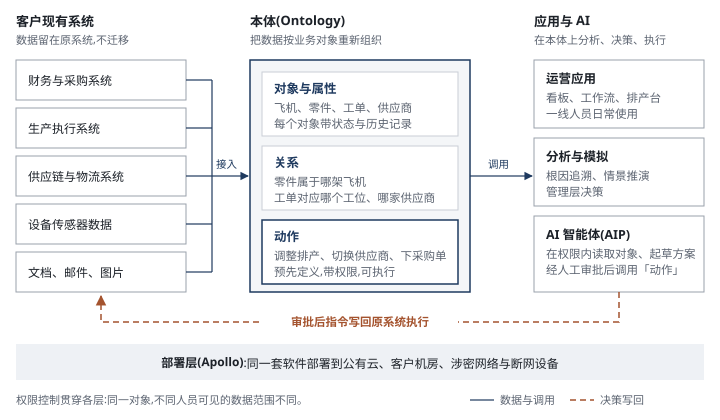

# Palantir(PLTR.US)业务认知 · 基金经理版写法样例

> 2026-09-29 · 写法样例 · 本卡不写估值、目标价与评级
> 口径:本文件只示范基金经理版新增部分的写法:零章「业务速览」、技术章、业务章章首的通俗解释、术语词典。财务数字取自公司 2026 年二季度业绩稿与 10-Q(2026-08 发布);正式卡片以数字底座(facts_spine)为准,并在来源行写原文页码。
> 底稿:公司 S-1(2020)、10-K、10-Q、季度业绩稿与股东信;空客 Skywise 公开材料;企业软件采购顾问的公开分析。

## 零、业务速览:Palantir

> [!lead] **Palantir 为政府和大型企业提供决策软件:整合客户分散在各系统的数据,在统一的业务模型上决策,再把指令写回原系统执行。**2023 年接入大模型(AIP)后,美国企业客户成为增长主力。

```kpis
收入(2Q26) | 19.35 | 亿美元 | 同比 +93%
政府 : 商业(2Q26) | 51 : 49 | | 9.90 / 9.45 亿美元
美国收入占比(2Q26) | 81 | % | 15.73 亿美元,同比 +115%
毛利率(GAAP,2Q26) | 85 | % | 毛利 16.39 亿美元
```

> 来源:公司 2026 年二季度业绩稿与 10-Q(2026-08)

### 与普通 SaaS 的差异

理解 Palantir 最直接的参照是普通 SaaS:同为按年订阅的企业软件,差异在覆盖范围和交付方式。

表 0-1　Palantir 与普通 SaaS 的差异

| 维度 | 普通 SaaS(Salesforce、Workday) | Palantir |
|---|---|---|
| 定位 | 单一部门的标准流程 | 跨系统的决策与执行层 |
| 数据 | 本系统录入 | 接入客户现有系统,数据不迁移 |
| 上线 | 开通账号、完成配置,数周 | 先建业务模型;2023 年起以 5 天训练营切入 |
| 收费 | 按用户数,价目表公开 | 按平台议价,多年合同 |
| 部署 | 厂商公有云 | 公有云、客户机房、涉密网络 |
| 替换成本 | 较低 | 高:上层应用与流程需重建 |

> 来源:公司 10-K「Business」;企业软件采购顾问公开分析

> [!plain] 投资含义:跟踪指标不同。普通 SaaS 看付费席位,Palantir 看客户数、单客户收入和净收入留存率。详见 2.3 节。

### 工作原理

> [!analogy] Palantir 在客户现有系统之上建一层业务模型(公司称为本体):数据留在原系统,按飞机、零件、订单等对象重新组织,对象之间的关系和可执行的动作(改排产、换供应商)预先定义。管理者和 AI 在这层模型上定位问题、形成方案,审批后指令写回原系统执行。与报表工具的区别在最后一步:决策可以直接执行。



### 典型案例

> [!example] 最典型的是空客。2015 年空客为 A350 产能爬坡引入 Palantir,把零件、工序、质检和供应商交期数据接入同一平台,工程师可按「单架飞机 × 单道工序」定位缺件与返工。空客称 A350 生产节奏因此加快 33%〔空客 Skywise 公开材料〕;2017 年该平台以 Skywise 品牌向航空公司开放。

表 0-2　其他典型客户

| 客户 | 时间 | 用途 | 规模或效果 |
|---|---|---|---|
| 美国陆军 | 2025-08 | 十年期企业协议,整合 75 份既有合同,陆军与国防部各机构按需采购 | 合同上限 100 亿美元 |
| 英国 NHS England | 2023-11 | 联邦数据平台:病床与择期手术排程、疫苗接种、供应链等 5 类用途 | 7 年合同最高 3.30 亿英镑 |
| 坦帕总医院(美国) | 2024-06 | 扩大合作:病床分配、病人流转与排班 | 病人入床安排耗时降 83%,麻醉后恢复室滞留降 28%〔公开报道〕 |

> 来源:美国陆军公告(2025-08);NHS England 公告(2023-11);Healthcare IT News 报道(坦帕总医院)

### 价值流向

客户按年支付平台费,合同多为多年期。获客路径是单一用例切入、见效后扩到更多部门,**增长主要来自存量客户扩容**:2Q26 净收入留存率 157%,即一年前的客户今年支出增加 57%。主要成本是工程与销售人员及股权激励;云算力与第三方大模型按用量采购。

```chain
{"title":"图 0-2 价值流向:客户按年支付平台费,人力是最大成本项",
 "subtitle":"实线 = 产品与服务;虚线 = 资金",
 "columns":[
  {"name":"上游采购","nodes":[{"label":"云算力","sub":"亚马逊、微软、谷歌","muted":true},{"label":"第三方大模型","sub":"按调用量付费","muted":true},{"label":"工程与销售人员","sub":"最大成本项,含股权激励"}]},
  {"name":"Palantir","me":true,"nodes":[{"label":"四个软件平台","sub":"Gotham / Foundry / Apollo / AIP","strong":true},{"label":"部署与支持","sub":"训练营 → 上线 → 扩容"}]},
  {"name":"付费方(2Q26 收入)","nodes":[{"label":"政府","sub":"9.90 亿美元,其中美国 8.09 亿"},{"label":"企业","sub":"9.45 亿美元,其中美国 7.64 亿"}]},
  {"name":"应用场景","nodes":[{"label":"国防与情报决策"},{"label":"医院运营"},{"label":"排产、供应链、设备维修"}]}],
 "links":[{"fwd":"采购","back":"付费"},{"fwd":"软件 + 部署","back":"平台年费"},{"fwd":"部署到业务"}],"legend":false,
 "source":"来源:公司 2026 年二季度业绩稿;结构为作者依据 10-K「Business」「Costs」整理"}
```

### 技术演变

四代产品方向一致:降低单个客户的交付人力。详见第二章。

```timeline
2003 起 | **Gotham**:为美国情报与国防机构开发,把人、地点、事件连成关系网 |
2016 | **Foundry**:同一架构进入企业,用于排产、供应链、设备维修 |
2021 | **Apollo**:作为商用产品推出,自动部署与升级,覆盖涉密与断网环境 |
2023 | **AIP**:大模型接入本体(当年 4 月发布);四季度起以 5 天训练营获客 | hot
```

### 跟踪指标

表 0-3　核心跟踪指标

| 指标 | 2Q26 | 看点 |
|---|---|---|
| 美国商业收入 | 7.64 亿美元,同比 +149% | 增速能否维持在 100% 以上 |
| 净收入留存率 | 157% | 老客户扩容是否持续 |
| 客户数 | 1,049 家,同比 +24% | 训练营转化是否放缓 |

> 来源:公司 2026 年二季度业绩稿

市场的主要担心是云厂商和数据平台自带的 AI 智能体压缩 Palantir 的新客户空间。目前证据不足,我们把握不高;验证信号是美国商业客户数增速连续两个季度放缓。

## 二、技术与产品:原理、差异与演变

> [!lead] 本章说明 Palantir 解决的问题、原理、与三类常被比较对象的差异,以及产品演变对经营的影响。

### 2.1 要解决的问题:数据分散,跨部门决策依赖人工对表

大型机构的数据分散在几十上百个系统里,各有格式、权限和负责人。一个跨部门问题(一架飞机为何延误交付、一名病人为何等不到床位)的答案分散在五六个系统中,传统做法是各部门导出表格、人工拼接、开会对数,耗时且易出错。

### 2.2 原理:三层结构,核心在中间的本体层

结构见图 0-1:数据接入层、本体层、应用层。本体把数据库中的一条记录对应到现实中的一个对象:一条维修记录挂在某架飞机、某个零件、某位技师名下,这架飞机可执行的动作(停飞、换件、改航线)也定义在本体里。**客户在本体上搭建的应用越多,替换需要重做的工作越多**,这是客户粘性的主要来源。

### 2.3 与普通 SaaS、数据平台、咨询外包的差异

投资者常把 Palantir 归入三类公司:普通 SaaS、数据平台、咨询外包。它与三者在客户 IT 架构中处于不同层级。

```chain
{"title":"图 2-1 在客户 IT 架构中的位置:Palantir 不替换下两层,而是把它们连接起来",
 "columns":[
  {"name":"底层:数据存储","nodes":[{"label":"数据库、数据仓库","sub":"甲骨文、Snowflake、Databricks","muted":true},{"label":"传感器、文档、图片","muted":true}]},
  {"name":"中层:部门业务软件","nodes":[{"label":"ERP","sub":"财务、采购、生产","muted":true},{"label":"普通 SaaS","sub":"销售管理、人事、IT 工单","muted":true}]},
  {"name":"上层:Palantir","me":true,"nodes":[{"label":"本体","sub":"把下两层数据组织为业务对象","strong":true},{"label":"应用与 AI","sub":"跨部门的具体问题"}]},
  {"name":"使用方","nodes":[{"label":"一线业务人员"},{"label":"管理层"},{"label":"AI 智能体","sub":"权限内执行,人工审批"}]}],
 "links":[{"fwd":"读取"},{"fwd":"读取","back":"写回执行"},{"fwd":"使用"}],"legend":"实线箭头 = 读取数据;虚线 = 决策写回原系统",
 "source":"来源:作者依据公司 10-K 业务描述与官网架构说明整理"}
```

**与普通 SaaS:差异在覆盖范围与上线方式。**SaaS 把一个部门的一类流程标准化,开通即用;Palantir 解决跨部门问题,需先建本体,上线慢但替换成本高。

**与数据平台:差异在是否执行。**Snowflake、Databricks 提供存储与计算,不直接驱动业务动作;Palantir 读取其数据,并把决策写回业务系统。数据平台也在向 AI 智能体延伸,是潜在竞争者。

**与咨询外包:差异在收入与人力的关系。**咨询按人天收费,收入随人数增长;Palantir 早年驻场交付接近咨询,2023 年训练营推出后,收入增速明显快于人员增速。

表 2-1　Palantir 与三类常被比较对象的逐项对比

| 维度 | 普通 SaaS | 数据平台 | 咨询与系统集成 | Palantir |
|---|---|---|---|---|
| 代表公司 | Salesforce、Workday | Snowflake、Databricks | 埃森哲、国防 IT 承包商 | — |
| 产品形态 | 标准化的部门软件 | 存储与计算能力 | 人工工时 | 统一平台 + 部署服务 |
| 能否直接执行 | 本系统内执行 | 不执行 | 交付后由客户使用 | 决策写回原系统 |
| 收费方式 | 按用户数 | 按存储与计算用量 | 按人天 | 按平台议价,多年合同 |
| 部署环境 | 厂商公有云 | 公有云为主 | 客户现场 | 公有云、客户机房、涉密网络 |
| 收入与人力 | 基本脱钩 | 基本脱钩 | 同步增长 | 训练营后明显脱钩 |

> 来源:作者依据各公司 10-K 业务描述整理;收费方式为常见做法,个别合同不同

> [!plain] 投资含义:Palantir 的毛利率属于软件公司水平(2Q26 GAAP 口径 85%),获客方式早年接近咨询公司。收入增长能否持续快于人员增长,决定它按哪类公司估值。

### 2.4 技术演变:四代平台各自解决的问题

```roadmap
{"title":"图 2-2 技术演变:从情报分析到企业运营,再到 AI 执行",
 "subtitle":"共同方向:降低单个客户的交付人力",
 "stages":[
  {"era":"2003 起","name":"Gotham:情报分析","gist":"把分散数据库中的人、地点、通话、资金往来连成关系网。","solves":"情报数据分散,人工比对慢","cost":"每个项目需工程团队驻场定制,长期亏损","who":"受益:情报与国防机构;受损:传统国防 IT 外包"},
  {"era":"2016","name":"Foundry:进入企业","gist":"同一架构转向运营管理:排产、供应链、设备维修、医院床位。","solves":"企业数据孤岛,决策依赖开会对表","cost":"销售周期长,驻场成本高","who":"受益:大型企业;受损:部分定制开发项目"},
  {"era":"2021","name":"Apollo:自动部署","gist":"公有云、客户机房、涉密网络、断网设备共用一套代码。","solves":"数百个部署难以人工升级","cost":"前期投入大,不单独收费","who":"受益:Palantir 自身交付成本;涉密环境用户"},
  {"era":"2023","name":"AIP:大模型接入本体","gist":"大模型在权限内读取业务对象、起草方案,人工审批后执行。","solves":"大模型不了解企业业务、无法落地执行","cost":"依赖外部模型厂商;调用有成本","who":"受益:快速应用 AI 的企业与政府;受损:AI 试点类咨询","now":true}],
 "fork":{"label":"下一阶段:企业 AI 执行层由谁主导",
  "options":[
   {"name":"A. 平台型软件(Palantir 等)","if":"企业需要跨系统、带权限、可执行的 AI,本体层难复制","signal":"美国商业客户数与净收入留存率继续上升"},
   {"name":"B. 云厂商与数据平台","if":"多数企业需求以「够用」为主,且已在用其平台","signal":"其 AI 智能体在大型企业落地;Palantir 新客户增长放缓"},
   {"name":"C. 大模型厂商","if":"补齐企业系统连接与权限管理","signal":"模型厂商企业收入占比、官方连接器数量"}]},
 "source":"来源:公司 S-1、10-K 与业绩会;Apollo 年份为公司所述商用推出时间"}
```

### 2.5 交付模式变化:从驻场实施到 5 天训练营

早年每签一个客户需派驻工程团队数月,收入与人员投入同步增长。**2023 年四季度起,公司以 AIP 训练营替代传统试点**:客户带真实数据参加,5 天内完成一个可用流程,传统试点通常需要 1–3 个月。

```flow
{"title":"图 2-3 交付流程:从训练营到企业级协议","subtitle":"强调框为收入放量环节",
 "steps":[
  {"label":"训练营","sub":"1–5 天,客户带真实数据","tag":"获客"},
  {"label":"首个用例","sub":"单一问题跑通"},
  {"label":"上线生产","sub":"进入日常流程"},
  {"label":"扩展部门与场景","sub":"存量客户扩容","hot":true},
  {"label":"企业级协议","sub":"多年期、全公司范围","hot":true}],
 "source":"来源:公司 2023 年四季度以来业绩会与股东信"}
```

我们判断,训练营是 2023 年以来美国商业客户加速增长的主要原因,也是利润率随收入提升的前提。

### 2.6 对公司经营的影响

- **获客速度**:训练营缩短试点周期,美国商业客户数增长加快。
- **交付成本**:Apollo 与标准化本体让一套代码服务更多客户,2Q26 GAAP 毛利率 85%。
- **竞争门槛**:大模型越普及,「用上 AI」本身越不稀缺;Palantir 需证明本体与权限层难以被云厂商和数据平台复制,这是未来几年最大的不确定性。

## 三、美国商业(样例:只示范章首写法)

> [!lead] 美国商业指 Palantir 向美国企业客户销售软件的收入,是公司增长最快的部分:**2026 年二季度收入 7.64 亿美元,同比增长 149%**〔公司业绩稿〕。

> [!plain] 这块业务向美国大型企业销售 Palantir 平台,用于医院床位调度、工厂排产、保险理赔审核、能源设备维修等具体问题。客户先通过训练营验证单一用例,再增加场景和部门,因此关键指标是单客户收入的增长,而非新签客户数。

### 3.1 行业规模

(样例省略:按 v3.2 六节照写,每节第一句先给结论,再上图和数据。)

## 附录、术语小词典

> [!lead] 正文中每章首次出现的术语可悬停(手机上点按)查看解释。

```glossary
术语 | 含义 | 投资相关性
Ontology / 本体 | 把各系统数据按业务对象重新组织:对象(飞机、订单)、关系(零件属于哪架飞机)、动作(改排产、下订单) | 最难被复制的部分;上面搭的应用越多,替换成本越高
Gotham | 面向政府(情报、国防、执法)的平台,把人、地点、事件连成关系网 | 政府收入的起家产品
Foundry | 面向企业的平台:接入运营数据、建本体、搭应用 | 商业收入的主体
Apollo | 把软件自动部署、升级到公有云、客户机房、涉密网络和断网设备的系统 | 降低交付成本;进入涉密环境的前提
AIP | 人工智能平台,2023 年推出:大模型接入本体,在权限内读数、起草方案,人工审批后执行 | 2023 年以来美国商业客户加速增长的主要来源
普通 SaaS / 软件即服务 | 厂商在云上运行、客户按月或按年订阅的标准化软件 | 多按用户数收费,收费与上线方式都和 Palantir 不同
按席位收费 | 按使用软件的员工人数收费 | 企业用 AI 替代人工时,这类收入容易受影响
数据平台 | 专门存储和计算数据的软件,如 Snowflake、Databricks | Palantir 的上游与潜在竞争者
FDE / 前线部署工程师 | 派驻客户现场、负责接入数据和搭建应用的工程师 | 早年成本的大头;人效越高,利润率越高
训练营 / Bootcamp | 客户带真实数据参加,5 天内做出可用流程,取代 1–3 个月的传统试点 | 决定获客速度与获客成本
数据孤岛 | 不同系统各自存储数据、互不相通 | Palantir 要解决的根本问题
大模型 / LLM | 能理解和生成文字的大型 AI 模型 | AIP 的原料;Palantir 不自己训练,向模型厂商接入
AI 智能体 / Agent | 能分步骤自主完成任务(查数据、填表、发指令)的 AI 程序 | 企业 AI 的下一阶段,也是与云厂商、数据平台正面竞争之处
涉密网络 | 与互联网物理隔离的网络,军方和情报机构常用 | 能在此部署的软件商很少,构成政府业务门槛
合同上限 / Ceiling | 政府合同写明的最高可支出金额,不等于实际支出 | 新闻里的「百亿美元合同」多是上限,不能当成收入
已拨付 / Obligated | 政府已正式划拨、承诺支付的金额 | 比上限更接近未来收入
TCV / 总合同价值 | 当期签订合同在整个合同期内的总金额 | 看订单势头;不等于当年收入
RPO / 剩余履约义务 | 已签合同中尚未确认为收入的部分(会计口径,不含客户可随时取消的部分) | 看未来收入可见度,口径比 TCV 严
净收入留存率 / NDR | 一年前的客户今年的支出是去年的多少 | 高于 100% 说明老客户在扩容;2Q26 为 157%
调整后营业利润 | 公司自报口径,剔除股票薪酬及相关雇主税 | 与会计利润差距大,两套口径要一起看
SBC / 股票薪酬 | 以股票而非现金支付的员工薪酬 | 不花现金但稀释股东;Palantir 占收入比例较高
Rule of 40 | 收入增速加利润率不低于 40% 视为健康的软件公司经验法则 | 公司常用的自我评价指标,利润率为调整后口径
```
